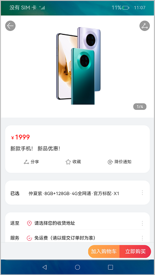
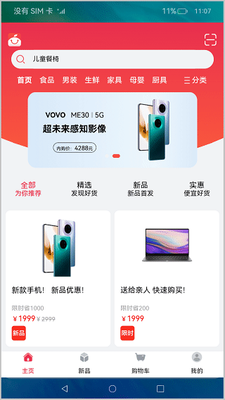

# Stage模型下Ability的创建和使用（ArkTS）

## 介绍
本篇Codelab基于Stage模型，对Ability的创建和使用进行讲解。首先在课程中我们将带领大家使用DevEco Studio创建一个Stage模型Ability，并使用UIAbilityContext启动另一个Ability，然后借助Want，在Ability之间传递参数，最后我们使用HiLog打印Ability的生命周期。效果如图所示：


### 相关概念

-   [UIAbility](https://gitee.com/openharmony/docs/blob/master/zh-cn/application-dev/reference/apis/js-apis-app-ability-uiAbility.md)：UIAbility组件是系统调度的基本单元，为应用提供绘制界面的窗口；一个UIAbility组件中可以通过多个页面来实现一个功能模块。每一个UIAbility组件实例，都对应于一个最近任务列表中的任务。

-   [UIAbilityContext](https://gitee.com/openharmony/docs/blob/master/zh-cn/application-dev/reference/apis/js-apis-inner-application-uiAbilityContext.md)：UIAbilityContext是UIAbility的上下文环境，继承自Context，提供UIAbility的相关配置信息以及操作UIAbility和ServiceExtensionAbility的方法，如启动UIAbility，停止当前UIAbilityContext所属的UIAbility，启动、停止、连接、断开连接ServiceExtensionAbility等。
-   [Want](https://gitee.com/openharmony/docs/blob/master/zh-cn/application-dev/reference/apis/js-apis-app-ability-want.md)：Want是对象间信息传递的载体, 可以用于应用组件间的信息传递。 Want的使用场景之一是作为startAbility的参数, 其包含了指定的启动目标, 以及启动时需携带的相关数据。
-   [HiLog](https://gitee.com/openharmony/docs/blob/master/zh-cn/application-dev/reference/apis/js-apis-hilog.md)：HiLog日志系统，让应用可以按照指定类型、指定级别、指定格式字符串输出日志内容，帮助开发者了解应用的运行状态，更好地调试程序。

## 环境搭建

### 软件要求

-   [DevEco Studio](https://gitee.com/openharmony/docs/blob/master/zh-cn/application-dev/quick-start/start-overview.md#%E5%B7%A5%E5%85%B7%E5%87%86%E5%A4%87)版本：DevEco Studio 3.1 Release。
-   OpenHarmony SDK版本：API version 9。

### 硬件要求

-   开发板类型：[润和RK3568开发板](https://gitee.com/openharmony/docs/blob/master/zh-cn/device-dev/quick-start/quickstart-appendix-rk3568.md)。
-   OpenHarmony系统：3.2 Release。

### 环境搭建

完成本篇Codelab我们首先要完成开发环境的搭建，本示例以**RK3568**开发板为例，参照以下步骤进行：

1.  [获取OpenHarmony系统版本](https://gitee.com/openharmony/docs/blob/master/zh-cn/device-dev/get-code/sourcecode-acquire.md#%E8%8E%B7%E5%8F%96%E6%96%B9%E5%BC%8F3%E4%BB%8E%E9%95%9C%E5%83%8F%E7%AB%99%E7%82%B9%E8%8E%B7%E5%8F%96)：标准系统解决方案（二进制）。以3.2 Release版本为例：

    

2.  搭建烧录环境。
    1.  [完成DevEco Device Tool的安装](https://gitee.com/openharmony/docs/blob/master/zh-cn/device-dev/quick-start/quickstart-ide-env-win.md)
    2.  [完成RK3568开发板的烧录](https://gitee.com/openharmony/docs/blob/master/zh-cn/device-dev/quick-start/quickstart-ide-3568-burn.md)

3.  搭建开发环境。
    1.  开始前请参考[工具准备](https://gitee.com/openharmony/docs/blob/master/zh-cn/application-dev/quick-start/start-overview.md#%E5%B7%A5%E5%85%B7%E5%87%86%E5%A4%87)，完成DevEco Studio的安装和开发环境配置。
    2.  开发环境配置完成后，请参考[使用工程向导](https://gitee.com/openharmony/docs/blob/master/zh-cn/application-dev/quick-start/start-with-ets-stage.md#创建ets工程)创建工程（模板选择“Empty Ability”）。
    3.  工程创建完成后，选择使用[真机进行调测](https://gitee.com/openharmony/docs/blob/master/zh-cn/application-dev/quick-start/start-with-ets-stage.md#使用真机运行应用)。


## 代码结构解读
本篇Codelab只对核心代码进行讲解，完整代码可以直接从gitee获取。
```
├──entry/src/main/ets             // 代码区
│  ├──common                      // 公共资源目录
│  ├──DetailsAbility
│  │  └──DetailsAbility.ts        // 关联详情页面的Ability
│  ├──entryability
│  │  └──EntryAbility.ts          // 程序入口类
│  ├──model
│  │  └──DataModel.ets            // 业务逻辑文件
│  ├──pages
│  │  ├──DetailsPage.ets          // 详情页面
│  │  └──NavPage.ets              // 导航页面
│  ├──view                        // 自定义组件目录
│  └──viewmodel                   // 视图业务逻辑文件目录
└──entry/src/main/resources       // 资源文件目录
```

## 创建Ability和Page页面

在本篇教程中，我们需要创建两个Ability：EntryAbility，DetailsAbility，其中EntryAbility是由工程默认创建的，这里我们只讲如何创建DetailsAbility。

-   使用DevEco Studio，选中对应的模块，单击鼠标右键，选择New \> Ability，在对话框中修改名字后，即可创建相关的Ability。
-   创建完Ability后，需要我们为Ability设置page页面，选中pages目录，单击鼠标右键，选择New \> Page，在对话框中修改名字后，即可创建相关的Page页面。示例代码如下：

    ```typescript
    // DetailsPage.ets
    ...
    @Entry
    @Component
    struct DetailsPage {
      private goodsDetails: GoodsData = new GoodsData();
    
      aboutToAppear() {
        if (position !== undefined) {
          this.goodsDetails = viewModel.loadDetails(position);
        }
      }
    
      build() {
        Column() {
          Scroll() {
            Column() {
              Stack({ alignContent: Alignment.Top }) {
                // 商品图片预览组件
                PreviewerComponent({ goodsImg: this.goodsDetails.goodsImg })
                this.TopBarLayout()
              }
              .height(DetailsPageStyle.TOP_LAYOUT_HEIGHT)
              .width(PERCENTAGE_100)
              .backgroundColor($r('app.color.background1'))
              // 展示商品信息的卡片布局
              this.CardsLayout()
            }.width(PERCENTAGE_100)
          }
          .height(DetailsPageStyle.SCROLL_LAYOUT_WEIGHT)
          .backgroundColor($r('app.color.background'))
          // 底部工具栏
          BottomBarComponent().height(DetailsPageStyle.TOOLBAR_WEIGHT)
        }
        .height(PERCENTAGE_100)
        .width(PERCENTAGE_100)
      }
      ...
    }
    ```


- 使用windowStage.loadContent为指定Ability设置相关的Page页面，由于配置流程一样，我们在这里只展示为DetailsAbility配置页面的核心代码：

  ```typescript
  // DetailsAbility.ts
  ...
  export default class DetailsAbility extends UIAbility {
  ...
    onWindowStageCreate(windowStage: window.WindowStage): void {
      ...
      windowStage.loadContent('pages/DetailsPage', (err, data) => {
        if (err.code) {
          hilog.error(DETAIL_ABILITY_DOMAIN, TAG, 'Failed. Cause: %{public}s', JSON.stringify(err) ?? '');
          return;
        }
        hilog.info(DETAIL_ABILITY_DOMAIN, TAG, 'Succeeded. Data: %{public}s', JSON.stringify(data) ?? '');
      });
    }
    ...
  };
  ```


效果如图所示：



由于篇幅有限，这里不再详细介绍页面中的具体布局和布局中的业务视图组件。

## UIAbilityContext模块启动Ability的能力

UIAbilityContext是UIAbility的上下文环境，继承自Context，提供UIAbility的相关配置信息以及操作UIAbility和ServiceExtensionAbility的方法，如启动UIAbility，停止当前UIAbilityContext所属的UIAbility，启动、停止、连接、断开连接ServiceExtensionAbility等。

在购物应用中，我们点击首页商品列表中的某一项商品，即可跳转到商品的详情页面。此处使用到UIAbilityContext模块的启动Ability的能力。关于[获取UIAbilityContext的方法](https://gitee.com/openharmony/docs/blob/master/zh-cn/application-dev/reference/apis/js-apis-inner-application-uiAbilityContext.md)，推荐使用getContext(this)方式来获取UIAbilityContext。

```typescript
// HomePage.ets
...
  build() {
    Column() {
      Column() {
        Blank().height(HomePageStyle.BLANK_HEIGHT)
        // Logo和二维码区域
        TopBarComponent()
          .padding({
            top: HomePageStyle.PADDING_VERTICAL,
            bottom: HomePageStyle.PADDING_VERTICAL,
            left: HomePageStyle.PADDING_HORIZONTAL,
            right: HomePageStyle.PADDING_HORIZONTAL
          })
        SearchComponent()
        TabsComponent({ tabMenus: this.tabMenus })
        BannerComponent({ bannerList: this.bannerList })
        MenusComponent({ menus: this.menus })
        // 商品列表组件
        GoodsComponent({ goodsList: this.goodsList, startPage: (index) => {
          let handler = getContext(this) as AppContext.UIAbilityContext;
          viewModel.startDetailsAbility(handler, index);
        } })
      }
      .width(PERCENTAGE_100)
    }
    .height(PERCENTAGE_100)
    .backgroundImage($rawfile('index/index_background.png'), ImageRepeat.NoRepeat)
    .backgroundImageSize(ImageSize.Cover)
  }
 ...
```

startDetailsAbility方法调用了UIAbilityContext模块启动Ability的能力。

```typescript
// HomeViewModel.ets
... 
  public startDetailsAbility(context: common.UIAbilityContext, index: number): void {
    const want: Want = {
      bundleName: getContext(context).applicationInfo.name,
      abilityName: DETAILS_ABILITY_NAME,
      parameters: {
        position: index
      }
    };
    try {
      context.startAbility(want);
    } catch (error) {
      hilog.error(HOME_PAGE_DOMAIN, TAG, '%{public}s', error);
    }
  }
...
```

## 信息传递载体Want

[Want](https://gitee.com/openharmony/docs/blob/master/zh-cn/application-dev/reference/apis/js-apis-app-ability-want.md)是对象间信息传递的载体, 可以用于应用组件间的信息传递。Want的使用场景之一是作为startAbility的参数, 其包含了指定的启动目标, 以及启动时需携带的相关数据。
在购物应用的EntryAbility中，我们使用startDetailsAbility方法启动DetailsAbility，并在代码中指定了Want的具体参数，并使用parameters参数传递商品信息。

在DetailsAbility中通过AppStorage来存储detailWant对象。

```typescript
// DetailsAbility.ts
...
export default class DetailsAbility extends UIAbility {
  onCreate(want, launchParam): void {
    let index: number = want?.parameters?.position;
    AppStorage.SetOrCreate(KEY, index);
    hilog.info(DETAIL_ABILITY_DOMAIN, TAG, '%{public}s', 'Ability onCreate');
  }
  ...
};
```

在对应的DetailsPage页面，使用AppStorage来获取detailWant对象，解析detailWant对象中的商品信息参数，调用loadDetails方法来展示商品详情。

```typescript
// DetailsPage.ets
...
let viewModel: DetailsViewModel = new DetailsViewModel();
const KEY: string = 'GoodsPosition';
let position = AppStorage.Get<number>(KEY);
...
@Entry
@Component
struct DetailsPage {
  private goodsDetails: GoodsData = new GoodsData();

  aboutToAppear() {
    if (position !== undefined) {
      this.goodsDetails = viewModel.loadDetails(position);
    }
  }
 ...
}
```

效果如图所示：



## 使用HiLog打印生命周期函数

[HiLog](https://gitee.com/openharmony/docs/blob/master/zh-cn/application-dev/reference/apis/js-apis-hilog.md)日志系统可以让应用按照指定类型、指定级别、指定格式字符串打印日志内容，帮助开发者了解应用/服务的运行状态，更好地调试程序。

HiLog提供了debug、info、warn、error以及fatal接口，在购物应用中，我们使用hilog打印EntryAbility 、DetailsAbility的生命周期。

在打印之前，我们需要了解三个参数：

-   domain：日志对应的领域标识，范围是0x0\~0xFFFF。建议开发者在应用内根据需要自定义划分。
-   tag：指定日志标识，可以为任意字符串，建议用于标识调用所在的类或者业务行为。
-   level：日志级别。
-   format：格式字符串，用于日志的格式化输出。格式字符串中可以设置多个参数，参数需要包含参数类型、隐私标识。隐私标识分为\{public\}和\{private\}，缺省为\{private\}。标识\{public\}的内容明文输出，标识\{private\}的内容以<private\>过滤回显。

下面我们在EntryAbility中演示如何使用hilog对象打印Ability的生命周期函数 onBackground，代码如下：

```typescript
// EntryAbility.ts
...
export default class EntryAbility extends UIAbility {
  ...
  onBackground(): void {
    // Ability has back to background
    hilog.isLoggable(ENTRY_ABILITY_DOMAIN, TAG, hilog.LogLevel.INFO);
    hilog.info(ENTRY_ABILITY_DOMAIN, TAG, '%{public}s', 'Ability onBackground');
  }
}
```

此时我们点击商品列表中的商品，系统会打开商品详情页，承载商品列表视图的EntryAbility将返回到后台，系统会执行EntryAbility的onBackground\(\)方法，我们在DevEco Studio的控制台中可以观察相关生命周期函数的变换情况。

## 总结

您已经完成了本次Codelab的学习，并了解到以下知识点：

1. UIAbilityContext的获取方式和startAbility方法的使用。
2. Want的基础使用。
3. HiLog的使用方式。
4. Ability相关生命周期函数的调用。


