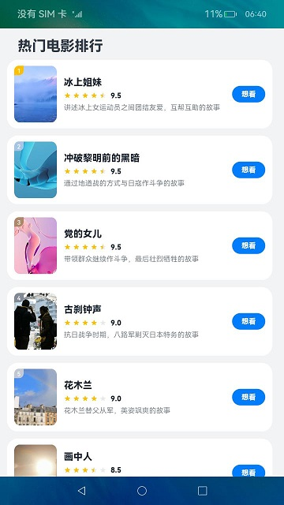
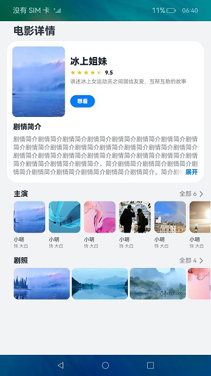
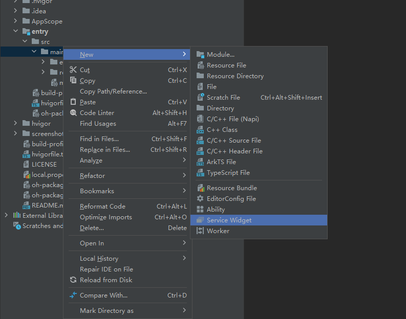
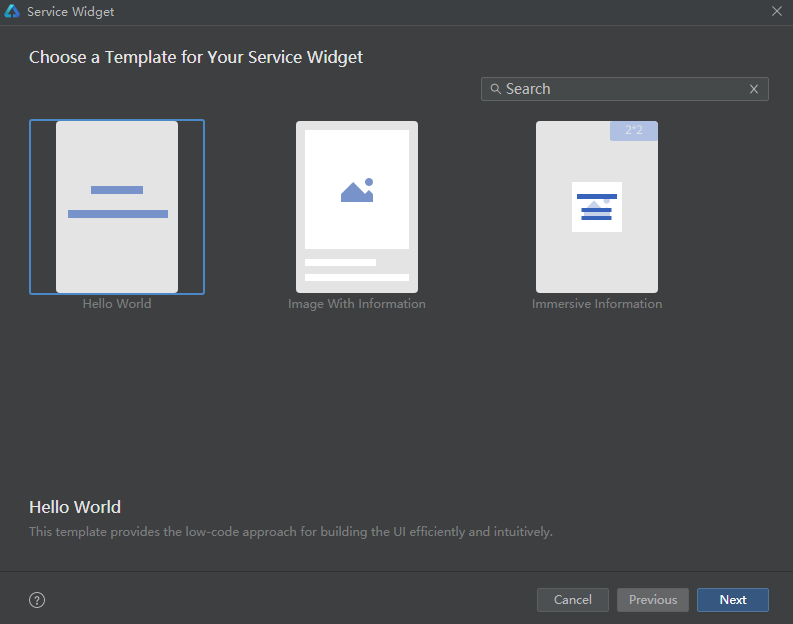
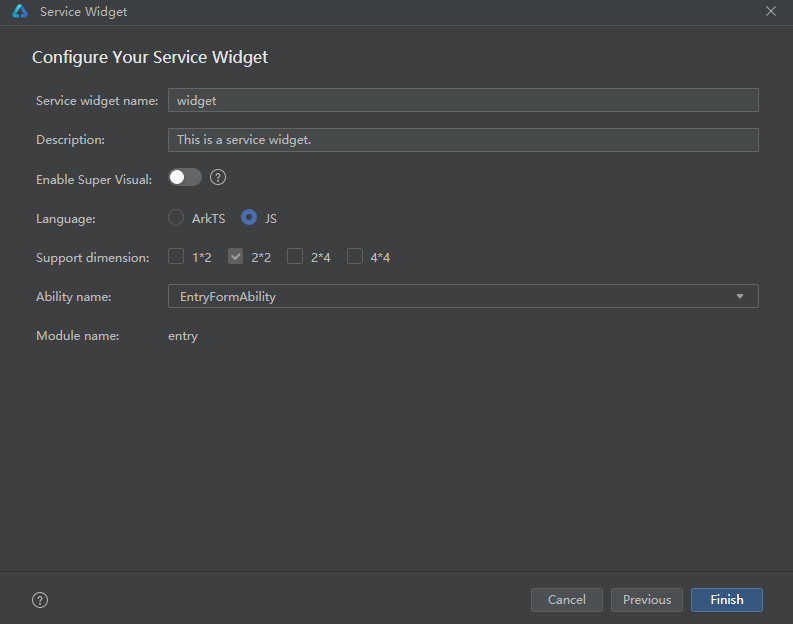
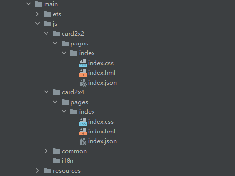
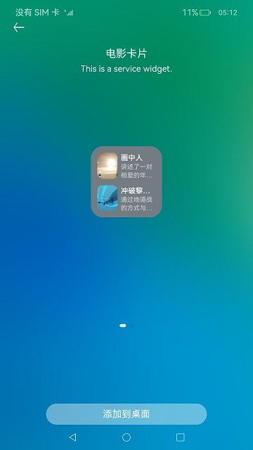

# 电影卡片（JS）

## 介绍
本篇Codelab基于元服务卡片的能力，实现带有卡片的电影应用，介绍卡片的开发过程和生命周期实现。需要完成以下功能：

1.  元服务卡片，用于在桌面上添加2x2或2x4规格元服务卡片。
2.  关系型数据库，用于创建、查询、添加、删除卡片数据。


### 相关概念

-   [关系型数据库](https://gitee.com/openharmony/docs/blob/master/zh-cn/application-dev/reference/apis/js-apis-data-relationalStore.md)：关系型数据库基于SQLite组件提供了一套完整的对本地数据库进行管理的机制，对外提供了一系列的增、删、改、查等接口，也可以直接运行用户输入的SQL语句来满足复杂的场景需要。
-   [元服务卡片](https://gitee.com/openharmony/docs/blob/master/zh-cn/application-dev/reference/apis/js-apis-app-form-formExtensionAbility.md)：卡片是一种界面展示形式，可以将应用的重要信息或操作前置到卡片，以达到服务直达、减少体验层级的目的。
    -   卡片提供方：显示卡片内容，控制卡片布局以及控件点击事件。
    -   卡片使用方：显示卡片内容的宿主应用，控制卡片在宿主中展示的位置。
    -   卡片管理服务：用于管理系统中所添加卡片的常驻代理服务，包括卡片对象的管理与使用，以及卡片周期性刷新等。

## 环境搭建

### 软件要求

-   [DevEco Studio](https://gitee.com/openharmony/docs/blob/master/zh-cn/application-dev/quick-start/start-overview.md#%E5%B7%A5%E5%85%B7%E5%87%86%E5%A4%87)版本：DevEco Studio 3.1 Release。
-   OpenHarmony SDK版本：API version 9。

### 硬件要求

-   开发板类型：[润和RK3568开发板](https://gitee.com/openharmony/docs/blob/master/zh-cn/device-dev/quick-start/quickstart-appendix-rk3568.md)。
-   OpenHarmony系统：3.2 Release。

### 环境搭建

1. [获取OpenHarmony系统版本](https://gitee.com/openharmony/docs/blob/master/zh-cn/device-dev/get-code/sourcecode-acquire.md#%E8%8E%B7%E5%8F%96%E6%96%B9%E5%BC%8F3%E4%BB%8E%E9%95%9C%E5%83%8F%E7%AB%99%E7%82%B9%E8%8E%B7%E5%8F%96)：标准系统解决方案（二进制）。以3.2 Release版本为例：

   

2. 搭建烧录环境。

   1.  [完成DevEco Device Tool的安装](https://gitee.com/openharmony/docs/blob/master/zh-cn/device-dev/quick-start/quickstart-ide-env-win.md)
   2.  [完成RK3568开发板的烧录](https://gitee.com/openharmony/docs/blob/master/zh-cn/device-dev/quick-start/quickstart-ide-3568-burn.md)

3. 搭建开发环境。

   1.  开始前请参考[工具准备](https://gitee.com/openharmony/docs/blob/master/zh-cn/application-dev/quick-start/start-overview.md#%E5%B7%A5%E5%85%B7%E5%87%86%E5%A4%87)，完成DevEco Studio的安装和开发环境配置。
   2.  开发环境配置完成后，请参考[使用工程向导](https://gitee.com/openharmony/docs/blob/master/zh-cn/application-dev/quick-start/start-with-ets-stage.md#创建ets工程)创建工程（模板选择“Empty Ability”）。
   3.  工程创建完成后，选择使用[真机进行调测](https://gitee.com/openharmony/docs/blob/master/zh-cn/application-dev/quick-start/start-with-ets-stage.md#使用真机运行应用)。

## 代码结构解读

本篇Codelab只对核心代码进行讲解，对于完整代码，我们会在gitee中提供。

```
├──entry/src/main/ets            // 代码区     
│  ├──common  
│  │  ├──constants
│  │  │  ├──CommonConstants.ets  // 常量类
│  │  │  └──StyleConstants.ets   // 格式常量类
│  │  ├──datasource
│  │  │  ├──DataSource.ets       // 懒加载数据源
│  │  │  └──MovieListData.ets    // 电影列表数据 
│  │  └──utils
│  │     ├──CommonUtils.ets      // 数据操作工具类  
│  │     ├──GlobalContext.ets    // 全局上下文工具类
│  │     └──Logger.ets           // 日志打印工具类
│  ├──detailsability
│  │  └──EntryDetailsAbility.ets // 电影详情入口类
│  ├──entryability
│  │  └──EntryAbility.ets        // 程序入口类
│  ├──entryformability
│  │  └──EntryFormAbility.ets    // 卡片创建，更新，删除操作类
│  ├──pages
│  │  ├──MovieDetailsPage.ets    // 电影详情页
│  │  └──MovieListPage.ets       // 主页面
│  ├──view
│  │  ├──MovieDetailsTitle.ets   // 电影详情头部组件
│  │  ├──MovieItem.ets           // 列表item组件
│  │  ├──MovieStarring.ets       // 电影主演组件
│  │  ├──MovieStills.ets         // 电影剧照组件
│  │  ├──StarsWidget.ets         // 电影评分组件
│  │  └──StoryIntroduce.ets      // 电影简介组件
│  └──viewmodel
│     ├──FormBean.ets            // 卡片对象
│     ├──FormDataBean.ets        // 卡片数据对象
│     └──MovieDataBean.ets       // 电影数据对象
├──entry/src/main/js             // js代码区
│  ├──card2x2                    // 2x2卡片目录
│  ├──card2x4                    // 2x4卡片目录
│  └──common                     // 卡片资源目录
└──entry/src/main/resources      // 资源文件目录
```

## 关系型数据库

元服务卡片需要用数据库保存不同卡片数据，而且在添加多张卡片情况下，需要保持数据同步刷新。因此需要创建一张表，用于保存卡片信息。

1. 数据库创建使用的SQLite。

   ```typescript
   // CommonConstants.ets
   // 创建数据库表结构
   static readonly CREATE_TABLE_FORM: string = 'CREATE TABLE IF NOT EXISTS Form ' +
     '(id INTEGER PRIMARY KEY AUTOINCREMENT, formId TEXT NOT NULL, formName TEXT NOT NULL, dimension INTEGER)';
   ```

2. 在EntryAbility的onCreate方法通过CommonUtils.createRdbStore方法创建数据库，并创建相应的表。

   ```typescript
   // EntryAbility.ets
   export default class EntryAbility extends UIAbility {
     onCreate(want: Want, launchParam: AbilityConstant.LaunchParam) {
       ...
       // 创建数据库
       CommonUtil.createRdbStore(this.context);
     }
   }
   
   // CommonUtils.ets
   import relationalStore from '@ohos.data.relationalStore';
   
   async createRdbStore(context: Context) {
     let rdbStore = GlobalContext.getContext().getObject('rdbStore') as relationalStore.RdbStore;
     if (this.isEmpty(rdbStore)) {
       rdbStore = await relationalStore.getRdbStore(context, CommonConstants.STORE_CONFIG);
       if (!this.isEmpty(rdbStore)) {
         rdbStore.executeSql(CommonConstants.CREATE_TABLE_FORM).catch((error: Error) => {
           Logger.error(CommonConstants.TAG_COMMON_UTILS, 'executeSql error ' + JSON.stringify(error));
         });
         GlobalContext.getContext().setObject('rdbStore', rdbStore);
       }
     }
     return rdbStore;
   }
   ```

## 构建应用页面

电影卡片应用有两个页面，分别是电影列表和电影详情。

## 电影列表

电影列表采用Column容器嵌套List和自定义组件MovieItem形式完成页面整体布局，效果如图所示：



```typescript
// MovieListPage.ets
build() {
  Column() {
    ...
    List({ space: StyleConstants.LIST_COMPONENT_SPACE }) {
      LazyForEach(this.dataSource, (item: MovieDataBean) => {
        ListItem() {
          // 电影item
          MovieItem({ movieItem: item });
        }
      }, (item: MovieDataBean) => JSON.stringify(item))
    }
    ...
  }
  ...
}

// MovieItem.ets
aboutToAppear() {
  if (CommonUtils.isEmpty(this.movieItem)) {
    Logger.error(CommonConstants.TAG_MOVIE_ITEM, 'movieItem is null');
    return;
  }
  // 获取电影索引
  this.sort = this.movieItem.sort;
  ...
}

build() {
  Row(){
    ...
    Text($r('app.string.want_to_see'))
      ...
      .onClick(() => {
        router.pushUrl({
          url: CommonConstants.SEE_BUTTON_PUSH,
          params: {
            index: this.sort
          }
        }).catch((error: Error) => {
          ...
        });
      })
  }
  ...
}
```

## 电影详情

电影详情采用Column容器嵌套自定义组件MovieDetailsTitle、StoryIntroduce、MovieStarring和MovieStills形式完成页面整体布局，效果如图所示：



```typescript
// MovieDetailPage.ets
aboutToAppear() {
   let index: number = 0;
   let params = router.getParams() as Record<string, Object>;
   if (!CommonUtils.isEmpty(params)) {
      index = params.index as number;
   } else {
      let position = GlobalContext.getContext().getObject('position') as number;
      index = position ?? 0;
   }
   let listData: MovieDataBean[] = CommonUtils.getListData();
   if (CommonUtils.isEmptyArr(listData)) {
      Logger.error(CommonConstants.TAG_DETAILS_PAGE, 'listData is 0');
      return;
   }
   this.movieData = listData[index];
   this.introduction = listData[index].introduction;
}

build() {
  Column() {
    ...
    Column() {
      // 电影详情头部组件
      MovieDetailsTitle({
        movieDetail: this.movieData
      })
      // 剧情简介组件
      StoryIntroduce({
        introduction: this.introduction
      })
    }
    ...
    // 电影主演组件
    MovieStarring()
    // 电影剧照组件
    MovieStills()
  }
  ...
}
```

## 元服务卡片

使用元服务卡片分为四步：创建、初始化、更新、删除。

### 创建元服务卡片目录

1. 在main目录下，点击鼠标右键 > New > Service Widget。

   

2. 然后选择第一个选项下面带有Hello World字样，点击下一步Next。

   

3. 填写卡片名字（Service widget name）、卡片介绍（Description）、是否开启低代码开发（Enable Super Visual）、开发语言（ArkTS和JS）、支持卡片规格（Support dimension）、关联表单（Ability name）点击Finish完成创建。如需创建多个卡片目录重新按照步骤1执行。

   

4. 创建完卡片后，同级目录出现js目录，然后开发者在js目录下使用hml+css+json开发js卡片页面。

   

### 初始化元服务卡片

应用选择添加元服务卡片到桌面后，在EntryFormAbility的onAddForm方法进行卡片初始化操作，效果如图所示：



```typescript
// EntryFormAbility.ets
onAddForm(want: Want) {
   if (want.parameters === undefined) {
      return formBindingData.createFormBindingData();
   }
   let formId: string = want.parameters[CommonConstants.IDENTITY_KEY] as string;
   let formName: string = want.parameters[CommonConstants.NAME_KEY] as string;
   let dimensionFlag: number = want.parameters[CommonConstants.DIMENSION_KEY] as number;
   CommonUtils.createRdbStore(this.context).then((rdbStore: relationalStore.RdbStore) => {
      let form: FormBean = new FormBean();
      form.formId = formId;
      form.formName = formName;
      form.dimension = dimensionFlag;
      CommonUtils.insertForm(form, rdbStore);
   }).catch((error: Error) => {
      Logger.error(CommonConstants.TAG_FORM_ABILITY, 'onAddForm create rdb error ' + JSON.stringify(error));
   });
   let listData: MovieDataBean[] = CommonUtils.getListData();
   let formData = CommonUtils.getFormData(listData);
   return formBindingData.createFormBindingData(formData);
}
```

### 更新元服务卡片

1. 初始化加载电影列表布局之前，在MovieListPage的aboutToAppear方法中，通过CommonUtils.startTimer方法开启定时器，时间到则调用updateMovieCardData方法更新电影卡片数据。

   ```typescript
   // MovieListPage.ets
   aboutToAppear() {
     ...
     // 启动定时器，每5分钟更新一次电影卡片数据。
     CommonUtils.startTimer();
   }
   
   // CommonUtils.ets
   startTimer() {
     let intervalId = GlobalContext.getContext().getObject('intervalId') as number;
     if (this.isEmpty(intervalId)) {
       intervalId = setInterval(() => {
         let rdbStore = GlobalContext.getContext().getObject('rdbStore') as relationalStore.RdbStore;
         this.updateMovieCardData(rdbStore);
       }, CommonConstants.INTERVAL_DELAY_TIME);
     }
     GlobalContext.getContext().setObject('intervalId', intervalId);
   }
   
   // 更新电影卡片数据
   updateMovieCardData(rdbStore: relationalStore.RdbStore) {
    if (this.isEmpty(rdbStore)) {
      Logger.error(CommonConstants.TAG_COMMON_UTILS, 'rdbStore is null');
      return;
    }
    let predicates: relationalStore.RdbPredicates = new relationalStore.RdbPredicates(CommonConstants.TABLE_NAME);
    rdbStore.query(predicates).then((resultSet: relationalStore.ResultSet) => {
      if (resultSet.rowCount <= 0) {
        Logger.error(CommonConstants.TAG_COMMON_UTILS, 'updateCardMovieData rowCount <= 0');
        return;
      }
      let listData: MovieDataBean[] = this.getListData();
      resultSet.goToFirstRow();
      do {
        let formData = this.getFormData(listData);
        let formId: string = resultSet.getString(resultSet.getColumnIndex(CommonConstants.FORM_ID));
        formProvider.updateForm(formId, formBindingData.createFormBindingData(formData))
          .catch((error: Error) => {
            Logger.error(CommonConstants.TAG_COMMON_UTILS, 'updateForm error ' + JSON.stringify(error));
          });
      } while (resultSet.goToNextRow());
      resultSet.close();
    }).catch((error: Error) => {
      Logger.error(CommonConstants.TAG_COMMON_UTILS, 'updateCardMovieData error ' + JSON.stringify(error));
    });
   ```

2. 通过src/main/resources/base/profile/form_config.json配置文件，根据updateDuration或者scheduledUpdateTime字段配置刷新时间。updateDuration优先级高于scheduledUpdateTime，两者同时配置时，以updateDuration配置的刷新时间为准。当配置的刷新时间到了，系统调用onUpdateForm方法进行更新。

   ```typescript
   // form_config.json
   {
     // 卡片的类名
     "name": "card2x2",
     // 卡片的描述
     "description": "This is a service widget.",
     // 卡片对应完整路径 
     "src": "./js/card2x2/pages/index/index",
     // 定义与显示窗口相关的配置
     "window": {
       "designWidth": 720,
       "autoDesignWidth": true
     },
     // 卡片的主题样式
     "colorMode": "auto",
     // 是否为默认卡片
     "isDefault": true,
     // 卡片是否支持周期性刷新
     "updateEnabled": true,
     // 采用24小时制，精确到分钟
     "scheduledUpdateTime": "00:00",
     // 当取值为0时，表示该参数不生效，当取值为正整数N时，表示刷新周期为30*N分钟。
     "updateDuration": 1,
     // 卡片默认外观规格
     "defaultDimension": "2*2",
     // 卡片支持外观规格
     "supportDimensions": [
       "2*2"
     ]
   }
   ...
   
   // EntryFormAbility.ets
   onUpdateForm(formId: string) {
     CommonUtils.createRdbStore(this.context).then((rdbStore: relationalStore.RdbStore) => {
       CommonUtils.updateMovieCardData(rdbStore);
     }).catch((error: Error) => {
       ...
     });
     ...
   }
   ```

### 删除元服务卡片

当用户需要删除元服务卡片时，可以在EntryFormAbility的onRemoveForm方法中，通过CommonUtils.deleteFormData方法删除数据库中对应的卡片信息。

```typescript
// EntryFormAbility.ets
onRemoveForm(formId: string) {
  CommonUtils.createRdbStore(this.context).then((rdbStore: relationalStore.RdbStore) => {
    // 从数据库中删除电影卡片信息
    CommonUtils.deleteFormData(formId, rdbStore);
  }).catch((error: Error) => {
    ...
  });
}

// CommonUtils.ets
deleteFormData(formId: string, rdbStore: relationalStore.RdbStore) {
  ...
  let predicates: relationalStore.RdbPredicates = new relationalStore.RdbPredicates(CommonConstants.TABLE_NAME);
  predicates.equalTo(CommonConstants.FORM_ID, formId);
  rdbStore.delete(predicates).catch((error: Error) => {
    ...
  });
}
```

## 总结

您已经完成了本次Codelab的学习，并了解到以下知识点：

1.  使用关系型数据库插入、更新、删除卡片数据。
2.  使用FormExtensionAbility创建、更新、删除元服务卡片。

