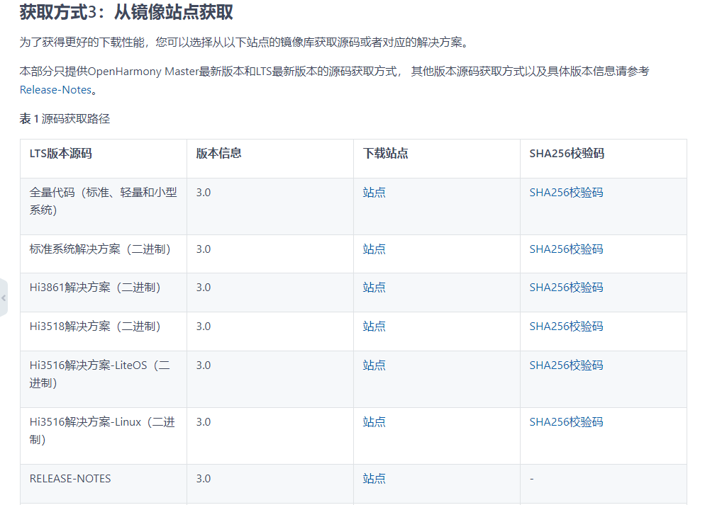
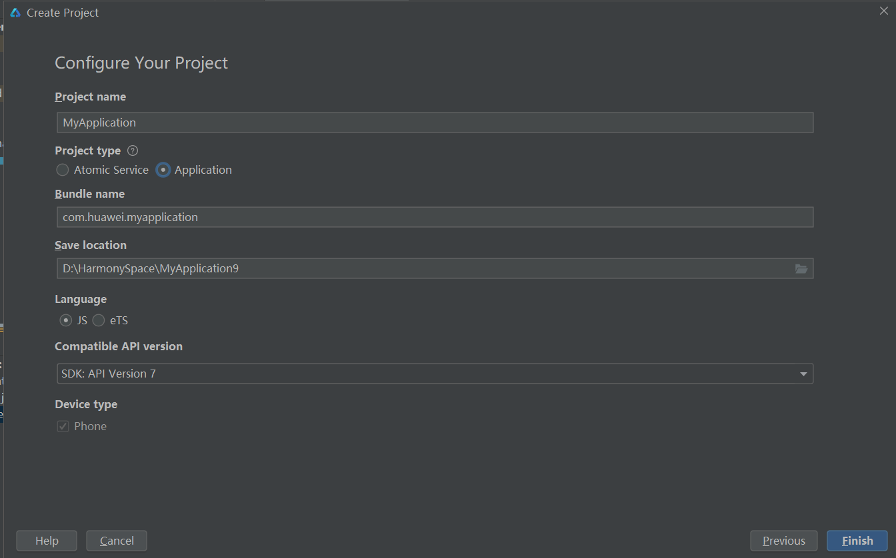
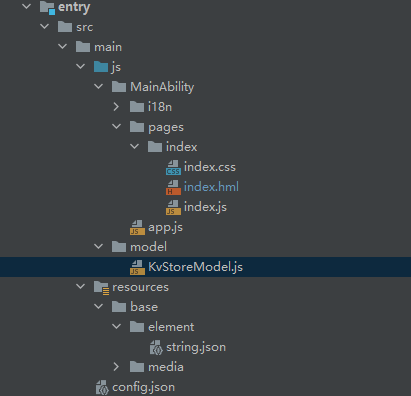

# 介绍

分布式数据服务\(Distributed Data Service，DDS\)为应用程序提供不同设备间数据分布式的能力。通过调用分布式数据接口，应用程序将数据保存到分布式数据库中。通过结合帐号、应用和分布式数据服务对属于不同的应用的数据进行隔离，保证不同应用之间的数据不能通过分布式数据服务互相访问。在通过可信认证的设备间，分布式数据服务支持应用数据相互同步，为用户提供在多种终端设备上一致的数据访问体验。效果图如下：

**图 1** <a name="fig2318804493"></a>  


# 搭建OpenHarmony环境

完成本篇Codelab我们首先要完成开发环境的搭建，本示例以**Hi3516DV300**开发板为例，参照以下步骤进行：

1.  [获取OpenHarmony系统版本](https://gitee.com/openharmony/docs/blob/master/zh-cn/device-dev/get-code/sourcecode-acquire.md#%E8%8E%B7%E5%8F%96%E6%96%B9%E5%BC%8F3%E4%BB%8E%E9%95%9C%E5%83%8F%E7%AB%99%E7%82%B9%E8%8E%B7%E5%8F%96)：标准系统解决方案（二进制）

    以3.0版本为例：

    

2.  搭建烧录环境

    1.  [完成DevEco Device Tool的安装](https://device.harmonyos.com/cn/docs/documentation/guide/install_windows-0000001050164976)

    2.  [完成Hi3516开发板的烧录](https://device.harmonyos.com/cn/docs/documentation/guide/hi3516_upload-0000001052148681)

3.  搭建开发环境

    1.  开始前请参考[下载与安装软件](https://developer.harmonyos.com/cn/docs/documentation/doc-guides/software_install-0000001053582415)、[配置开发环境](https://gitee.com/openharmony/docs/blob/master/zh-cn/application-dev/quick-start/configuring-openharmony-sdk.md)，完成DevEco Studio的安装和开发环境配置。
    2.  开发环境配置完成后，请参考[使用工程向导](https://gitee.com/openharmony/docs/blob/master/zh-cn/application-dev/quick-start/use-wizard-to-create-project.md)创建工程，使用JS或者eTS语言开发、“Application”为例，模板选择“\[Standard\]Empty Ability”。
    3.  工程创建完成后，可参考下面章节进行代码编写，使用真机进行调测：

    -   [配置OpenHarmony应用签名信息](https://gitee.com/openharmony/docs/blob/master/zh-cn/application-dev/quick-start/configuring-openharmony-app-signature.md)
    -   [hap包安装指导](https://gitee.com/openharmony/docs/blob/master/zh-cn/application-dev/quick-start/installing-openharmony-app.md)
    -   工程示例：

    

# 代码结构解读

本篇Codelab只对核心代码进行讲解，对于完整代码，我们会在最后的参考中提供下载方式，接下来我们来讲解整个工程的代码结构：



-   pages：用于存放所有页面的目录。
    -   index：构成关系型数据库操作界面，包括index.hml布局文件，index.css样式文件，index.js逻辑处理文件。
    -   KvStoreModel.js：创建分布式数据库，以及提供表格数据的增、删、改、查API接口。


-   config.json：配置文件。

# 分布式组网

1.  硬件准备：准备两台烧录相同的版本系统的**Hi3516DV300**开发板A，B。
2.  两个开发板A，B配置在同一个WiFi网络之下。

    打开设置--\>WLAN--\>点击右侧WiFi开关--\>点击目标WiFi并输入密码。

    

3.  将设备A，B设置为互相信任的设备。

    -   找到系统应用“音乐”。

    

    -   设备A打开音乐，点击左下角流转按钮，弹出列表框，在列表中会展示远端设备的id。

        

    -   选择远端设备B的id，另一台开发板（设备B）会弹出验证的选项框。

        

    -   设备B点击允许，设备B将会弹出随机PIN码，将设备B的PIN码输入到设备A的PIN码填入框中。

    

    配网完毕。
	
# 创建分布式数据库

1. 导入模块

   ```
   import distributedData from '@ohos.data.distributeddata';
   ```

2. 参考分布式数据库[接口](https://gitee.com/openharmony/docs/blob/master/zh-cn/application-dev/reference/apis/js-apis-distributed-data.md)，在kvStoreModel类中定义KvManager和KvStore变量，并通过createKVManager创建分布式数据库管理对象KvManager，通过getKVStore获取数据库操作实例KvStore。其中config表示创建KVManager实例的配置信息，包括调用方的包名和用户信息。options表示创建 KvStore实例的配置信息。表示示例代码如下：

```
export default class KvStoreModel {
    kvManager;
    kvStore;
    constructor() {
    }
    createKvStore(callback) {
      if (typeof (this.kvStore) === 'undefined') {
        //创建KVManager实例的配置信息
        var config = {
          bundleName: 'com.ohos.distributedmusicplayer',
          userInfo: {
            userId: '0',
            userType: 0
          }
        };
        let self = this;
        distributedData.createKVManager(config).then((manager) => {
          self.kvManager = manager;
          //创建 KvStore实例的配置信息
          var options = {
            createIfMissing: true,
            encrypt: false,
            backup: false,
            autoSync: true,
            kvStoreType: 1,
            schema: '',
            securityLevel: 3,
          };
          self.kvManager.getKVStore(STORE_ID, options).then((store) => {
            self.kvStore = store;
            callback();
          });
        });
      } else {
        callback();
      }
    }
}
```

# 操作分布式数据方法<a name="ZH-CN_TOPIC_0000001234279165"></a>

创建分布式数据库后，获得一个KvStore，通过KvStore调用相关接口执行相关的数据操作，结果以Promise形式返回。

- 添加键值对到数据库：使用put\(\)方法，该方法接收两个参数，分别是要添加的数值Key和要添加的数值。示例代码如下：

  ```
  put(key, value) {
    this.kvStore.put(key, value).then((data) => {
  	this.kvStore.get(key).then((data) => {
  	});
    }).catch((err) => {
    });
  }
  ```

- 数据库中删除指定键值对的数据：使用delete\(\)方法，该方法接收一个参数，需要删除数据的键值key，结果以Promise形式返回。示例代码如下：

  ```
  delete(key) {
    this.kvStore.delete(key).then((data) => {
    }).catch((err) => {
    });
  }
  ```

- 数据库中获取指定键值对的数据：使用get\(\)方法，该方法接收两个参数，分别是需要获取数据的键值key和返回函数callback,结果以callback函数形式返回。示例代码如下：

  ```
  get(key,callback){
    this.kvStore.get(key).then((data) => {
         callback(data);
    });
  }
  ```
	
# 同步分布式数据库

通常情况下，当数据库的数据产生变化时，需要主动通知与该数据相关联的进程或者应用，从而使得相关进程或者应用接收到数据变化后完成相应的处理。对于数据提供方，当数据库数据变化，可以通过如下方法通知数据订阅者：

```
broadcastMessage(key, value) {
  let self = this;
  this.createKvStore(() => {
	self.put(key, value);//self.delete(key)新增或者删除数据都可导致数据变化
  });
}
```

对于数据接收方，可以通过KvStore提供的[on](https://gitee.com/openharmony/docs/blob/master/zh-cn/application-dev/reference/arkui-js/Readme-CN.md)方法注册一个数据订阅者。示例代码如下：

```
setOnMessageReceivedListener(callback) {
  let self = this;
  this.createKvStore(() => {
	self.kvStore.on('dataChange', 1, (data) => {
	  for (var i = 0; i < data.insertEntries.length; i++) {
		callback(data.insertEntries[0].key, data.insertEntries[0].value.value, 0);
		return;
	  }
	  for (i = 0; i < data.updateEntries.length; i++) {
		callback(data.updateEntries[0].key, data.updateEntries[0].value.value, 1);
		return;
	  }
	  for (i = 0; i < data.deleteEntries.length; i++) {
		callback(data.deleteEntries[0].key, '', 2);
		return;
	  }
	});
  });
}
```
# 恭喜你

通过本Codelab的学习，您已经学会了分布式数据库服务的基础操作（创建、新增、删除、同步）。

# 参考

代码待开源


