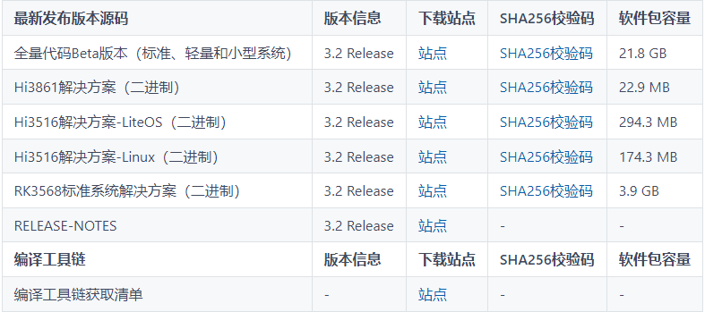

# 应用内字体大小调节（ArkTS）
## 介绍

本篇Codelab将介绍如何使用基础组件[Slider](https://gitee.com/openharmony/docs/blob/master/zh-cn/application-dev/reference/arkui-ts/ts-basic-components-slider.md)，通过拖动滑块调节应用内字体大小。要求完成以下功能：

1.  实现两个页面的UX：主页面和字体大小调节页面。
2.  拖动滑块改变字体大小系数，列表页和调节页面字体大小同步变化。往右拖动滑块字体变大，反之变小。
3.  字体大小支持持久化存储，再次启动时，应用内字体仍是调节后的字体大小。效果图如下所示：


### 相关概念

-   字体大小调节原理：通过组件Slider滑动，获取滑动数值，将这个值通过首选项进行持久化，页面的字体通过这个值去改变大小。
-   [首选项](https://gitee.com/openharmony/docs/blob/master/zh-cn/application-dev/reference/apis/js-apis-data-preferences.md)：首选项为应用提供Key-Value键值型的数据处理能力，支持应用持久化轻量级数据，并对其修改和查询。

## 环境搭建

### 软件要求

-   [DevEco Studio](https://gitee.com/openharmony/docs/blob/master/zh-cn/application-dev/quick-start/start-overview.md#%E5%B7%A5%E5%85%B7%E5%87%86%E5%A4%87)版本：DevEco Studio 3.1 Release及以上版本。
-   OpenHarmony SDK版本：API version 9及以上版本。

### 硬件要求

-   开发板类型：[润和RK3568开发板](https://gitee.com/openharmony/docs/blob/master/zh-cn/device-dev/quick-start/quickstart-appendix-rk3568.md)。
-   OpenHarmony系统：3.2 Release及以上版本。

### 环境搭建

完成本篇Codelab我们首先要完成开发环境的搭建，本示例以**RK3568**开发板为例，参照以下步骤进行：

1.  [获取OpenHarmony系统版本](https://gitee.com/openharmony/docs/blob/master/zh-cn/device-dev/get-code/sourcecode-acquire.md#%E8%8E%B7%E5%8F%96%E6%96%B9%E5%BC%8F3%E4%BB%8E%E9%95%9C%E5%83%8F%E7%AB%99%E7%82%B9%E8%8E%B7%E5%8F%96)：标准系统解决方案（二进制）。以3.2 Release版本为例：

    

2.  搭建烧录环境。
    1.  [完成DevEco Device Tool的安装](https://gitee.com/openharmony/docs/blob/master/zh-cn/device-dev/quick-start/quickstart-ide-env-win.md)
    2.  [完成RK3568开发板的烧录](https://gitee.com/openharmony/docs/blob/master/zh-cn/device-dev/quick-start/quickstart-ide-3568-burn.md)

3.  搭建开发环境。
    1.  开始前请参考[工具准备](https://gitee.com/openharmony/docs/blob/master/zh-cn/application-dev/quick-start/start-overview.md#%E5%B7%A5%E5%85%B7%E5%87%86%E5%A4%87)，完成DevEco Studio的安装和开发环境配置。
    2.  开发环境配置完成后，请参考[使用工程向导](https://gitee.com/openharmony/docs/blob/master/zh-cn/application-dev/quick-start/start-with-ets-stage.md#创建ets工程)创建工程（模板选择“Empty Ability”）。
    3.  工程创建完成后，选择使用[真机进行调测](https://gitee.com/openharmony/docs/blob/master/zh-cn/application-dev/quick-start/start-with-ets-stage.md#使用真机运行应用)。

## 代码结构解读

本篇Codelab只对核心代码进行讲解，对于完整代码，我们会在gitee中提供。

```
├──entry/src/main/ets                // 代码区
│  ├──common
│  │  ├──bean
│  │  │  ├──ChatData.ets             // 聊天列表数据类
│  │  │  ├──ItemDirection.ets        // 聊天数据位置
│  │  │  └──SettingData.ets          // 设置列表数据类
│  │  ├──constants
│  │  │  ├──CommonConstants.ets      // 公共常量类
│  │  │  └─StyleConstants.ets        // 属性常量类
│  │  ├──database
│  │  │  └──PreferencesUtil.ets      // 首选项数据操作工具类
│  │  └──utils
│  │     └──Logger.ets               // 日志工具类
│  ├──entryability
│  │  └──EntryAbility.ets            // 程序入口类
│  ├──pages
│  │  ├──HomePage.ets                // 主页面
│  │  └──SetFontSizePage.ets         // 字体大小调节页面
│  ├──view
│  │  ├──ChatItemComponent.ets       // 字体大小调节页面聊天Item组件
│  │  ├──SettingItemComponent.ets    // 主页面列表Item组件
│  │  └──TitleBarComponent.ets       // 页面标题栏组件
│  └──viewmodel
│     ├──HomeViewModel.ets           // 主页面数据模型
│     └──SetViewModel.ets            // 字体大小调节页面数据模型
└──entry/src/main/resources          // 资源文件目录
```

## 保存默认大小

应用初始化时，为了保证页面中文本的正常显示。在entryAbility生命周期onCreate方法处，添加一个命名为“myPreferences”的首选项表。在表中添加一个名为“appFontSize”的字段，保存默认字体大小。代码如下所示：

```typescript
// 导入首选项数据库
import dataPreferences from '@ohos.data.preferences';

// 先将Promise<Preferences>保存到全局
globalThis.getFontPreferences = (() => {
  let preferences: Promise<dataPreferences.Preferences> = dataPreferences.getPreferences(context, PREFERENCES_NAME);
  return preferences;
});
```

```typescript
// 保存默认字体大小
saveDefaultFontSize(fontSize: number) {
  globalThis.getFontPreferences().then((preferences) => {
    // 拿到preferences实例后，先判断是否存在该字段
    preferences.has(KEY_APP_FONT_SIZE).then(async (isExist) => {
      Logger.info(TAG, 'preferences has changeFontSize is ' + isExist);
      // 如果不存在，调用保存方法
      if (!isExist) {
        Logger.info(TAG, 'saveSize do not has exit...');
        // 将字体大小写入到preferences实例
        await preferences.put(KEY_APP_FONT_SIZE, fontSize);
        // 将preferences实例数据进行持久化
        preferences.flush();
      }
    }).catch((err) => {
      Logger.error(TAG, 'Has the value failed with err: ' + err);
    });
  }).catch((err) => {
    Logger.error(TAG, 'Get the preferences failed, err: ' + err);
  });
}
```

## 获取字体大小

在HomePage页面加载显示的时候，即生命周期onPageShow方法处，通过PreferencesUtil工具类中的getChangeFontSize方法读取首选项中的数据。

将读取到的数据保存到页面带有@State的变量中，通过这个变量对文本字体大小进行设置。代码如下所示：

```typescript
// HomePage.ets
onPageShow() {
  PreferencesUtil.getChangeFontSize().then((value) => {
    this.changeFontSize = value;
    Logger.info(TAG, 'Get the value of changeFontSize: ' + this.changeFontSize);
  })
}
...
Text('设置字体大小')
  .fontSize(this.changeFontSize + 'fp')
```

```typescript
// PreferencesUtil.ets工具类
async getChangeFontSize() {
  let fontSize: number = 0;
  const preferences = await globalThis.getFontPreferences();
  fontSize = await preferences.get(KEY_APP_FONT_SIZE, fontSize);
  return fontSize;
}
```

## 修改字体大小

在应用主页面，点击设置字体大小，可以跳转到字体大小调节页面。拖动滑块修改数据后，SetFontSizePage页面的Slider组件监听到onChange事件，改变字体大小后，调用PreferencesUtil工具类中saveChangeFontSize方法写入本条数据即可。代码如下所示：

```typescript
// SetFontSizePage.ets
Slider({
  value: this.changeFontSize === CommonConstants.SET_SIZE_HUGE
    ? CommonConstants.SET_SLIDER_MAX : this.changeFontSize,
  min: CommonConstants.SET_SLIDER_MIN,
  max: CommonConstants.SET_SLIDER_MAX,
  step: CommonConstants.SET_SLIDER_STEP,
  style: SliderStyle.InSet
})
  ...
  .onChange((value: number) => {
    // 获取改变后的字体大小
    this.changeFontSize = value === CommonConstants.SET_SLIDER_MAX ? CommonConstants.SET_SIZE_HUGE : value;
    // 获取字体大小的文本
    this.fontSizeText = SetViewModel.getTextByFontSize(this.changeFontSize);
    // 保存数据
    PreferencesUtil.saveChangeFontSize(this.changeFontSize);
  })
```

```typescript
// PreferencesUtil.ets工具类
saveChangeFontSize(fontSize: number) {
  globalThis.getFontPreferences().then(async (preferences) => {
    await preferences.put(KEY_APP_FONT_SIZE, fontSize);
    preferences.flush();
  }).catch((err) => {
    Logger.error(TAG, 'Get the preferences failed, err: ' + err);
  });
}
```

## 总结

您已经完成了本次Codelab的学习，并了解到以下知识点：

1.  使用Slider实现滑动条。
2.  使用首选项实现持久化应用轻量级数据。

