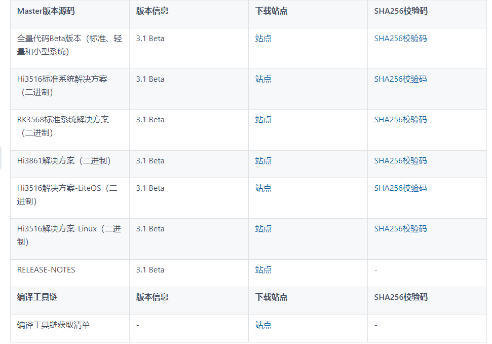
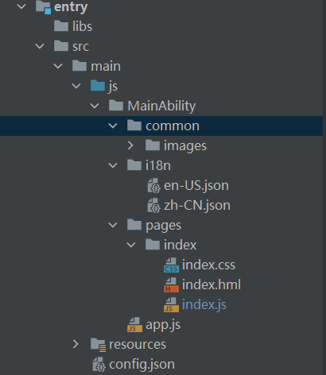
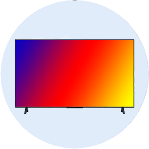

# 1.介绍

本文将介绍分布式游戏鉴权应用。操作过程为：

1.  设备A点击“开始游戏”按钮，开始搜索周边设备。
2.  设备A显示周边设备，点击设备B并发起连接请求，远程拉起设备B的FA。
3.  设备B收到请求后，选择是否允许“开启游戏”。
    -   选择允许，远程拉起设备A，并传递允许的信息，设备A解析了信息后自动开始游戏。
    -   选择不允许，远程拉起设备A，并传递不允许的信息，设备A回到最初的状态，并提示申请鉴权未通过。


效果图展示：


# 2.相关概念

[dialog](https://gitee.com/openharmony/docs/blob/master/zh-cn/application-dev/reference/arkui-js/js-components-container-dialog.md)

[弹窗](https://gitee.com/openharmony/docs/blob/master/zh-cn/application-dev/reference/apis/js-apis-prompt.md)

[FeatureAbility](https://gitee.com/openharmony/docs/blob/master/zh-cn/application-dev/reference/apis/js-apis-featureAbility.md)

# 3.搭建OpenHarmony环境

完成本篇Codelab我们首先要完成开发环境的搭建，本示例以**RK3568**开发板为例，参照以下步骤进行：

1. [获取OpenHarmony系统版本](https://gitee.com/openharmony/docs/blob/master/zh-cn/device-dev/get-code/sourcecode-acquire.md#%E8%8E%B7%E5%8F%96%E6%96%B9%E5%BC%8F3%E4%BB%8E%E9%95%9C%E5%83%8F%E7%AB%99%E7%82%B9%E8%8E%B7%E5%8F%96)：标准系统解决方案（二进制）。

   以3.1版本为例：

   

2. 搭建烧录环境。

    1.  [完成DevEco Device Tool的安装](https://gitee.com/openharmony/docs/blob/master/zh-cn/device-dev/quick-start/quickstart-standard-env-setup.md)
    2.  完成RK3568开发板的烧录

    -   [DevEco Device Tool编译源码烧录](https://device.harmonyos.com/cn/docs/documentation/guide/ide-rk3568-upload-0000001239220669)
    -   [每日构建版本烧录](https://gitee.com/openharmony/docs/blob/master/zh-cn/device-dev/quick-start/quickstart-standard-running-rk3568-burn.md)

3. 搭建开发环境。

    1.  开始前请参考[工具准备](https://gitee.com/openharmony/docs/blob/master/zh-cn/application-dev/quick-start/start-overview.md#%E5%B7%A5%E5%85%B7%E5%87%86%E5%A4%87)，完成DevEco Studio的安装和开发环境配置。
    2.  开发环境配置完成后，请参考[使用工程向导](https://gitee.com/openharmony/docs/blob/master/zh-cn/application-dev/quick-start/start-with-ets.md#%E5%88%9B%E5%BB%BAets%E5%B7%A5%E7%A8%8B)创建工程（模板选择“Empty Ability”），选择JS或者eTS语言开发。
    3.  工程创建完成后，选择使用[真机进行调测](https://gitee.com/openharmony/docs/blob/master/zh-cn/application-dev/quick-start/start-with-ets.md#%E4%BD%BF%E7%94%A8%E7%9C%9F%E6%9C%BA%E8%BF%90%E8%A1%8C%E5%BA%94%E7%94%A8)。

# 4.分布式组网

本章节以系统自带的音乐播放器为例（具体以实际的应用为准），介绍如何完成两台设备的分布式组网。

1. 硬件准备：准备两台烧录相同的版本系统的**RK3568**开发板A、B。

2. 开发板A、B连接同一个WiFi网络。

   打开设置--\>WLAN--\>点击右侧WiFi开关--\>点击目标WiFi并输入密码。

   

3. 将设备A，B设置为互相信任的设备。

    -   找到系统应用“音乐”。

   

    - 设备A打开音乐，点击左下角流转按钮，弹出列表框，在列表中会展示远端设备的id。

      

    - 选择远端设备B的id，另一台开发板（设备B）会弹出验证的选项框。

      

    - 设备B点击允许，设备B将会弹出随机PIN码，将设备B的PIN码输入到设备A的PIN码填入框中。

   

   配网完毕。

# 5.代码结构解读

本篇Codelab只对核心代码进行讲解，对于完整代码，我们会在参考中提供下载方式，整个工程的代码结构如下：



- common：存放公共资源

- pages：存放页面

  index.js：主页面

- config.json：配置文件

# 6.初始化页面

在本章节中，您将学会如何进行页面初始化。

1. 在data下定义需要使用的字段。

   ```
   data: {
     // 目标设备Id，用于记录申请过来的设备Id
     targetDeviceId: '',
     // 是否同意玩游戏
     isAgree: false,
     // 是否显示开始游戏图标
     showStart: false
   },
   ```

2. 根据Ability启动参数来判断页面被拉起的状态。

   在拉起页面时候，设置requestType为分布式拉起页面的业务请求类型（申请鉴权或者回复鉴权结果），如果没有requestType参数，则为手动拉起本机Ability。然后通过分析requestType参数的值来进行不同的业务逻辑操作。

   ```
   onInit() {
     // 获取Ability启动参数
     featureAbility.getWant().then((want) => {
       if (want.parameters !== undefined && want.parameters !== null && want.parameters !== '') {
         // 如果是请求授权被拉起Ability（requestType === 0），则记录申请权限的设备id
         if (want.parameters.requestType === 0) {
           this.isGame = false;
           this.targetDeviceId = want.parameters.localDeviceId;
         } else if (want.parameters.requestType === 1) {
           // 如果是授权后被拉起Ability（requestType === 1），则根据授权情况判断是否进行游戏
           if (want.parameters.isAgree !== null) {
             this.isAgree = want.parameters.isAgree;
             if (this.isAgree === true) {
               this.isGame = true;
               this.isStart = true;
               this.startGame();
             } else {
               this.showStart = true;
               prompt.showToast({
                 message: '申请授权未被允许',
                 duration: 5000
               });
             }
           }
           this.targetDeviceId = want.parameters.localDeviceId;
         } else {
           // 如果没有请求类型字段（requestType），则表明是手动启动的Ability，此时显示启动游戏图标
           this.showStart = true;
         }
       }
     });
   ```

# 7.显示鉴权设备

在本章节中，您将学会如何显示需要鉴权的设备列表。效果图如下：


1. 在index.js文件中，在data下定义deviceList数组，用来表示周边的设备。代码如下：

   ```
   export default {
     data: {
       //可授权的设备
       deviceList: []
     }
   }
   ```

2. 在index.hml文件中：

    -   定义一个"开始游戏"的button组件，设置startFA的点击事件；
    -   显示周边设备的对话框dialog，使用list 、list-item实现设备列表的展示；
    -   通过for属性遍历deviceList数组，$item是每一项的实例；
    -   给每一项设置selectDevice点击事件，参数为设备的networkId。

   代码如下：

   ```
   <div class="container">
       <button class="text-button" onclick="startFA">开始游戏</button>
       <dialog id="continueAbilityDialog" class="dialog-main" oncancel="cancelDialog">
           <div class="dialog-div">
               <text class="dialog_title_text">选择设备</text>
               <list class="dialog_device_list" divider="true">
                   <list-item for="{{ deviceList }}" class="device_list_item">
                       <div>
                           <label class="device_item_title" target="{{ $item.id }}">{{ $item.name }}</label>
                           <input class="device_item_radio" type="radio" checked="{{ $item.id === 'localhost' }}"
                                  id="{{ $item.id }}"
                                  name="radioSample" value="{{ $item.id }}"
                                  onchange="onRadioChange({{ $item.id }})"></input>
                       </div>
                   </list-item>
               </list>
               <div class="inner-btn">
                   <button class="dialog_cancel_button" type="text" value="取消" onclick="onDismissDialogClicked"></button>
               </div>
           </div>
       </dialog>
   </div>
   ```

3. 在index.css文件中，定义布局和样式。代码如下：

   ```
   .container {
       flex-direction: column;
       justify-content: center;
       align-items: center;
   }
   
   .text-button{
       background-color: #5959f1;
       color: #FFFFFF;
       text-align: center;
       font-size: 16px;
       width: 80px;
       height: 40px;
       border-radius: 8px;
   }
   
   .select-device-dialog {
       width: 90%;
       height: 33%;
   }
   
   .select-device-wrapper {
       margin: 5%;
       width: 90%;
       height: 90%;
       flex-direction: column;
   }
   
   .select-device-title {
       width: 100%;
       height: 20%;
       text-align: left;
       font-size: 20px;
   }
   
   .select-device-list {
       width: 100%;
       height: 60%;
       text-align: left;
       font-size: 15px;
   }
   
   .select-device-item {
       width: 100%;
       height: 33%;
   }
   
   .select-device-item-left {
       width: 100%;
       height: 100%;
       text-align: left;
       font-size: 16px;
   }
   
   .dialog-main {
       width: 500px;
   }
   
   .dialog-div {
       flex-direction: column;
       align-items: center;
   }
   
   .dialog_title_text {
       width: 434px;
       height: 80px;
       font-size: 32px;
       font-weight: 600;
   }
   
   .dialog_cancel_button {
       width: 100%;
       font-size: 32px;
   }
   ```

4. 在index.js文件中：

    - 定义createDeviceManager方法，获得设备管理器实例并进行获得同一网段下的所有在线设备；

      ```
      // 创建实例
        createDeviceManager() {
          if (dmClass !== null) {
            return;
          }
          deviceManager.createDeviceManager('com.huawei.cookbook', (err, data) => {
            if (err) {
              return;
            }
            subscribeId = Math.floor(Math.random() * 10000 + 1000);
            dmClass = data;
            dmClass.on('dmFaCallback', data => this.log('dmFaCallback on:' + JSON.stringify(data)));
            dmClass.on('deviceStateChange', mFilterOption, data => this.log('deviceStateChange on:' + JSON.stringify(data)));
            dmClass.on('deviceFound', data => this.log('deviceFound on:' + JSON.stringify(data)));
            dmClass.on('discoverFail', data => this.log('discoverFail on:' + JSON.stringify(data)));
            dmClass.on('serviceDie', data => this.log('serviceDie on:' + JSON.stringify(data)));
            this.getLocalDeviceInfoSync();
            const deviceInfoList = dmClass.getTrustedDeviceListSync();
            const list = [];
            list[0] = DEVICE_LIST_LOCALHOST;
            if (deviceInfoList.length > 0) {
              for (let i = 0; i < deviceInfoList.length; i++) {
                list[i + 1] = {
                  name: deviceInfoList[i].deviceName,
                  id: deviceInfoList[i].deviceId
                };
              }
            }
            this.deviceList = list;
          });
        },
      ```

    - 定义getLocalDeviceInfoSync方法，获取本设备信息；

      ```
      getLocalDeviceInfoSync() {
          if (dmClass != null) {
            deviceInfo = dmClass.getLocalDeviceInfoSync();
          } else {
            prompt.showToast({
              message: '请先初始化'
            });
          }
        },
      ```

    - 将获取到的同一网段下的所有在线设备信息放入deviceList数组中；

    - 通过this.$element\('showDialog'\)找到hml文件中dialog组件，调用show\(\)方法显示对话框。

# 8.鉴权申请与回应

在本章节中，您将学会如何从设备A拉起设备B的FA，并将设备A的标识信息发送给设备B。效果图如下：


申请鉴权（同意游戏）


申请鉴权（拒绝游戏）

1. 设备A点击开始游戏，显示可以进行鉴权申请的设备列表，并选中设备申请游戏鉴权

    1. 定义startFa方法，用以显示设备列表对话框；

       ```
       startFA() {
           this.$element('continueAbilityDialog').show();
         },
       ```

    2. 定义onRadioChange方法，用以监听选择的设备变化；

       ```
       onRadioChange(inputValue, e) {
           if (inputValue === e.value) {
             if (e.value === 'localhost') {
               this.$element('continueAbilityDialog').close();
               return;
             }
             if (this.deviceList.length > 0) {
               for (let i = 0; i < this.deviceList.length; i++) {
                 if (this.deviceList[i].id === e.value) {
                   this.startAbilityContinuation(this.deviceList[i].id, this.deviceList[i].name);
                 }
               }
             }
           }
         },
       ```

    3. 定义startAbilityContinuation方法，用以申请鉴权；

       ```
       startAbilityContinuation(deviceId, deviceName) {
           this.$element('continueAbilityDialog').close();
           const wantValue = {
             bundleName: 'com.huawei.cookbook',
             abilityName: 'com.huawei.gameauthopenh.MainAbility',
             deviceId: deviceId,
             // localDeviceId：申请设备的id，requestType，请求类型：0，申请鉴权
             parameters: {'localDeviceId': deviceInfo.deviceId, 'requestType': 0}
           };
       
           featureAbility.startAbility({
             want: wantValue
           }).then((data) => {
             // 销毁自身Ability
             featureAbility.terminateSelf();
           });
         },
       ```

2. 设备B被设备A分布式拉起，对游戏进行授权

    1. index.hml页面添加div用以显示授权选项；

       ```
       <div class="div-permit" if="{{!isGame}}" >
           <text class="text-title">来自远程合成设备小游戏权限请求，是否允许?</text>
           <div class="div-button"  >
               <text class="text-allow" onclick="responds(true)">允许</text>
               <text class="text-reject" onclick="responds(false)">不允许</text>
           </div>
       </div>
       ```

    2. 定义responds方法用以反馈鉴权结果，并分布式拉起设备A的Ability；

       ```
       responds(value) {
           const wantValue = {
             bundleName: 'com.huawei.cookbook',
             abilityName: 'com.huawei.gameauthopenh.MainAbility',
             deviceId: this.targetDeviceId,
             parameters: {'localDeviceId': deviceInfo.deviceId, 'requestType': 1, 'isAgree': value}
           };
           featureAbility.startAbility({
             want: wantValue
           }).then((data) => {
             console.info('featureAbility.startAbility finished, ' + JSON.stringify(data));
             featureAbility.terminateSelf();
           });
         },
       ```

3. 设备A被分布式拉起并解析鉴权结果，并根据结果执行不同的操作；

   在onInit方法中调用featureAbility.getWant\(\)来获取启动信息并根据启动信息判断游戏申请是否被拒绝；

   ```
   onInit() {
     ...
     // 获取Ability启动参数
     featureAbility.getWant().then((want) => {
       if (want.parameters !== undefined && want.parameters !== null && want.parameters !== '') {
         // 如果是请求授权被拉起Ability（requestType === 0），则记录申请权限的设备id
         if (want.parameters.requestType === 0) {
           this.isGame = false;
           this.targetDeviceId = want.parameters.localDeviceId;
         } else if (want.parameters.requestType === 1) {
           // 如果是授权后被拉起Ability（requestType === 1），则根据授权情况判断是否进行游戏
           if (want.parameters.isAgree !== null) {
             this.isAgree = want.parameters.isAgree;
             if (this.isAgree === true) {
               this.isGame = true;
               this.isStart = true;
               this.startGame();
             } else {
               this.showStart = true;
               prompt.showToast({
                 message: '申请授权未被允许',
                 duration: 5000
               });
             }
           }
           this.targetDeviceId = want.parameters.localDeviceId;
         } else {
           // 如果没有请求类型字段（requestType），则表明是手动启动的Ability，此时显示启动游戏图标
           this.showStart = true;
         }
       }
     });
     ...
   },
   ```

4. index.css文件新增内容如下：

   ```
   .div-permit{
       flex-direction: column;
       justify-content: center;
       align-items: center;
       width: 100%;
       height: 100%;
   }
   .div-button{
       flex-direction: row;
       justify-content: center;
       align-items: center;
   }
   .text-title{
       color: #222222;
       font-size: 22px;
       align-items: center;
       align-content: center;
       margin: 20px;
   }
   .text-allow{
       color: #3E7BDE;
       font-size: 18px;
       margin-right: 10px;
   }
   .text-reject{
       color: #212121;
       font-size: 18px;
       margin-left: 10px;
   }
   ```

# 9.游戏：图形的运动、碰撞与合成

-   [图形的运动](#section187941120145510)
-   [图形的碰撞与合成](#section66477253562)

如下图所示，按照从左到右的顺序，相同的图形碰撞合成下一个图形，最终合成OpenHarmony图形。

      

效果图预览：


## 图形的运动

1. 在index.js的data下定义图片资源数组imgArray和显示在屏幕中图片的数组modes。代码如下：

   ```
   export default {
     data: {
       // 图片数组
       imgArray: ['common/images/product0.png', 'common/images/product1.png',
         'common/images/product2.png', 'common/images/product3.png',
         'common/images/product4.png', 'common/images/product5.png',
         'common/images/product6.png'],
       //在屏幕中出现的数据
       modes: [],
     }
   }
   ```

   modes添加数据模型格式为：要显示的图形路径src、图形的宽度width、图形的高度height、图形的等级level\(用于区分不同的图形\)，以及图形的左坐标left、顶部坐标top和其在x、y方向上的速度。新增一个数据模型到数组中，代码如下：

   ```
   addNewData() {
     var index = Math.floor(Math.random() * 4);
     var src = this.imgArray[index];
     var width = 50 + index * 10;
     var height = 50 + index * 10;
   
     this.modes.push({
       level: index,
       width: width,
       height: height,
       src: src,
       top: 0,
       left: 120,
       speedX: 0,
       speedY: 10,
     })
   }
   ```

2. 在index.hml文件中，遍历modes数组，用Image组件显示图形，只需要动态更改class、style、src等属性即可。代码如下：

   ```
   <div class="div-image" if="{{isStart}}">
       <image for="{{ (index, item) in modes }}"
              class="product{{ item.level }}"
              style="top : {{ item.top }}; left : {{ item.left }}" src="{{ item.src }} "/>
   </div>
   ```

   对应的index.css新增内容如下：

   ```
   .div-image{
       flex-direction: column;
       justify-content: flex-start;
       align-items: flex-start;
       width: 100%;
       height: 100%;
   }
   
   .product0{
       width: 50px;
       height: 50px;
       position: absolute;
   }
   .product1{
       width: 60px;
       height: 60px;
       position: absolute;
   }
   .product2{
       width: 70px;
       height: 70px;
       position: absolute;
   }
   .product3{
       width: 80px;
       height: 80px;
       position: absolute;
   }
   .product4{
       width: 90px;
       height: 90px;
       position: absolute;
   }
   .product5{
       width: 100px;
       height: 100px;
       position: absolute;
   }
   .product6{
       width: 110px;
       height: 110px;
       position: absolute;
   }
   ```

3. 使用setInterval\(\)开启定时器，反复执行excuteTask\(\)方法，该方法用来计算图形的运动。图形的移动主要是将图形的顶部top和左侧left的坐标值，每次递增各自的x、y方向的速度值。部分代码如下：

   ```
   export default {
     startGame(){
       addNewData();
       intervalId = setInterval(this.excuteTask, 50);
     },
     excuteTask(){     
       this.modes.forEach(item => {
         item.top += item.speedY;
         item.left += item.speedX;
       });
     }
   }
   ```


## 图形的碰撞与合成

这部分仅介绍核心的思路，具体的实现过程读者可自行完成，其达到的效果图如下：


1. 两个图形若满足它们的的圆心距离小于它们半径的总和，则认为它们发生了碰撞。部分代码如下：

   ```
   isCollision(run, other) {
     var runCenterX = run.left + run.width / 2;
     var runCenterY = run.top + run.width / 2;
     var otherCenterX = other.left + other.width / 2;
     var otherCenterY = other.top + other.width / 2;
     var distance = Math.sqrt(Math.abs(runCenterX - otherCenterX) * Math.abs(runCenterX - otherCenterX) +
     Math.abs(runCenterY - otherCenterY) * Math.abs(runCenterY - otherCenterY));
     if (distance < (run.width + other.width) / 2) {     return true;
     }
     return false;
   }
   ```

2. 通过判断两个图形的等级level值是否相等，若相等就可以进行合成。部分代码如下：

   ```
   isCompose( productA,  productB) {
     return productA.level == productB.level;
   }
   ```

# 10.恭喜你

通过本篇Codelab，您可以学到：

-   JS如何分布式拉起FA
-   Ability启动模式

# 11.参考

[gitee地址](https://gitee.com/openharmony/codelabs/tree/master/Distributed/GameAuthOpenH)