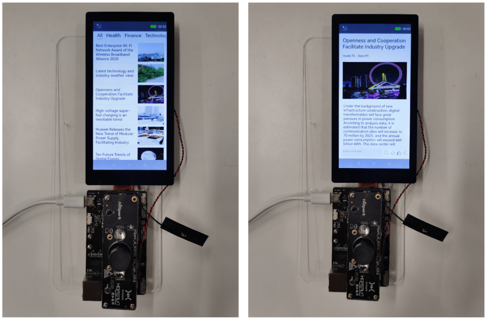
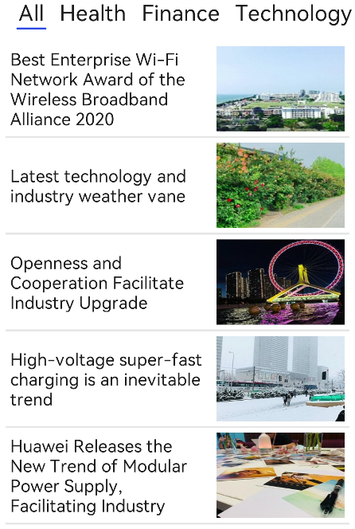
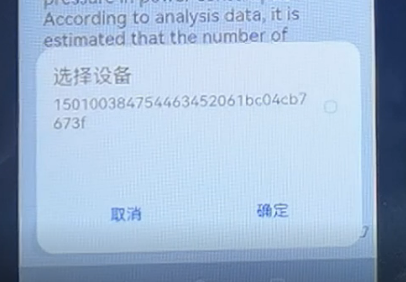

# NewsDemoOpenHarmony
# 介绍<a name="ZH-CN_TOPIC_0000001206603661"></a>

本篇Codelab我们将教会大家如何构建一个简易的OpenHarmony新闻客户端（JS版本）。应用包含两级页面，分别是主页面和详情页面，两个页面都展示了丰富的UI组件，其中详情页的实现逻辑中还展示了如何通过调用相应接口，实现跨设备拉起FA。本教程将结合以下内容进行讲解：

1．顶部tabs以及新闻列表list的使用

2．每条新闻的文本框以及图像

3．布局及页面跳转

4．设备发现以及跨设备拉起FA

**最终效果预览如下图所示：**



# 搭建OpenHarmony环境<a name="ZH-CN_TOPIC_0000001161043690"></a>

完成本篇Codelab我们首先要完成开发环境的搭建，本示例以**Hi3516DV300**开发板为例，参照以下步骤进行：

1. [获取OpenHarmony系统版本](https://gitee.com/openharmony/docs/blob/master/zh-cn/device-dev/get-code/sourcecode-acquire.md#%E8%8E%B7%E5%8F%96%E6%96%B9%E5%BC%8F3%E4%BB%8E%E9%95%9C%E5%83%8F%E7%AB%99%E7%82%B9%E8%8E%B7%E5%8F%96)：标准系统解决方案（二进制）。

2. 搭建烧录环境：

   1.  [完成DevEco Device Tool的安装](https://device.harmonyos.com/cn/docs/documentation/guide/install_windows-0000001050164976)

   2.  [完成Hi3516开发板的烧录](https://device.harmonyos.com/cn/docs/documentation/guide/hi3516_upload-0000001052148681)

3. 搭建开发环境：

   1. 开始前请参考[下载与安装软件](https://developer.harmonyos.com/cn/docs/documentation/doc-guides/software_install-0000001053582415)、[配置开发环境](https://gitee.com/openharmony/docs/blob/master/zh-cn/application-dev/quick-start/configuring-openharmony-sdk.md)，完成DevEco Studio的安装和开发环境配置。

   2. 开发环境配置完成后，请参考[使用工程工程向导](https://gitee.com/openharmony/docs/blob/master/zh-cn/application-dev/quick-start/use-wizard-to-create-project.md)创建工程，使用JS或者eTS语言开发、“Application”为例，模板选择“\[Standard\]Empty Ability”。

   3. 工程创建完成后，可参考下面章节进行代码编写，使用真机进行调测：

      -   [配置OpenHarmony应用签名信息](https://gitee.com/openharmony/docs/blob/master/zh-cn/application-dev/quick-start/configuring-openharmony-app-signature.md)
      -   [hap包安装指导](https://gitee.com/openharmony/docs/blob/master/zh-cn/application-dev/quick-start/installing-openharmony-app.md)
      -   工程示例：

      
# 分布式组网<a name="ZH-CN_TOPIC_0000001192921592"></a>

完成本篇Codelab我们还需要完成开发板的分布式组网，本示例以**Hi3516DV300**开发板为例，参照以下步骤进行：

1. 硬件准备：准备两台烧录相同的版本系统的**Hi3516DV300**开发板A、B。

2. 两个开发板A、B配置在同一个WiFi网络之下。

   打开设置--\>WLAN--\>点击右侧WiFi开关--\>点击目标WiFi并输入密码。

   

3. 将设备A、B设置为互相信任的设备。

   -  找到系统应用“音乐”。

     

   - 设备A打开音乐，点击左下角带箭头的流转按钮，弹出列表框，在列表中会展示远端设备的id。

     

   - 选择远端设备B的id，另一台开发板（设备B）会弹出验证的选项框。

     

   - 设备B点击允许，设备B将会弹出随机PIN码，将设备B的PIN码输入到设备A的PIN码填入框中。

     

   配网完毕。

# 代码结构解读<a name="ZH-CN_TOPIC_0000001161203642"></a>

本篇Codelab只对核心代码进行讲解，对于完整代码，我们会在最后的参考中提供下载方式，接下来我们会用一小节来讲解整个工程的代码结构：


-   images：存放工程使用到的图片资源。
-   index：构成新闻列表页面，包括index.hml布局文件、index.css样式文件、index.js逻辑处理文件。
-   detail：构成新闻详情页面，包括detail.hml布局文件、detail.css样式文件、detail.js逻辑处理文件。
-   config.json：配置文件。

# 添加主页新闻类型<a name="ZH-CN_TOPIC_0000001206603663"></a>

首先为我们的应用添加顶部新闻类型，用于切换不同类别的新闻。这里会使用到tabs、tab-bar控件，同时使用for循环对新闻的title进行遍历，新闻的标题有All、Health、Finance、Technology、Sport、Internet、Game七大类。图片示例和代码如下：


```
<div class="container">
    <tabs index="0" vertical="false" onchange="changeNewsType">
        <tab-bar class="tab-bar" mode="scrollable">
            <text class="tab-text" for="{{ title in titleList }}">{{ title.name }} </text>
        </tab-bar>
    </tabs>
</div>
```
# 添加主页顶部新闻类型<a name="ZH-CN_TOPIC_0000001206763653"></a>

1. 我们需要实现一个新闻item的布局，其样式包含左边的新闻标题、右边的新闻图片以及下方的新闻分割线，图片示例和代码如下：

   

   ```
   <div style="flex-direction : column">
       <div style="flex-direction : row">
             <text class="text">
                 {{ news.title }}
             </text>
             <image class="image" src="{{ news.imgUrl }}">
                 </image>
             </div>
        <div style="height : 2px; width : 100%; background-color : #97d2d4d4;">
        </div>
    </div>
   ```

2. 我们需要实现一个新闻列表，也就是将上方的新闻item进行一个循环的展示，这需要用到list、list-item的相关知识点。我们需要将newsList新闻列表数据进行循环，所以新闻item的布局外层需要嵌套一个list和list-item，图片示例和代码如下：

   

   ```
   <list class="list">
       <list-item for="{{ news in newsList }}" onclick="itemClick(news)">
              // 新闻item的布局代码填充到这里         
       </list-item>
   </list>
   ```

3. 我们需要实现新闻类型的切换，每一条新闻都会有一个新闻类型，当选择All的时候默认展示所有类型的新闻，当选择具体的新闻类型时，如选择Health，则需要筛选出属于Health类型的新闻进行展示。添加一个自定义函数changeNewsType，代码如下所示：

   ```
   // 选择新闻类型
   changeNewsType: function (e) {
     const type = titles[e.index].name;
     this.newsList = [];
     if (type === 'All') {
       // 展示全部新闻
       this.newsList = newsData;
     } else {
       // 分类展示新闻
       const newsArray = [];
       for (var news of newsData) {
          if (news.type === type) {
             newsArray.push(news);
         }
       }
       this.newsList = newsArray;
     }
   }
   ```
# 详情页页面布局<a name="ZH-CN_TOPIC_0000001160725160"></a>

详情页面包含新闻标题、阅读量和喜好数、新闻图片、新闻文字以及下方的状态栏。状态栏包括1个可输入文本框和4个功能按键，图片示例和代码如下：


```
<div class="container">
    <text class="text-title">{{ title }}</text>
    <text class="text-reads">reads: {{ reads }}   likes: {{ likes }}</text>
    <image class="image" src="{{ imgUrl }}"></image>
    <text class="text-content">
        {{ content }}
    </text>
    <!-- 详情页底部-->
    <div class="bottom">
        <textarea class="textarea" placeholder="Enter a comment."></textarea>
        <image class="image-bottom" src="/common/images/icon_message.png"></image>
        <image class="image-bottom" src="/common/images/icon_star.png"></image>
        <image class="image-bottom" src="/common/images/icon_good.png"></image>
        <image class="image-bottom" src="/common/images/icon_share.png" onclick="toShare"></image>
    </div>
</div>
```

需要注意的是detail.hml只是展示了页面的布局结构，其具体的布局样式需要参考detail.css文件。

# 跳转详情页<a name="ZH-CN_TOPIC_0000001160885148"></a>

完成新闻列表页面和详情页的布局后，需要实现页面跳转的功能。新闻列表页面中绑定一个list-item的点击事件itemClick，其中传入的参数是news（新闻的详细数据）。

```
<list-item for="{{ news in newsList }}" onclick="itemClick(news)">
```

在JS中页面跳转需要在JS文件的头部引入如下一行代码：

```
import router from '@system.router';
```

实现list-item的点击事件itemClick，其代码如下所示：

```
itemClick(news) {
  // 跳转到详情页面
  router.push({
    uri: 'pages/detail/detail',
    params: {
      'title': news.title,
      'type': news.type,
      'imgUrl': news.imgUrl,
      'reads': news.reads,
      'likes': news.likes,
      'content': news.content
    }
  });
}
```
# 设备发现<a name="ZH-CN_TOPIC_0000001161044046"></a>

首先给分享按钮添加一个分享事件toShare，代码如下所示：

```
<image class="image-bottom" src="/common/images/icon_share.png" onclick="toShare"></image>
```

然后调用getTrustedDeviceListSync\(\)，获取所有可信设备的列表，代码如下所示：

```
import deviceManager from '@ohos.distributedHardware.deviceManager';

toShare() {
    // 创建设备管理实例
    deviceManager.createDeviceManager('com.huawei.codelab', (err, data) => {
      if (err) {
        return;
      }
      this.deviceMag = data;
      // 获取所有可信设备的列表
      this.deviceList = this.deviceMag.getTrustedDeviceListSync();
    });
    // 循环遍历设备列表,获取设备名称和设备Id
    for (let i = 0; i < this.deviceList.length; i++) {
      this.deviceList[i] = {
        deviceName: this.deviceList[i].deviceName,
        deviceId: this.deviceList[i].deviceId,
        checked: false
      };
    }
    this.$element('showDialog').show();
  }
```

最后自定义dialog弹窗显示所有可信设备，代码如下所示：

```
<dialog id="showDialog" class="select-device-dialog">
    <div class="select-device-wrapper">
        <text class="select-device-title">选择设备</text>
        <list class="select-device-list">
            <list-item class="select-device-item" for="{{ deviceList }}" id="list">
                <text class="select-device-item-left">{{ $item.deviceName }}
                </text>
                <input class="select-device-item-right" type="checkbox" name="Device" value="{{$idx}}"
                       @change="selectDevice({{$idx}})" checked="{{$item.checked}}">
                </input>
            </list-item>
        </list>
        <div class="choose-ok-or-not">
            <text class="select-device-btn" @click="chooseCancel">取消</text>
            <text class="select-device-btn" @click="chooseComform">确定</text>
         </div>
    </div>
</dialog>
```

最终实现的效果如下所示：



> **说明：** 
>本工程项目包含getTrustedDeviceListSync\(\)获取所有可信设备的列表方法，请选择API 7或以上版本。
# 分布式拉起<a name="ZH-CN_TOPIC_0000001161203992"></a>

弹出设备列表后，选择设备并点击“确定”按钮，将会分布式拉起另外一台设备，其具体实现代码如下所示：

```
chooseComform() {
    this.$element('showDialog').close();
    for (let i = 0; i < this.deviceList.length; i++) {
      // 判断设备是否被选中
      if (this.deviceList[i].checked) {
      const params = {
        url: 'pages/detail/detail',
        title: this.title,
        type: this.type,
        imgUrl: this.imgUrl,
        reads: this.reads,
        likes: this.likes,
        content: this.content,
      };

      const wantValue = {
        bundleName: 'com.huawei.newsdemooh',
        abilityName: 'com.huawei.newsdemooh.MainAbility',
        deviceId: this.deviceList[i].deviceId,
        parameters: params
      };

      featureAbility.startAbility({
        want: wantValue
      }).then((data) => {
        console.info('featureAbility.startAbility finished, ' + JSON.stringify(data));
      });
      console.info('featureAbility.startAbility want=' + JSON.stringify(wantValue));
      console.info('featureAbility.startAbility end');
      }
    }
}
```
# 回顾和总结<a name="ZH-CN_TOPIC_0000001206604011"></a>

本篇Codelab中我们介绍了应用的主页面和详情页。在主页面可以切换新闻类型、滑动新闻列表、点击查看新闻详情；在新闻详情页可以上下滑动查看新闻，并且跨设备拉起。

需要说明的是，本篇codelab是采用JS作为主要编程语言，其中分布式的相关实现也是用的JS提供的相关接口来实现的。
# 恭喜你<a name="ZH-CN_TOPIC_0000001206764005"></a>

目前你已经成功完成了Codelab并且学到了：

-   如何将一个JS项目部署到OpenHarmony设备上。

-   如何使用list、list-item、tabs、tab-bar等组件。
-   如何进行布局编写及页面跳转。
-   如何进行跨设备分布式拉起。
# 参考<a name="ZH-CN_TOPIC_0000001160885580"></a>

[gitee源码](https://gitee.com/openharmony/codelabs/tree/master/Distributed/NewsDemo)


