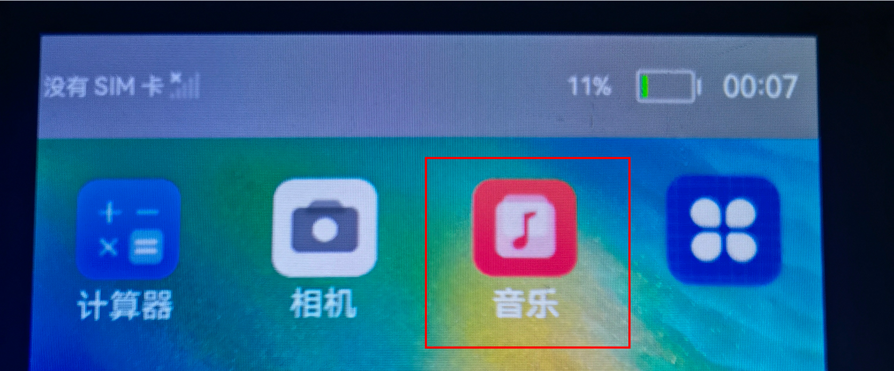
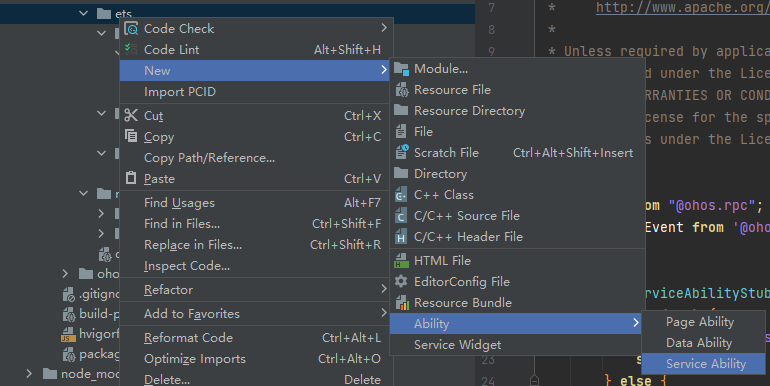

# 概述<a name="ZH-CN_TOPIC_0000001204484230"></a>

本篇Codelab是基于TS扩展的声明式开发范式编程语言编写的一个分布式益智拼图游戏，可以两台设备同时开启一局拼图游戏，每次点击九宫格内的图片，都会同步更新两台设备的图片位置。效果图如下：


> **说明：** 
>本示例涉及使用系统接口，需要手动替换Full SDK才能编译通过，具体操作可参考[替换指南](https://gitee.com/openharmony/docs/blob/master/zh-cn/application-dev/quick-start/full-sdk-switch-guide.md)。

# 搭建OpenHarmony环境<a name="ZH-CN_TOPIC_0000001204328298"></a>

完成本篇Codelab我们首先要完成开发环境的搭建，本示例以**Hi3516DV300**开发板为例，参照以下步骤进行：

1. [获取OpenHarmony系统版本](https://gitee.com/openharmony/docs/blob/master/zh-cn/device-dev/get-code/sourcecode-acquire.md#%E8%8E%B7%E5%8F%96%E6%96%B9%E5%BC%8F3%E4%BB%8E%E9%95%9C%E5%83%8F%E7%AB%99%E7%82%B9%E8%8E%B7%E5%8F%96)：标准系统解决方案（二进制）。

   以3.0版本为例：

   

2. 搭建烧录环境。

   1.  [完成DevEco Device Tool的安装](https://gitee.com/openharmony/docs/blob/master/zh-cn/device-dev/quick-start/quickstart-ide-env-win.md)
   2.  [完成Hi3516开发板的烧录](https://gitee.com/openharmony/docs/blob/master/zh-cn/device-dev/quick-start/quickstart-ide-3516-burn.md)
3. 搭建开发环境。

    1.  开始前请参考[工具准备](https://gitee.com/openharmony/docs/blob/master/zh-cn/application-dev/quick-start/start-overview.md#%E5%B7%A5%E5%85%B7%E5%87%86%E5%A4%87)，完成DevEco Studio的安装和开发环境配置。
    2.  开发环境配置完成后，请参考[使用工程向导](https://gitee.com/openharmony/docs/blob/master/zh-cn/application-dev/quick-start/start-with-ets-fa.md#%E5%88%9B%E5%BB%BAets%E5%B7%A5%E7%A8%8B)创建工程（模板选择“Empty Ability”），选择JS或者eTS语言开发。
    3.  工程创建完成后，选择使用[真机进行调测](https://gitee.com/openharmony/docs/blob/master/zh-cn/application-dev/quick-start/start-with-ets-fa.md#%E4%BD%BF%E7%94%A8%E7%9C%9F%E6%9C%BA%E8%BF%90%E8%A1%8C%E5%BA%94%E7%94%A8)。

# 分布式组网<a name="ZH-CN_TOPIC_0000001204488438"></a>

本章节以系统自带的音乐播放器为例（具体以实际的应用为准），介绍如何完成两台设备的分布式组网。

1. 硬件准备：准备两台烧录相同的版本系统的**Hi3516DV300**开发板A、B。

2. 开发板A、B连接同一个WiFi网络。

   打开设置--\>WLAN--\>点击右侧WiFi开关--\>点击目标WiFi并输入密码。

   

3. 将设备A，B设置为互相信任的设备。

   -   找到系统应用“音乐”。

   

   - 设备A打开音乐，点击左下角流转按钮，弹出列表框，在列表中会展示远端设备的id。

     

   - 选择远端设备B的id，另一台开发板（设备B）会弹出验证的选项框。

     

   - 设备B点击允许，设备B将会弹出随机PIN码，将设备B的PIN码输入到设备A的PIN码填入框中。

   

   配网完毕。

# 代码结构解读<a name="ZH-CN_TOPIC_0000001248764277"></a>

本篇Codelab只对核心代码进行讲解，首先来介绍下整个工程的代码结构：


-   MainAbility：存放应用主页面。
    -   pages/index.ets：应用主页面。

-   model：存放获取组网内的设备列表相关文件。
    -   RemoteDeviceModel.ets：获取组网内的设备列表。

-   ServiceAbility：存放ServiceAbility相关文件。
    -   service.ts：service服务，创建一个ServiceAbility，用于跨设备连接后通讯。

-   resources ：存放工程使用到的资源文件。
    -   resources/rawfile：存放工程中使用的图片资源文件。

-   config.json：配置文件。

# 实现页面布局和样式<a name="ZH-CN_TOPIC_0000001204324270"></a>

在本章节中，您将学会如何制作一个简单的拼图游戏。

1. 实现主页面布局和样式。

   - 在MainAbility/pages/index.ets 主界面文件中添加入口组件PictureGame。PictureGame组件页面布局代码如下：

     ```
     // 入口组件
     @Entry
     @Component
     struct PictureGame {
       @Provide imageIndexForPosition: number[] = []
       @Provide pictureList: string[]= []
       build() {
         Column() {
           Text("益智拼图游戏").fontSize(40).margin({ top: 30, bottom: 30 })
           PictureGrid()
           Row() {
             Button("重新开始").fontSize(20).margin({ right: 10 }).onClick(() => {
               ...
             })
             Button("亲子协同").fontSize(20).margin({ left: 10 }).onClick(()=>{
               ...
             })
           }.margin(30)
           Image($rawfile('picture.jpg')).width(300).height(300)
     
         }
         .width('100%')
         .height('100%')
       }
     }
     
     ```

   - 给PictureGame组件添加九宫格拼图子组件PictureGrid。PictureGrid九宫格拼图组件主要是由[Grid组件](https://gitee.com/openharmony/docs/blob/master/zh-cn/application-dev/reference/arkui-ts/ts-container-grid.md)、[GridItem组件](https://gitee.com/openharmony/docs/blob/master/zh-cn/application-dev/reference/arkui-ts/ts-container-griditem.md)和[Image组件](https://gitee.com/openharmony/docs/blob/master/zh-cn/application-dev/reference/arkui-ts/ts-basic-components-image.md)构成，页面布局代码如下：

     ```
     // 九宮格拼图组件
     @Component
     struct PictureGrid {
       private gridRowTemplate: string = ''
       @Consume imageIndexForPosition : number[]
       @Consume pictureList: string[]
       private heightValue: number
     
       aboutToAppear() {
         var rows = Math.round(this.pictureList.length / 3);
         this.gridRowTemplate = '1fr '.repeat(rows);
         this.heightValue = rows * 101 ;
       }
     
       build() {
         Column() {
           Grid() {
             ForEach(this.pictureList.map((item,index)=>{return {i:index,data:item};}),(item,index) => {
               GridItem() {
                 Image($rawfile(this.pictureList[item.i]))
                   .width(100)
                   .height(100)
                   .onClick(() => {
                    ...
                   })
               }
             }, (item: string) => item.toString())
           }
           .rowsTemplate(this.gridRowTemplate)
           .columnsTemplate('1fr 1fr 1fr')
           .columnsGap(1)
           .rowsGap(1)
           .height(this.heightValue)
           .width(303)
         }
       }
     }
     ```

     在入口组件的生命周期函数aboutToAppear\(\)中调用onRandom\(\)方法，初始化imageIndexForPosition数组。如果Ability是被其他设备拉起的，在aboutToAppear\(\)中调用featureAbility.getWant\(\)，可通过want中的参数重新初始化imageIndexForPosition数组和pictureList数组，入口组件的生命周期函数aboutToAppear\(\)代码如下：

     ```
     async aboutToAppear() {
       let self =this;
       this.onRandom();
       // 当被拉起时，通过want传递的参数同步对端界面UI
       await featureAbility.getWant((error, want) => {
         var status = want.parameters;
         if(want.parameters.pictureList){
           self.pictureList = JSON.parse(status.pictureList)
           self.imageIndexForPosition = status.imageIndexForPosition;
           // 远端被拉起后，连接对端的service
           if(want.parameters.remoteDeviceId) {
             let remoteDeviceId = want.parameters.remoteDeviceId
             onConnectRemoteService(remoteDeviceId)
           }
         }
       });
     }
     ```

2. 给"重新开始"按钮添加点击事件。

   点击"重新开始"按钮，调用onRandom\(\)方法，打乱图片现阶段排列顺序，在onRandom\(\)调用setupRandomPosition\(\)方法，初始化imageIndexForPosition数组，onRandom\(\)和setupRandomPosition\(\)代码如下：

   ```
   onRandom() {
     this.setupRandomPosition();
     this.pictureList = []
     this.imageIndexForPosition.forEach(value => {
       if (value == 9) {
         this.pictureList.push("--")
       } else {
         this.pictureList.push(`picture_0` + value + `.png`)
       }
     });
   }
   // 初始化imageIndexForPosition数组
   setupRandomPosition() {
     let list1 = [5, 4, 3, 9, 1, 8, 6, 7, 2];
     let list2 = [3, 1, 6, 7, 9, 8, 4, 2, 5];
     let list3 = [4, 8, 3, 5, 2, 7, 9, 1, 6];
     let list4 = [4, 3, 5, 2, 8, 7, 6, 1, 9];
     let lists = [list1, list2, list3, list4];
     this.imageIndexForPosition = lists[Math.floor(Math.random() * 4)];
   }
   ```

3. 给九宫格内的每张图片添加点击事件。

   点击九宫格内的图片，调用onchange\(\)方法，每一次点击后，需要调用onFinish\(\)方法校验当前imageIndexForPosition 中的元素是否是从小到大排列。其中onChange\(\)和onFinish\(\)方法代码如下

   ```
   onChange(index) {
     let self = this;
     // 相邻位置数组
     let menu = {
       "1": [2, 4],
       "2": [1, 3, 5],
       "3": [2, 6],
       "4": [1, 5, 7],
       "5": [2, 4, 6, 8],
       "6": [3, 5, 9],
       "7": [4, 8],
       "8": [5, 7, 9],
       "9": [6, 8]
     }
     // 被点击的图片位置
     let click_num = index + 1;
     // 空白图片位置
     let no_see_num = self.imageIndexForPosition.indexOf(9) + 1;
     // 获取点击后能够移动的图片位置
     let arr = menu[no_see_num];
     // 判断arr是否包含点击的图片
     if(arr.length==2){
       if (!(arr[0]==click_num||arr[1]==click_num)) {
   
       } else {
         let temp = self.imageIndexForPosition[no_see_num - 1];
         self.imageIndexForPosition[no_see_num - 1] = self.imageIndexForPosition[click_num - 1];
         self.imageIndexForPosition[click_num - 1] = temp;
   
         self.pictureList = [];
         self.imageIndexForPosition.forEach(value => {
           if (value == 9) {
             self.pictureList.push("--")
           } else {
             self.pictureList.push(`picture_0` + value + `.png`)
           }
         });
       }
     }else if(arr.length==3){
       if (!(arr[0]==click_num||arr[1]==click_num||arr[2]==click_num)) {
         
       } else {
         let temp = self.imageIndexForPosition[no_see_num - 1];
         self.imageIndexForPosition[no_see_num - 1] = self.imageIndexForPosition[click_num - 1];
         self.imageIndexForPosition[click_num - 1] = temp;
   
         self.pictureList = [];
         self.imageIndexForPosition.forEach(value => {
           if (value == 9) {
             self.pictureList.push("--")
           } else {
             self.pictureList.push(`picture_0` + value + `.png`)
           }
         });
       }
     }else if(arr.length==4){
       if (!(arr[0]==click_num||arr[1]==click_num||arr[2]==click_num||arr[3]==click_num)) {
         
       } else {
         let temp = self.imageIndexForPosition[no_see_num - 1];
         self.imageIndexForPosition[no_see_num - 1] = self.imageIndexForPosition[click_num - 1];
         self.imageIndexForPosition[click_num - 1] = temp;
   
         self.pictureList = [];
         self.imageIndexForPosition.forEach(value => {
           if (value == 9) {
             self.pictureList.push("--")
           } else {
             self.pictureList.push(`picture_0` + value + `.png`)
           }
         });
       }
     }
     // 发送消息到远端Service服务
     sendMessageToRemoteService(JSON.stringify(self.imageIndexForPosition));
     // 判断是否完成拼接
     self.onFinish();
   }
   
   onFinish() {
     let finalList = [1, 2, 3, 4, 5, 6, 7, 8, 9];
     if (this.equarList(this.imageIndexForPosition, finalList)) {
       this.pictureList = [];
       this.imageIndexForPosition.forEach(value => {
         this.pictureList.push("picture_0" + value + ".png")
       });
       prompt.showToast({
         message: "success"
       });
       // 完成拼接后断开Service连接
       onDisconnectService();
     }
   }
   ```

# 拉起远端FA，并连接远端Service服务<a name="ZH-CN_TOPIC_0000001204164274"></a>

在本章节中，您将学会如何拉起在同一组网内的设备上的FA，创建并连接远端Service服务。

1. 调用featureAbility.startAbility\(\)方法，拉起远端FA，并同步界面UI。

   点击"亲子协同"按钮，调用RegisterDeviceListCallback\(\)发现设备列表，并弹出设备列表选择框CustomDialogExample，选择设备后拉起远端FA。CustomDialogExample\(\)代码如下：

   ```
   // 设备列表弹出框
   @CustomDialog
   struct CustomDialogExample {
     @State editFlag: boolean = false
     @Consume imageIndexForPosition : number[]
     @Consume pictureList: string[]
     controller: CustomDialogController
     cancel: () => void
     confirm: () => void
     build() {
       Column() {
         List({ space: 10, initialIndex: 0 }) {
           ForEach(DeviceIdList, (item) => {
             ListItem() {
               Row() {
                 Text(item)
                   .width('87%').height(50).fontSize(10)
                   .textAlign(TextAlign.Center).borderRadius(10).backgroundColor(0xFFFFFF)
                   .onClick(() => {
                     onStartRemoteAbility(item,this.imageIndexForPosition,this.pictureList);
                     this.controller.close();
                   })
                 Radio({value:item})
                   .onChange((isChecked) => {
                     onStartRemoteAbility(item,this.imageIndexForPosition,this.pictureList);
                     this.controller.close();
                   }).checked(false)
               }
             }.editable(this.editFlag)
           }, item => item)
         }
       }.width('100%').height(200).backgroundColor(0xDCDCDC).padding({ top: 5 })
     }
   }
   ```

   点击Text组件或者Radio组件都会调用onStartRemoteAbility\(\)方法拉起远端FA,onStartRemoteAbility\(\)代码如下：

   ```
   function onStartRemoteAbility(deviceId,imageIndexForPosition,pictureList: string[]) {
     AuthDevice(deviceId);
     let numDevices = remoteDeviceModel.deviceList.length;
     if (numDevices === 0) {
       prompt.showToast({
         message: "onStartRemoteAbility no device found"
       });
       return;
     }
   
     var params = {
       imageIndexForPosition: JSON.stringify(imageIndexForPosition),
       pictureList : JSON.stringify(pictureList),
       remoteDeviceId : localDeviceId
     }
     var wantValue = {
       bundleName: 'com.huawei.cookbook',
       abilityName: 'com.example.openharmonypicturegame.MainAbility',
       deviceId: deviceId,
       parameters: params
     };
     featureAbility.startAbility({
       want: wantValue
     }).then((data) => {
       // 拉起远端后，连接远端service
       onConnectRemoteService(deviceId)
     });
   }
   ```

   创建ServiceAbility，步骤如下图所示：

   

2. 调用featureAbility.connectAbility方法，连接远端Service服务，连接成功后返会remote对象。

   在featureAbility.startAbility\(\)成功的回调中调用onConnectRemoteService\(\)方法，onConnectRemoteService\(\)方法代码如下：

   ```
   // 连接远端Service
   async function onConnectRemoteService(deviceId) {
     // 连接成功的回调
     async function onConnectCallback(element, remote) {
        mRemote = remote;
     }
     // Service异常死亡的回调
     function onDisconnectCallback(element) {
     }
     // 连接失败的回调
     function onFailedCallback(code) {
       prompt.showToast({
         message: "onConnectRemoteService onFailed: " + code
       });
     }
     let numDevices = remoteDeviceModel.deviceList.length;
     if (numDevices === 0) {
       prompt.showToast({
         message: "onConnectRemoteService no device found"
       });
       return;
     }
     connectedAbility = await featureAbility.connectAbility(
       {
         deviceId: deviceId,
         bundleName: "com.huawei.cookbook",
         abilityName: "com.example.openharmonypicturegame.ServiceAbility",
       },
       {
         onConnect: onConnectCallback,
         onDisconnect: onDisconnectCallback,
         onFailed: onFailedCallback,
       },
     );
   }
   ```

   在配置文件config.json需要设置ServiceAbility的属性visible为true，代码如下：

   ```
   "abilities": [
         ...
         {
           "visible": true,
           "srcPath": "ServiceAbility",
           "name": ".ServiceAbility",
           "icon": "$media:icon",
           "srcLanguage": "ets",
           "description": "$string:description_serviceability",
           "type": "service"
         }
   ],
   ```

   同时，Service侧也需要在onConnect\(\)时返回IRemoteObject，从而定义与Service进行通信的接口。onConnect\(\)需要返回一个IRemoteObject对象，OpenHarmony提供了IRemoteObject的默认实现，通过继承rpc.RemoteObject来创建自定义的实现类。Service侧把自身的实例返回给调用侧的代码如下：

   ```
   import rpc from "@ohos.rpc";
   import commonEvent from '@ohos.commonEvent';
   class FirstServiceAbilityStub extends rpc.RemoteObject{
       constructor(des) {
           if (typeof des === 'string') {
               super(des);
           } else {
               return null;
           }
       }
       onRemoteRequest(code, data, reply, option) {
           if (code === 1) {
               let arr = data.readIntArray();
               reply.writeInt(100);
               // 发布公共事件相关流程
   	    ...
   
   
           } else {
           }
           return true;
       }
   }
   
   export default {
       // 创建Service的时候调用，用于Service的初始化
       onStart() {
       },
       // 在Service销毁时调用。Service应通过实现此方法来清理任何资源，如关闭线程、注册的侦听器等。
       onStop() {
       },
       // 在Ability和Service连接时调用，该方法返回IRemoteObject对象，开发者可以在该回调函数中生成对应Service的IPC通信通道
       onConnect(want) {
           try {
               let value = JSON.stringify(want);
           } catch(error) {
           }
           return new FirstServiceAbilityStub("[pictureGame] first ts service stub");
       },
       // 在Ability与绑定的Service断开连接时调用
       onDisconnect(want) {
           let value = JSON.stringify(want);
       },
       // 在Service创建完成之后调用，该方法在客户端每次启动该Service时都会调用
       onCommand(want, startId) {
           let value = JSON.stringify(want);
       }
   };
   ```

# RPC跨设备通讯<a name="ZH-CN_TOPIC_0000001248884271"></a>

在本章节中，您将学会在成功连接远端Service服务的前提下，如何利用RPC进行跨设备通讯。

1. 成功连接远端Service服务的前提下，点击"重新开始"按钮或者九宫格内的图片，都会完成一次跨设备通讯，假如在设备A端点击"重新开始"按钮，消息的传递是由设备A端的FA传递到设备B的Service服务，发送消息的方法sendMessageToRemoteService\(\)代码如下：

   ```
   // 连接成功后发送消息
   async function sendMessageToRemoteService(imageIndexForPosition) {
     if (mRemote == null) {
       prompt.showToast({
         message: "mRemote is null"
       });
       return;
     }
     let option = new rpc.MessageOption();
     let data = new rpc.MessageParcel();
     let reply = new rpc.MessageParcel();
     data.writeIntArray(JSON.parse(imageIndexForPosition));
     await mRemote.sendRequest(1, data, reply, option);
     let msg = reply.readInt();
   }
   ```

2. 在B端的Service接收消息，当A端成功连接B端Service服务后，在A端会返回一个remote对象，当A端remote对象调用sendRequest\(\)方法后，在B端的Service中的onRemoteRequest\(\)方法中会接收到发送的消息，其中继承rpc.RemoteObject的类和onRemoteRequest\(\)方法代码如下：

   ```
   class FirstServiceAbilityStub extends rpc.RemoteObject{
       constructor(des) {
           if (typeof des === 'string') {
               super(des);
           } else {
               return null;
           }
       }
   
       onRemoteRequest(code, data, reply, option) {
           if (code === 1) {
               // 从data中接收数据
               let arr = data.readIntArray();
               // 回复接收成功标识
               reply.writeInt(100);
               // 发布公共事件相关流程
              ...
   
           } else {
           }
           return true;
       }
   }
   ```

# Service服务发布公共事件<a name="ZH-CN_TOPIC_0000001249084227"></a>

在本章节中，您将学会如何通过CommonEvent发布公共事件，详细信息请参考[CommonEvent开发指南](https://gitee.com/openharmony/docs/blob/master/zh-cn/application-dev/reference/apis/js-apis-commonEvent.md)。

当Service服务接收到消息后，在onRemoteRequest\(\)发布公共事件，代码如下：

```
onRemoteRequest(code, data, reply, option) {
    if (code === 1) {
	// 从data中接收数据
	let arr = data.readIntArray();
	// 回复接收成功标识
	reply.writeInt(100);
	// 公共事件相关信息
	var params ={
	    imageIndexForPosition: arr
	}
	var options = {
            // 公共事件的初始代码
	    code: 1,
            // 公共事件的初始数据			
	    data: 'init data',、
            // 有序公共事件 	        
	    isOrdered: true, 	
	    bundleName: 'com.huawei.cookbook',
	    parameters: params

        }
	// 发布公共事件回调
	function PublishCallBack() {
	}
	// 发布公共事件
	commonEvent.publish("publish_moveImage", options, PublishCallBack);

	} else {
	}
	return true;
 }
```

在接收到消息后，把接收到的图片位置数组放入params中，然后发布名称为"publish\_moveImage"的有序公共事件。

# FA订阅公共事件<a name="ZH-CN_TOPIC_0000001248887677"></a>

在本章节中，您将学会如何通过CommonEvent订阅公共事件，详细信息请参考[CommonEvent开发指南](https://gitee.com/openharmony/docs/blob/master/zh-cn/application-dev/reference/apis/js-apis-commonEvent.md)。在九宫格组件PictureGrid的生命周期函数aboutToAppear\(\)中，调用订阅公共事件方法subscribeEvent\(\)，用来订阅"publish\_moveImage"公共事件，subscribeEvent\(\)代码如下：

```
 subscribeEvent(){
    let self = this;
    // 用于保存创建成功的订阅者对象，后续使用其完成订阅及退订的动作
    var subscriber; 
    // 订阅者信息
    var subscribeInfo = {
      events: ["publish_moveImage"],
      priority: 100

    };

    // 设置有序公共事件的结果代码回调
    function SetCodeCallBack(err) {
    }
    // 设置有序公共事件的结果数据回调
    function SetDataCallBack(err) {
    }
    // 完成本次有序公共事件处理回调
    function FinishCommonEventCallBack(err) {
    }
    // 订阅公共事件回调
    function SubscribeCallBack(err, data) {
      let msgData = data.data;
      let code = data.code;
      // 设置有序公共事件的结果代码
      subscriber.setCode(code, SetCodeCallBack);
      // 设置有序公共事件的结果数据
      subscriber.setData(msgData, SetDataCallBack);
      // 完成本次有序公共事件处理
      subscriber.finishCommonEvent(FinishCommonEventCallBack)
      // 处理接收到的数据data
      self.imageIndexForPosition = data.parameters.imageIndexForPosition;
      self.pictureList = [];
      self.imageIndexForPosition.forEach(value => {
        if (value == 9) {
          self.pictureList.push("--")
        } else {
          self.pictureList.push(`picture_0` + value + `.png`)
        }
      });

      self.onFinish();
    }

    // 创建订阅者回调
    function CreateSubscriberCallBack(err, data) {
      subscriber = data;
      // 订阅公共事件
      commonEvent.subscribe(subscriber, SubscribeCallBack);
    }

    // 创建订阅者
    commonEvent.createSubscriber(subscribeInfo, CreateSubscriberCallBack);
 }
```

在FA中订阅到Service服务发布的"publish\_moveImage"事件后，在SubscribeCallBack\(\)回调中重新赋值imageIndexForPosition数组与pictureList数组，从而同步更新界面UI。

# 相关概念与参考<a name="ZH-CN_TOPIC_0000001204484232"></a>

[PageAbility开发说明](https://gitee.com/openharmony/docs/blob/master/zh-cn/application-dev/ability/fa-pageability.md)

[ServiceAbility开发说明](https://gitee.com/openharmony/docs/blob/master/zh-cn/application-dev/ability/fa-serviceability.md)

[CommonEvent开发指南](https://gitee.com/openharmony/docs/blob/master/zh-cn/application-dev/reference/apis/js-apis-commonEvent.md)

# 总结<a name="ZH-CN_TOPIC_0000001249084229"></a>

-   应用间跨设别通讯是通过featureAbility.connectAbility连接远端Service服务成功后，再通过RPC相关API来进行消息传递。
-   应用内Service与FA之间可通过CommonEvent发布与订阅公共事件来完成通讯。
-   本篇Codelab在设备A与设备B通讯流程如下：
    1.  设备A与设备B在组网成功的前提下，设备A通过featureAbility.startAbility\(\)拉起设备B的Ability，并把设备A的deviceId作为参数传递给设备B的Ability，在设备B接收到参数的同时，通过featureAbility.connectAbility\(\)连接设备A的Service服务，在设备B中返回一个remote对象，该remote对象可将设备B的消息发送到设备A的Service服务。
    2.  在设备A侧，拉起设备B的Ability的成功回调中，设备A通过featureAbility.connectAbility\(\)连接设备B的Service服务，在设备A中返回一个remote对象，该remote对象可将设备A的消息发送到设备B的Service服务。
    3.  设备A侧通过remote.sendRequest\(\)将消息发送到设备B侧Service服务，设备B侧的Service服务中的onRemoteRequest\(\)接收消息。
    4.  设备B侧的Service中的onRemoteRequest\(\)接收到消息后，通过CommonEvent发布公共事件，将该消息发布出去。
    5.  设备B侧的Ability订阅该事件，用来接收发布的消息并做最后的处理。

