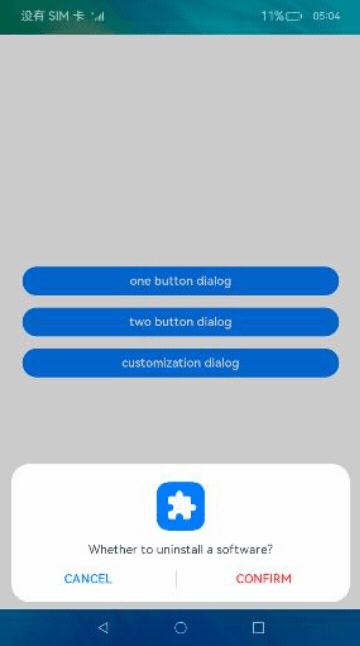

# 自定义弹窗（ArkTS）

## 介绍

本篇Codelab基于ArkTS的声明式开发范式实现了三种不同的弹窗，第一种直接使用公共组件，后两种使用CustomDialogController实现自定义弹窗，效果如图所示：


### 相关概念

-   [AlertDialog](https://gitee.com/openharmony/docs/blob/master/zh-cn/application-dev/reference/arkui-ts/ts-methods-alert-dialog-box.md)：警告弹窗，可设置文本内容和响应回调。
-   [CustomDialogController](https://gitee.com/openharmony/docs/blob/master/zh-cn/application-dev/reference/arkui-ts/ts-methods-custom-dialog-box.md)：通过CustomDialogController类显示自定义弹窗。

## 环境搭建

### 软件要求

-   [DevEco Studio](https://gitee.com/openharmony/docs/blob/master/zh-cn/application-dev/quick-start/start-overview.md#%E5%B7%A5%E5%85%B7%E5%87%86%E5%A4%87)版本：DevEco Studio 3.1 Release及以上版本。
-   OpenHarmony SDK版本：API version 9及以上版本。

### 硬件要求

-   开发板类型：[润和RK3568开发板](https://gitee.com/openharmony/docs/blob/master/zh-cn/device-dev/quick-start/quickstart-appendix-rk3568.md)。
-   OpenHarmony系统：3.2 Release及以上版本。

### 环境搭建

完成本篇Codelab我们首先要完成开发环境的搭建，本示例以**RK3568**开发板为例，参照以下步骤进行：

1. [获取OpenHarmony系统版本](https://gitee.com/openharmony/docs/blob/master/zh-cn/device-dev/get-code/sourcecode-acquire.md#%E8%8E%B7%E5%8F%96%E6%96%B9%E5%BC%8F3%E4%BB%8E%E9%95%9C%E5%83%8F%E7%AB%99%E7%82%B9%E8%8E%B7%E5%8F%96)：标准系统解决方案（二进制）。以3.2 Release版本为例：

   

2. 搭建烧录环境。

   1.  [完成DevEco Device Tool的安装](https://gitee.com/openharmony/docs/blob/master/zh-cn/device-dev/quick-start/quickstart-ide-env-win.md)
   2.  [完成RK3568开发板的烧录](https://gitee.com/openharmony/docs/blob/master/zh-cn/device-dev/quick-start/quickstart-ide-3568-burn.md)

3. 搭建开发环境。

   1.  开始前请参考[工具准备](https://gitee.com/openharmony/docs/blob/master/zh-cn/application-dev/quick-start/start-overview.md#%E5%B7%A5%E5%85%B7%E5%87%86%E5%A4%87)，完成DevEco Studio的安装和开发环境配置。
   2.  开发环境配置完成后，请参考[使用工程向导](https://gitee.com/openharmony/docs/blob/master/zh-cn/application-dev/quick-start/start-with-ets-stage.md#创建ets工程)创建工程（模板选择“Empty Ability”）。
   3.  工程创建完成后，选择使用[真机进行调测](https://gitee.com/openharmony/docs/blob/master/zh-cn/application-dev/quick-start/start-with-ets-stage.md#使用真机运行应用)。

## 代码结构解读

本篇Codelab只对核心代码进行讲解，对于完整代码，我们会在gitee中提供。

```
├──entry/src/main/ets               // 代码区
│  ├──common
│  │  └──constants
│  │     └──StyleConstants.ets      // 抽离样式
│  ├──entryability
│  │  └──EntryAbility.ts            // 程序入口类
│  ├──pages
│  │  └──DialogPage.ets	            // 主界面	
│  └──view
│     ├──CustomAlertDialog.ets      // 自定义弹窗组件
│     └──ConfirmDialog.ets          // 自定义弹窗组件
└──entry/src/main/resources         // 资源文件目录
```

## 构建页面

界面主要包括自定义弹窗以及公共组件警告弹窗两部分，效果如图所示：


### 公共弹窗组件

首先创建Index.ets作为主界面，公共弹窗组件直接使用AlertDialog的show方法拉起，效果如图所示：


```typescript
// Index.ets
@Entry
@Component
struct Index {
  ...
  build() {
    Flex({ direction: FlexDirection.Column, alignItems: ItemAlign.Center, justifyContent: FlexAlign.Center }) {
      Button($r('app.string.one_button_dialog'))
        .onClick(() => {
          AlertDialog.show(
            {
              message: $r('app.string.dialog_message'),
              offset: { dx: $r('app.float.dialog_offset_x'), dy: $r('app.float.dialog_offset_y') },
              alignment: DialogAlignment.Bottom,
              confirm: {
                value: $r('app.string.confirm_txt'),
                action: () => {
                  Logger.info('Button clicking callback');
                }
              },
              cancel: () => {
                Logger.info('Closed callbacks');
              }
            }
          )
        })
        .height(StyleConstants.BUTTON_HEIGHT)
        .width(StyleConstants.BUTTON_WIDTH)
      ...
  }
}
```

### 自定义弹窗

通过CustomDialogController的builder属性设置自定义弹窗组件，调用open方法拉起弹窗，效果如图所示：



```typescript
// DialogPage.ets
@Entry
@Component
struct Index {
  dialogControllerExample: CustomDialogController = new CustomDialogController({
    builder: ConfirmDialog({ cancel: this.onCancel, confirm: this.onAccept }),
    cancel: this.existApp,
    autoCancel: true,
    alignment: DialogAlignment.Bottom,
    customStyle: true,
    offset: { dx: $r('app.float.dialog_offset_x'), dy: $r('app.float.dialog_offset_y') }
  })；
  dialogControllerAlert: CustomDialogController = new CustomDialogController({
    builder: CustomAlertDialog({ cancel: this.onCancel, confirm: this.onAccept }),
    cancel: this.existApp,
    autoCancel: true,
    alignment: DialogAlignment.Bottom,
    customStyle: true,
    offset: { dx: $r('app.float.dialog_offset_x'), dy: $r('app.float.dialog_offset_y') }
  })；
  ...
  build() {
    Flex({ direction: FlexDirection.Column, alignItems: ItemAlign.Center, justifyContent: FlexAlign.Center }) {
      ...
      Button($r('app.string.two_button_dialog'))
        .onClick(() => {
          this.dialogControllerAlert.open();
        })
        .margin({ top: $r('app.float.button_margin_top') })
        .height(StyleConstants.BUTTON_HEIGHT)
        .width(StyleConstants.BUTTON_WIDTH)
      Button($r('app.string.customization_dialog'))
        .onClick(() => {
          this.dialogControllerExample.open();
        })
        .margin({ top: $r('app.float.button_margin_top') })
        .height(StyleConstants.BUTTON_HEIGHT)
        .width(StyleConstants.BUTTON_WIDTH)
    }
    .width(StyleConstants.FULL_PERCENT)
    .height(StyleConstants.FULL_PERCENT)
  }
}
```

## 总结

您已经完成了本次Codelab的学习，并了解到以下知识点：

1.  使用公共弹窗组件AlertDialog。
2.  使用CustomDialogController实现自定义弹窗。


