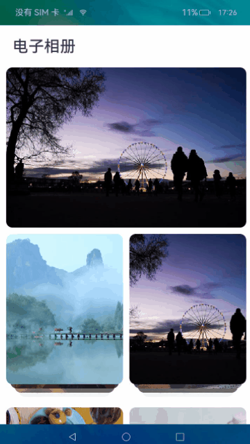
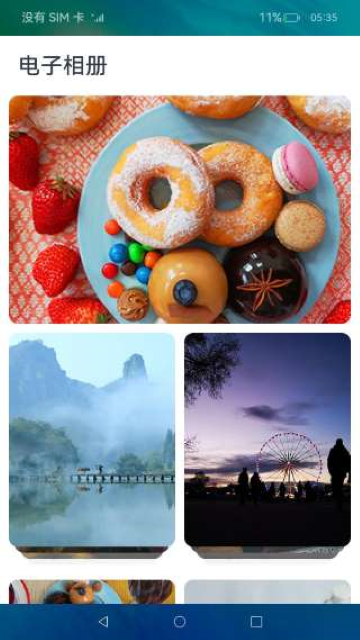
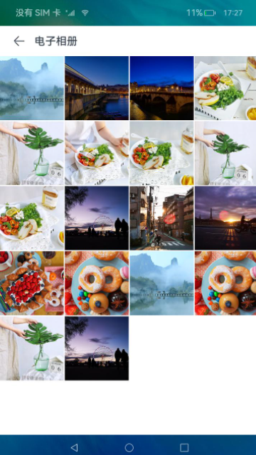
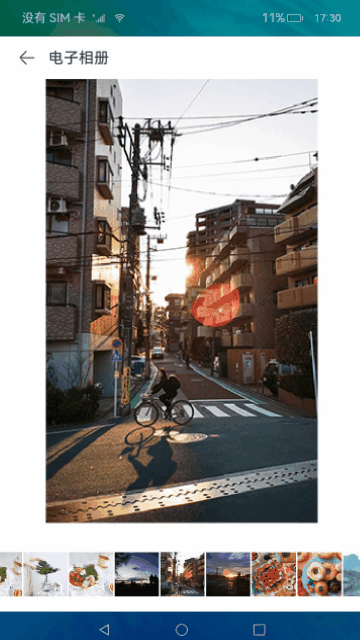
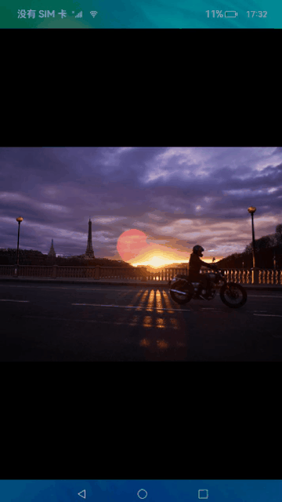

# 电子相册（ArkTS）

## 介绍

本篇Codelab介绍了如何实现一个简单的电子相册应用的开发，主要功能包括：

1.  实现首页顶部的轮播效果。
2.  实现页面跳转时共享元素的转场动画效果。
3.  实现通过手势控制图片的放大、缩小、左右滑动查看细节等效果。

    

### 相关概念

-   [Swiper](https://gitee.com/openharmony/docs/blob/master/zh-cn/application-dev/reference/arkui-ts/ts-container-swiper.md)：滑块视图容器，提供子组件滑动轮播显示的能力。
-   [Grid](https://gitee.com/openharmony/docs/blob/master/zh-cn/application-dev/reference/arkui-ts/ts-container-grid.md)：网格容器，由“行”和“列”分割的单元格所组成，通过指定“项目”所在的单元格做出各种各样的布局。
-   [Navigation](https://gitee.com/openharmony/docs/blob/master/zh-cn/application-dev/reference/arkui-ts/ts-basic-components-navigation.md)：Navigation组件一般作为Page页面的根容器，通过属性设置来展示页面的标题、工具栏、菜单。
-   [List](https://gitee.com/openharmony/docs/blob/master/zh-cn/application-dev/reference/arkui-ts/ts-container-list.md)：列表包含一系列相同宽度的列表项。适合连续、多行呈现同类数据，例如图片和文本。
-   [组合手势](https://gitee.com/openharmony/docs/blob/master/zh-cn/application-dev/reference/arkui-ts/ts-combined-gestures.md)：手势识别组，多种手势组合为复合手势，支持连续识别、并行识别和互斥识别。

## 环境搭建

### 软件要求

-   [DevEco Studio](https://gitee.com/openharmony/docs/blob/master/zh-cn/application-dev/quick-start/start-overview.md#%E5%B7%A5%E5%85%B7%E5%87%86%E5%A4%87)版本：DevEco Studio 3.1 Release及以上版本。
-   OpenHarmony SDK版本：API version 9及以上版本。

### 硬件要求

-   开发板类型：[润和RK3568开发板](https://gitee.com/openharmony/docs/blob/master/zh-cn/device-dev/quick-start/quickstart-appendix-rk3568.md)。
-   OpenHarmony系统：3.2 Release及以上版本。

### 环境搭建

完成本篇Codelab我们首先要完成开发环境的搭建，本示例以**RK3568**开发板为例，参照以下步骤进行：

1.  [获取OpenHarmony系统版本](https://gitee.com/openharmony/docs/blob/master/zh-cn/device-dev/get-code/sourcecode-acquire.md#%E8%8E%B7%E5%8F%96%E6%96%B9%E5%BC%8F3%E4%BB%8E%E9%95%9C%E5%83%8F%E7%AB%99%E7%82%B9%E8%8E%B7%E5%8F%96)：标准系统解决方案（二进制）。以3.2 Release版本为例：

    

2.  搭建烧录环境。
    1.  [完成DevEco Device Tool的安装](https://gitee.com/openharmony/docs/blob/master/zh-cn/device-dev/quick-start/quickstart-ide-env-win.md)
    2.  [完成RK3568开发板的烧录](https://gitee.com/openharmony/docs/blob/master/zh-cn/device-dev/quick-start/quickstart-ide-3568-burn.md)

3.  搭建开发环境。
    1.  开始前请参考[工具准备](https://gitee.com/openharmony/docs/blob/master/zh-cn/application-dev/quick-start/start-overview.md#%E5%B7%A5%E5%85%B7%E5%87%86%E5%A4%87)，完成DevEco Studio的安装和开发环境配置。
    2.  开发环境配置完成后，请参考[使用工程向导](https://gitee.com/openharmony/docs/blob/master/zh-cn/application-dev/quick-start/start-with-ets-stage.md#创建ets工程)创建工程（模板选择“Empty Ability”）。
    3.  工程创建完成后，选择使用[真机进行调测](https://gitee.com/openharmony/docs/blob/master/zh-cn/application-dev/quick-start/start-with-ets-stage.md#使用真机运行应用)。

## 代码结构解读

本篇Codelab只对核心代码进行讲解，对于完整代码，我们会在gitee中提供。

```
├──entry/src/main/ets                // 代码区
│  ├──common
│  │  ├──constansts
│  │  │  └──Constants.ets            // 常量类
│  │  └──utils
│  │     └──Logger.ets               // Logger公共类
│  ├──entryability
│  │  └──EntryAbility.ts             // 程序入口类
│  ├──pages
│  │  ├──DetailListPage.ets          // 图片详情页面
│  │  ├──DetailPage.ets              // 查看大图页面
│  │  ├──IndexPage.ets               // 电子相册主页面
│  │  └──ListPage.ets                // 图片列表页面
│  └──view
│     └──PhotoItem.ets               // 首页相册Item组件
└──entry/src/main/resources          // 资源文件
```

## 构建应用页面

### 应用首页

应用首页用Column组件来实现纵向布局，从上到下依次是标题组件Text、轮播图Swiper、相册列表Grid。标题和轮播图均设置固定高度，底部相册列表通过layoutWeight属性实现自适应占满剩余空间。



```typescript
// IndexPage.ets
Column() {
  Row() {
    Text($r('app.string.EntryAbility_label'))
  }

  Swiper(this.swiperController) {
    ForEach(Constants.BANNER_IMG_LIST, (item: Resource) => {
      Row() {
        Image(item)
        ...
      }
    }, (item, index) => JSON.stringify(item) + index)
  }
  ...

  Grid() {
    ForEach(IMG_ARR, (photoArr: Array<Resource>) => {
      GridItem() {
        PhotoItem({ photoArr })
      }
      ...
      .onClick(() => {
        router.pushUrl({
          url: Constants.URL_LIST_PAGE,
          params: { photoArr: JSON.stringify(photoArr) }
        });
      })
    }, (item, index) => JSON.stringify(item) + index)
  }
  ...
  .layoutWeight(1)
}
```

### 图片列表页面

图片列表页是网格状展开的图片列表，主要使用Grid组件和GridItem组件，GridItem高度通过aspectRatio属性设置为跟宽度一致。



```typescript
// ListPage.ets
Navigation() {
  Grid() {
    ForEach(this.photoArr, (img: Resource, index: number) => {
      GridItem() {
        Image(img)
          .onClick(() => {
            this.selectedIndex.set(index);
            router.pushUrl({
              url: Constants.URL_DETAIL_LIST_PAGE,
              params: {
                photoArr: JSON.stringify(this.photoArr),
              }
            })
          })
      }
      ...
      .aspectRatio(1)
    }, item => JSON.stringify(item))
  }
  .columnsTemplate(Constants.GRID_COLUMNS_TEMPLATE)
  .layoutWeight(1)
}
```

### 图片详情页面

图片详情页由两个横向滚动的List组件完成整体布局，两个组件之间有联动的效果。滚动底部的List，上边展示的图片会随着改变，同样左右滑动上边的图片时，底部List组件也会随之改变。



```typescript
// ListDetailPage.ets
Stack({ alignContent: Alignment.Bottom }) {
  List({ scroller: this.bigScroller, initialIndex: this.selectedIndex.get() }) {
    ForEach(this.photoArr, (img: Resource, index: number) => {
      ListItem() {
        Image(img)
          ...
          .gesture(PinchGesture({ fingers: Constants.DOUBLE_NUMBER })
            .onActionStart(this.goDetailPage.bind(this)))
          .onClick(this.goDetailPage.bind(this))
      }
    }, item => JSON.stringify(item))
  }
  ...
  .onScroll((scrollOffset, scrollState) => {
    if (scrollState === ScrollState.Fling) {
      this.bigScrollAction(scrollTypeEnum.SCROLL);
    }
  })
  .onScrollStop(() => this.bigScrollAction(scrollTypeEnum.STOP))

  List({ scroller: this.smallScroller, space: Constants.LIST_ITEM_SPACE, initialIndex: this.selectedIndex.get() }) {
    ForEach(this.smallPhotoArr, (img: Resource, index: number) => {
      ListItem() {
        this.SmallImgItemBuilder(img, index)
      }
    }, item => JSON.stringify(item))
  }
  ...
  .listDirection(Axis.Horizontal)
  .onScroll((scrollOffset, scrollState) => {
    if (scrollState === ScrollState.Fling) {
      this.smallScrollAction(scrollTypeEnum.SCROLL);
    }
  })
  .onScrollStop(() => this.smallScrollAction(scrollTypeEnum.STOP))
}
```

### 查看大图页面

查看大图页面由一个横向滚动的List组件来实现图片左右滑动时切换图片的功能，和一个Row组件实现图片的缩放和拖动查看细节功能。对图片进行缩放时会从List组件切换成Row组件来实现对单张图片的操作，对单张图片进行滑动操作时，也会由Row组件转换为List组件来实现图片的切换功能。



```typescript
// DetailPage.ets
Stack() {
  List({ scroller: this.scroller }) {
    ForEach(this.photoArr, (img: Resource, index: number) => {
      ListItem() {
        Image(img)
          ...
          .onClick(() => router.back()
          )
      }
      .gesture(PinchGesture({ fingers: Constants.DOUBLE_NUMBER })
        .onActionStart(() => {
          this.selectedIndex.set(index);
          this.resetImg();
          this.isScaling = true;
        })
      )
    }, item => JSON.stringify(item))
  }
  ...
  .onScrollStop(() => {
    let currentIndex = Math.round((this.scroller.currentOffset()
      .xOffset + (this.imageWidth / Constants.DOUBLE_NUMBER)) / this.imageWidth);
    this.scroller.scrollTo({ xOffset: currentIndex * this.imageWidth, yOffset: 0 });
  })
  .visibility(this.isScaling ? Visibility.Hidden : Visibility.Visible)

  Row() {
    Image(this.photoArr[this.selectedIndex.get()])
    ...
  }
  .visibility(this.isScaling ? Visibility.Visible : Visibility.Hidden)
}
```

## 通过手势控制图片

大图浏览界面双指捏合时通过改变Image组件的scale来控制图片的缩放，单手拖动时通过改变Image的偏移量来控制图片的位置，手势操作调用组合手势GestureGroup实现。其中PinchGesture实现双指缩放手势，PanGesture实现单指拖动手势。

```typescript
// DetailPage.ets 
Row() {
    Image(this.photoArr[this.selectedIndex.get()])
      .position({ x: this.imgOffSetX, y: this.imgOffSetY })
      .scale({ x: this.imgScale, y: this.imgScale })
  }
  .gesture(GestureGroup(GestureMode.Parallel,
  PinchGesture({ fingers: Constants.DOUBLE_NUMBER })
    .onActionUpdate((event: GestureEvent) => {
      this.imgScale = event.scale;
    })
    .onActionEnd(() => {
      if (this.imgScale < 1) {
        this.resetImg();
        this.imgOffSetX = 0;
        this.imgOffSetY = 0;
      }
    }),
  PanGesture()
    .onActionStart(() => {
      this.preOffsetX = this.imgOffSetX;
      this.preOffsetY = this.imgOffSetY;
    })
    .onActionUpdate((event: GestureEvent) => {
      this.imgOffSetX = this.preOffsetX + event.offsetX;
      this.imgOffSetY = this.preOffsetY + event.offsetY;
    })
    .onActionEnd(this.handlePanEnd.bind(this))
  ))
```

## 总结

您已经完成了本次Codelab的学习，并了解到以下知识点：

1.  如何实现首页顶部的轮播效果。
2.  如何实现页面跳转时共享元素的转场动画效果。
3.  如何通过手势控制图片的放大、缩小、左右滑动查看细节等效果。


