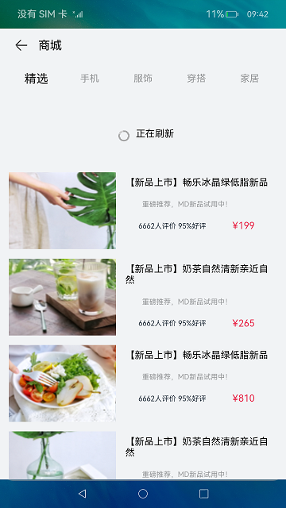
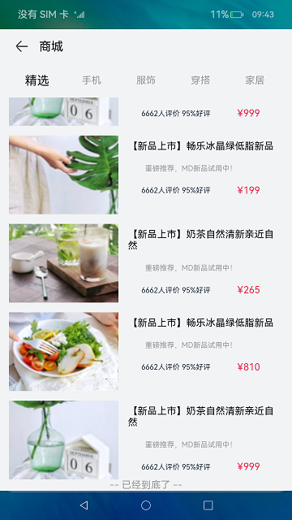

# List组件的使用之商品列表（ArkTS）

## 介绍

openHarmony ArkTS提供了丰富的接口和组件，开发者可以根据实际场景和开发需求，选用不同的组件和接口。在本篇CodeLab中，我们使用Scroll、List以及LazyForEach实现一个商品列表的页面，并且拥有下拉刷新，懒加载和到底提示的效果。效果图如下：


### 相关概念

-   [Scroll](https://gitee.com/openharmony/docs/blob/master/zh-cn/application-dev/reference/arkui-ts/ts-container-scroll.md/)：可滚动的容器组件，当子组件的布局尺寸超过父组件的视口时，内容可以滚动。
-   [List](https://gitee.com/openharmony/docs/blob/master/zh-cn/application-dev/reference/arkui-ts/ts-container-list.md/)：列表包含一系列相同宽度的列表项。适合连续、多行呈现同类数据，例如图片和文本。
-   [Tabs](https://gitee.com/openharmony/docs/blob/master/zh-cn/application-dev/reference/arkui-ts/ts-container-tabs.md/)：一种可以通过页签进行内容视图切换的容器组件，每个页签对应一个内容视图。
-   [LazyForEach](https://gitee.com/openharmony/docs/blob/master/zh-cn/application-dev/quick-start/arkts-rendering-control.md#%E6%95%B0%E6%8D%AE%E6%87%92%E5%8A%A0%E8%BD%BD)  ：开发框架提供数据懒加载（LazyForEach组件）从提供的数据源中按需迭代数据，并在每次迭代过程中创建相应的组件。

## 环境搭建

### 软件要求

-   [DevEco Studio](https://gitee.com/openharmony/docs/blob/master/zh-cn/application-dev/quick-start/start-overview.md#%E5%B7%A5%E5%85%B7%E5%87%86%E5%A4%87)版本：DevEco Studio 3.1 Canary1及以上版本。
-   OpenHarmony SDK版本：API version 9及以上版本。

### 硬件要求

-   开发板类型：[润和RK3568开发板](https://gitee.com/openharmony/docs/blob/master/zh-cn/device-dev/quick-start/quickstart-appendix-rk3568.md)。
-   OpenHarmony系统：3.2 Beta3及以上版本。

### 环境搭建

完成本篇Codelab我们首先要完成开发环境的搭建，本示例以**RK3568**开发板为例，参照以下步骤进行：

1.  [获取OpenHarmony系统版本](https://gitee.com/openharmony/docs/blob/master/zh-cn/device-dev/get-code/sourcecode-acquire.md#%E8%8E%B7%E5%8F%96%E6%96%B9%E5%BC%8F3%E4%BB%8E%E9%95%9C%E5%83%8F%E7%AB%99%E7%82%B9%E8%8E%B7%E5%8F%96)：标准系统解决方案（二进制）。以3.2 Beta3版本为例：

    

2.  搭建烧录环境。
    1.  [完成DevEco Device Tool的安装](https://gitee.com/openharmony/docs/blob/master/zh-cn/device-dev/quick-start/quickstart-ide-env-win.md)
    2.  [完成RK3568开发板的烧录](https://gitee.com/openharmony/docs/blob/master/zh-cn/device-dev/quick-start/quickstart-ide-3568-burn.md)

3.  搭建开发环境。
    1.  开始前请参考[工具准备](https://gitee.com/openharmony/docs/blob/master/zh-cn/application-dev/quick-start/start-overview.md#%E5%B7%A5%E5%85%B7%E5%87%86%E5%A4%87)，完成DevEco Studio的安装和开发环境配置。
    2.  开发环境配置完成后，请参考[使用工程向导](https://gitee.com/openharmony/docs/blob/master/zh-cn/application-dev/quick-start/start-with-ets-stage.md#创建ets工程)创建工程（模板选择“Empty Ability”），选择JS或者eTS语言开发。
    3.  工程创建完成后，选择使用[真机进行调测](https://gitee.com/openharmony/docs/blob/master/zh-cn/application-dev/quick-start/start-with-ets-stage.md#使用真机运行应用)。

## 代码结构解读

本篇Codelab只对核心代码进行讲解，完整代码可以直接从gitee获取。

```
├──entry/src/main/ets                      // 代码区
│  ├──common
│  │  └──CommonConstants.ets               // 常量集合文件
│  ├──entryability
│  │  └──EntryAbility.ts                   // 应用入口，承载应用的生命周期
│  ├──pages
│  │  └──ListIndex.ets                     // 页面入口
│  ├──view
│  │  ├──GoodsListComponent.ets            // 商品列表组件
│  │  ├──PutDownRefreshLayout.ets          // 下拉刷新组件
│  │  └──TabBarsComponent.ets              // Tabs组件
│  └──viewmodel
│     ├──InitialData.ets                   // 初始化数据
│     └──ListDataSource.ets                // List使用的相关数据加载
└──entry/src/main/resources
    ├──base
    │  ├──element                          // 字符串以及颜色的资源文件
    │  ├──media                            // 图片等资源文件
    │  └──profile                          // 页面配置文件存放位置
    ├──en_US
    │  └──element
    │     └──string.json                   // 英文字符存放位置
    ├──rawfile                             // 大体积媒体资源存放位置
    └──zh_CN
        └──element
           └──string.json                  // 中文字符存放位置
```

## 页面布局

页面使用Navigation与Tabs做页面布局，使用Navigation的title属性实现页面的标题，Tabs做商品内容的分类。示例代码如下：

```typescript
Row() {
  Navigation() {
    Column() {
      TabBars()
    }
    .width(LAYOUT_WIDTH_OR_HEIGHT)
    .justifyContent(FlexAlign.Center)
  }
  .size({ width: LAYOUT_WIDTH_OR_HEIGHT, height: LAYOUT_WIDTH_OR_HEIGHT })
  .title(STORE)
}
.height(LAYOUT_WIDTH_OR_HEIGHT)
.backgroundColor($r('app.color.primaryBgColor'))
```

页面分为“精选”、“手机”、“服饰”、“穿搭”、“家居”五个模块，由于本篇CodeLab的主要内容在“精选”部分，故将“精选”部分单独编写代码，其余模块使用ForEach遍历生成。示例代码如下：

```typescript
Tabs() {
  // 精选模块
  TabContent() {
    Scroll() {
      Column() {
        if (this.refreshStatus) {
          PutDownRefresh({ refreshText: $refreshText })
        }
        GoodsList()
        Text($r('app.string.to_bottom'))
          .fontSize(NORMAL_FONT_SIZE)
          .fontColor($r('app.color.gray'))
      }
      .width(LAYOUT_WIDTH_OR_HEIGHT)
    }
  }
  .tabBar(this.firstTabBar)

  // 其他模块
  ForEach(initTabBarData, (item, index) => {
    TabContent() {
      Column() {
        Text(item).fontSize(MAX_FONT_SIZE)
      }
      .justifyContent(FlexAlign.Center)
      .width(LAYOUT_WIDTH_OR_HEIGHT)
      .height(LAYOUT_WIDTH_OR_HEIGHT)
    }
    .tabBar(this.otherTabBar(item, index))
  })
}
```

## 商品列表的懒加载

使用Scroll嵌套List做长列表，实现Scroll与List的联动。具体实现代码如下：

```typescript
Scroll() {
  Column() {
    // 下拉刷新的组件
    if (this.refreshStatus) {
      PutDownRefresh({ refreshText:$refreshText })
    }

    // List的自定义组件
    GoodsList()
    Text($r('app.string.to_bottom')).fontSize(DEFAULT_16)
  }
  .width(THOUSANDTH_1000)
}
```

商品列表往往数据量很多，如果使用ForEach一次性遍历生成的话，性能不好，所以这里使用LazyForEach进行数据的懒加载。当向下滑动时，需要加载新的数据的时候，再将新的数据加载出来，生成新的列表。

通过onTouch事件来触发懒加载行为，当商品列表向下滑动，加载新的数据。示例代码如下：

```typescript
// GoodsListComponent
List({ space:commonConst.LIST_ITEM_SPACE }) {
  LazyForEach(this.goodsListData, (item) => {
    ListItem() {
      Row() {
        Column() {
          Image(item?.goodsImg)
        }
        ... // 布局样式

        Column() {
          ... // 布局代码
        }
        ... // 布局样式
      }
    }

    // 通过Touch事件来触发懒加载
    .onTouch((event：TouchEvent) => {
      switch (event.type) {
        case TouchType.Down：
          this.startTouchOffsetY = event.touches[0].y;
          break;
        case TouchType.Up：
          this.startTouchOffsetY = event.touches[0].y;
          break;
        case TouchType.Move：
          if (this.startTouchOffsetY - this.endTouchOffsetY > 0) {
            this.goodsListData.pushData();
          }
          break;
        default:
          break;
      }
    })
  })
}
```

## 下拉刷新与到底提示

下拉刷新同样使用TouchEvent做下拉的判断，当下拉的偏移量超出将要刷新的偏移量时，就展示下拉刷新的布局，同时使用条件渲染判断是否显示下拉刷新布局，实现效果如下图：



具体代码如下：

```typescript
putDownRefresh(event：TouchEvent) {
  switch (event.type) {
    case TouchType.Down：

      // 记录手指按下的y坐标
      this.currentOffsetY = event.touches[0].y;
      break;
    case TouchType.Move:

      // 根据下拉的偏移量来判断是否刷新
      this.refreshStatus = event.touches[0].y - this.currentOffsetY > MAX_OFFSET_Y;
      break;
    case TouchType.Cancel:
      break;
    case TouchType.Up:

      // 模拟刷新效果，并未真实请求数据
      const timer = setTimeout(() => {
        this.refreshStatus = false;
        }, REFRESH_TIME)
      break;
    default:
      break;
  }
}
...
// 下拉刷新的组件根据条件决定是否显示
if (this.refreshStatus) {
  PutDownRefresh({ refreshText:$refreshText })
}
```

列表到底提示“已经到底了”并回弹的效果使用了Scroll的edgeEffect来控制回弹，实现效果如下图：



具体代码如下：

```typescript
Scroll() {
  Column() {
    ...
    GoodsList()
    Text($r('app.string.to_bottom')).fontSize(DEFAULT_16)
  }
  .width(THOUSANDTH_1000)
}
.scrollBar(BarState.Off)
.edgeEffect(EdgeEffect.Spring)
.width(THOUSANDTH_1000)
.height(THOUSANDTH_1000)
.onTouch((event) => {
  this.putDownRefresh(event)
})
```

## 总结

您已经完成了本次Codelab的学习，并了解到以下知识点：

1.  使用Scroll组件与List组件实现列表布局。
2.  使用onTouch事件实现下拉刷新动作与懒加载效果。


