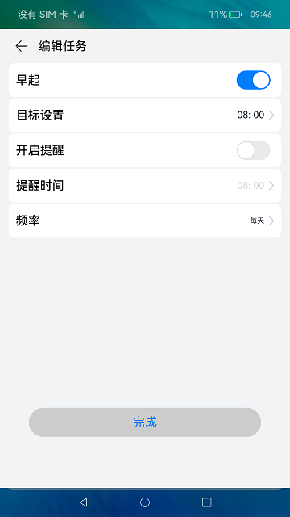

# List组件的使用之设置项（ArkTS）

## 介绍

在本篇CodeLab中，我们将使用List组件、Toggle组件以及Router接口，实现一个简单的设置页，点击将跳转到对应的详细设置页面。效果图如下：


### 相关概念

-   [@CustomDialog](https://gitee.com/openharmony/docs/blob/master/zh-cn/application-dev/quick-start/arkts-dynamic-ui-elememt-building.md#customdialog)：@CustomDialog装饰器用于装饰自定义弹窗。
-   [List](https://gitee.com/openharmony/docs/blob/master/zh-cn/application-dev/reference/arkui-ts/ts-container-list.md/)：List是常用的滚动类容器组件之一，它按照水平或者竖直方向线性排列子组件， List的子组件必须是ListItem，它的宽度默认充满List的宽度。
-   [TimePicker](https://gitee.com/openharmony/docs/blob/master/zh-cn/application-dev/reference/arkui-ts/ts-basic-components-timepicker.md)：TimePicker是选择时间的滑动选择器组件，默认以 00:00 至 23:59 的时间区创建滑动选择器。
-   [Toggle](https://gitee.com/openharmony/docs/blob/master/zh-cn/application-dev/reference/arkui-ts/ts-basic-components-toggle.md)：组件提供勾选框样式、状态按钮样式及开关样式。
-   [Router](https://gitee.com/openharmony/docs/blob/master/zh-cn/application-dev/reference/apis/js-apis-router.md)：通过不同的url访问不同的页面，包括跳转到应用内的指定页面、用应用内的某个页面替换当前页面、返回上一页面或指定的页面等。


## 环境搭建

### 软件要求

-   [DevEco Studio](https://gitee.com/openharmony/docs/blob/master/zh-cn/application-dev/quick-start/start-overview.md#%E5%B7%A5%E5%85%B7%E5%87%86%E5%A4%87)版本：DevEco Studio 3.1 Beta2及以上版本。
-   OpenHarmony SDK版本：API version 9及以上版本。

### 硬件要求

-   开发板类型：[润和RK3568开发板](https://gitee.com/openharmony/docs/blob/master/zh-cn/device-dev/quick-start/quickstart-appendix-rk3568.md)。
-   OpenHarmony系统：3.2 Release及以上版本。

### 环境搭建

完成本篇Codelab我们首先要完成开发环境的搭建，本示例以**RK3568**开发板为例，参照以下步骤进行：

1.  [获取OpenHarmony系统版本](https://gitee.com/openharmony/docs/blob/master/zh-cn/device-dev/get-code/sourcecode-acquire.md#%E8%8E%B7%E5%8F%96%E6%96%B9%E5%BC%8F3%E4%BB%8E%E9%95%9C%E5%83%8F%E7%AB%99%E7%82%B9%E8%8E%B7%E5%8F%96)：标准系统解决方案（二进制）。以3.2 Release版本为例：

    

2.  搭建烧录环境。
    1.  [完成DevEco Device Tool的安装](https://gitee.com/openharmony/docs/blob/master/zh-cn/device-dev/quick-start/quickstart-ide-env-win.md)
    2.  [完成RK3568开发板的烧录](https://gitee.com/openharmony/docs/blob/master/zh-cn/device-dev/quick-start/quickstart-ide-3568-burn.md)

3.  搭建开发环境。
    1.  开始前请参考[工具准备](https://gitee.com/openharmony/docs/blob/master/zh-cn/application-dev/quick-start/start-overview.md#%E5%B7%A5%E5%85%B7%E5%87%86%E5%A4%87)，完成DevEco Studio的安装和开发环境配置。
    2.  开发环境配置完成后，请参考[使用工程向导](https://gitee.com/openharmony/docs/blob/master/zh-cn/application-dev/quick-start/start-with-ets-stage.md#创建ets工程)创建工程（模板选择“Empty Ability”），选择JS或者eTS语言开发。
    3.  工程创建完成后，选择使用[真机进行调测](https://gitee.com/openharmony/docs/blob/master/zh-cn/application-dev/quick-start/start-with-ets-stage.md#使用真机运行应用)。

## 代码结构解读

本篇Codelab只对核心代码进行讲解，完整代码可以直接从gitee获取。

```
├──entry/src/main/ets                        // 代码区
│  ├──common
│  │  ├──constants
│  │  │  └──CommonConstant.ets               // 常量集合文件
│  │  └──utils
│  │     ├──BroadCast.ets                    // 事件发布订阅管理器
│  │     └──Log.ets                          // 日志打印
│  ├──entryability
│  │  └──EntryAbility.ts                      // 应用入口，承载应用的生命周期
│  ├──model
│  │  ├──EventSourceManager.ets              // 事件资源管理器
│  │  ├──TaskInfo.ets                        // 任务信息存放
│  │  └──TaskInitList.ets                    // 初始化数据
│  ├──pages
│  │  ├──ListIndexPage.ets                   // 页面入口
│  │  └──TaskEditPage.ets                    // 编辑任务页
│  ├──view
│  │  ├──CustomDialogView.ets                // 自定义弹窗统一入口
│  │  ├──TaskDetail.ets                      // 任务编辑详情组件
│  │  ├──TaskEditListItem.ets                // 任务编辑详情Item组件
│  │  ├──TaskList.ets                        // 任务列表组件
│  │  └──TaskSettingDialog.ets               // 弹窗组件
│  └──viewmodel
│     ├──FrequencySetting.ets                // 频率范围设置
│     └──TaskTargetSetting.ets               // 任务目标设置
└──entry/src/main/resources
   ├──base
   │  ├──element                             // 字符串以及颜色的资源文件
   │  ├──media                               // 图片等资源文件
   │  └──profile                             // 页面配置文件存放位置
   ├──en_US
   │  └──element
   │     └──string.json                      // 英文字符存放位置
   ├──rawfile                                // 大体积媒体资源存放位置
   └──zh_CN
       └──element
          └──string.json                     // 中文字符存放位置
```

## 任务列表页

任务列表页由上部分的标题、返回按钮以及正中间的任务列表组成。实现效果如图：


使用Navigation以及List组件构成元素，使用ForEach遍历生成具体列表。这里是Navigation构成页面导航：

```typescript
// TaskIndexPage.ets
Navigation() {
  Column() {

    // 页面中间的列表
    TaskList() 
  }
  .width(THOUSANDTH_1000)
  .justifyContent(FlexAlign.Center)
}
.size({ width:THOUSANDTH_1000, height:THOUSANDTH_1000 })
.title(ADD_TASK_TITLE)
```

列表右侧有一个判断是否开启的文字标识，点击某个列表需要跳转到对应的任务编辑页里。具体的列表实现如下：

```typescript
// TaskList.ets
List({ space:commonConst.LIST_ITEM_SPACE }) {
  ForEach(this.taskList, (item) => {
    ListItem() {
      Row() {
        Row() {
          Image(item?.icon)
          Text(item?.taskName)
          ...
        }
        .width(commonConst.THOUSANDTH_500)

        // 状态显示
        if (item?.isOpen) {
          Text($r('app.string.already_open'))
        }
          Image($rawfile('task/right_grey.png'))
            .width(commonConst.DEFAULT_8)
            .height(commonConst.DEFAULT_16)
      }
        ...
    }
      ...

    // 路由跳转到任务编辑页
    .onClick(() => {
      router.push({
        url: 'pages/task/TaskEdit',
        params: {
          params: formatParams(item),
        }
      })
    })
    ...
  })
}
```

## 任务编辑页

任务编辑页由上方的“编辑任务”标题以及返回按钮，主体内容的List配置项和下方的完成按钮组成，实现效果如图：



由于每一个配置项功能不相同，且逻辑复杂，故将其拆分为五个独立的组件。

任务编辑页面，由Navigation和一个自定义组件TaskDetail构成：

```typescript
// TaskEditPage.ets
Navigation() {
  Column() {
    TaskDetail()
  }
  .width(THOUSANDTH_1000)
  .height(THOUSANDTH_1000)
}
.size({ width:THOUSANDTH_1000, height:THOUSANDTH_1000 })
.title(EDIT_TASK_TITLE)
```

自定义组件由List以及其子组件ListItem构成：

```typescript
// TaskDetail.ets
List({ space:commonConst.LIST_ITEM_SPACE }) {
  ListItem() {
    TaskChooseItem()
  }
  ...
  ListItem() {
    TargetSetItem()
  }
  ...
  ListItem() {
    OpenRemindItem()
  }
  ...
  ListItem() {
    RemindTimeItem()
  }
  ...
  ListItem() {
    FrequencyItem()
  }
  ...
}
.width(commonConst.THOUSANDTH_940)
.margin({ bottom:commonConst.THOUSANDTH_400 })
```

列表的每一项做了禁用判断，需要任务打开才可以点击编辑：

```typescript
.enabled(this.settingParams?.isOpen)
```

一些特殊情况的禁用，如每日微笑、每日刷牙的目标设置不可编辑：

```typescript
.enabled(
  this.settingParams?.isOpen
  && (this.settingParams?.taskID !== taskType.smile)
  && (this.settingParams?.taskID !== taskType.brushTeeth)
)
```

提醒时间在开启提醒打开之后才可以编辑：

```typescript
.enabled(this.settingParams?.isOpen && this.settingParams?.isAlarm)
```

设置完成之后，点击完成按钮，此处为了模拟效果，并不与数据库产生交互，因此直接弹出提示“设置完成！！！”。

```typescript
finishTaskEdit() {
  prompt.showToast({
    message: commonConst.SETTING_FINISHED_MESSAGE
  })
}
```

## 任务编辑弹窗

弹窗由封装的自定义组件CustomDialogView注册事件，并在点击对应的编辑项时触发，从而打开弹窗：

CustomDialogView引入实例并注册事件：

```typescript
// TaskSettingDialog.ets
targetSettingDialog = new CustomDialogController({
  builder: TargetSettingDialog(),
  autoCancel: true,
  alignment: DialogAlignment.Bottom,
  offset: { dx:ZERO, dy:MINUS_20 }
})
...

// 注册事件
this.broadCast.on(
  BroadCastType.SHOW_TARGETSETTING_DIALOG,
  function () {
    self.targetSettingDialog.open();
  })
```

点击对应的编辑项触发：

```typescript
.onClick(() => {
  this.broadCast.emit(
  BroadCastType.SHOW_TARGETSETTING_DIALOG);
})
```

自定义弹窗的实现：

因为任务目标设置有三种类型：

-   早睡早起的时间
-   喝水的量度
-   吃苹果的个数

如下图所示：


故根据任务的ID进行区分，将同一弹窗复用：

```typescript
// TaskSettingDialog.ets
if ([taskType.getup, taskType.sleepEarly].indexOf(this.settingParams?.taskID) 
  > commonConst.HAS_NO_INDEX) {
  TimePicker({
    selected:commonConst.DEFAULT_SELECTED_TIME,
  })
  ...
} else {
  TextPicker({ range:this.settingParams?.taskID === taskType.drinkWater 
  ? this.drinkRange 
  : this.appleRange })
  ...
}
```

弹窗确认的时候将修改好的值赋予该项设置，如不符合规则，将弹出提示：

```typescript
// TaskSettingDialog.ets

// 校验规则
compareTime(startTime: string, endTime: string) {
  if (returnTimeStamp(this.currentTime) < returnTimeStamp(startTime) 
    || returnTimeStamp(this.currentTime) > returnTimeStamp(endTime)) {

    // 弹出提示
    prompt.showToast({
      message:commonConst.CHOOSE_TIME_OUT_RANGE
    })
    return false;
  }
  return true;
}

// 设置修改项
if (this.settingParams?.taskID === taskType.sleepEarly) {
  if (!this.compareTime(commonConst.SLEEP_EARLY_TIME, commonConst.SLEEP_LATE_TIME)) {
    return;
  }
  this.settingParams.targetValue = this.currentTime;
  return;
}
this.settingParams.targetValue = this.currentValue;
```

其余弹窗实现基本类似，这里不再赘述。

## 总结

您已经完成了本次Codelab的学习，并了解到以下知识点：

1.  使用List组件实现列表布局。
2.  使用@CustomDialog实现自定义弹窗。


