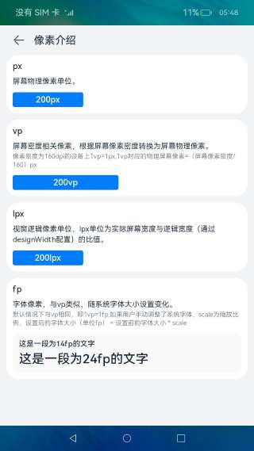
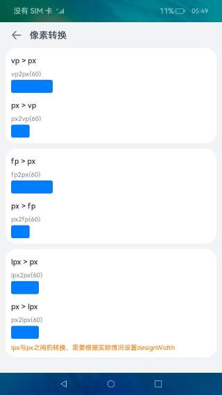

# 1 卡片介绍<a name="ZH-CN_TOPIC_0000001564100877"></a>

基于像素单位，展示了像素单位的基本知识与像素转换API的使用。

# 2 标题<a name="ZH-CN_TOPIC_0000001513020814"></a>

像素转换（ArkTS）

# 3 介绍<a name="ZH-CN_TOPIC_0000001563860773"></a>


本篇Codelab介绍像素单位的基本知识与像素单位转换API的使用。通过像素转换案例，向开发者讲解了如何使用像素单位设置组件的尺寸、字体的大小以及不同像素单位之间的转换方法。主要功能包括：

1.  展示了不同像素单位的使用。
2.  展示了像素单位转换相关API的使用。

    

## 相关概念<a name="section16161125162119"></a>

-   [像素单位](https://gitee.com/openharmony/docs/blob/master/zh-cn/application-dev/reference/arkui-ts/ts-pixel-units.md)：为开发者提供4种像素单位，框架采用vp为基准数据单位。
-   [List](https://gitee.com/openharmony/docs/blob/master/zh-cn/application-dev/reference/arkui-ts/ts-container-list.md)：列表包含一系列相同宽度的列表项。适合连续、多行呈现同类数据，例如图片和文本。
-   [Column](https://gitee.com/openharmony/docs/blob/master/zh-cn/application-dev/reference/arkui-ts/ts-container-column.md)：沿垂直方向布局的容器。
-   [Text](https://gitee.com/openharmony/docs/blob/master/zh-cn/application-dev/reference/arkui-ts/ts-basic-components-text.md)：显示一段文本的组件。


# 4 环境搭建<a name="ZH-CN_TOPIC_0000001513021238"></a>


## 软件要求<a name="zh-cn_topic_0000001353166866_section17200112092018"></a>

-   [DevEco Studio](https://gitee.com/openharmony/docs/blob/master/zh-cn/application-dev/quick-start/start-overview.md#%E5%B7%A5%E5%85%B7%E5%87%86%E5%A4%87)版本：DevEco Studio 3.1 Release。
-   OpenHarmony SDK版本：API version 9。

## 硬件要求<a name="zh-cn_topic_0000001353166866_section820192019206"></a>

-   开发板类型：[润和RK3568开发板](https://gitee.com/openharmony/docs/blob/master/zh-cn/device-dev/quick-start/quickstart-appendix-rk3568.md)。
-   OpenHarmony系统：3.2 Release。

## 环境搭建<a name="zh-cn_topic_0000001353166866_section1020132022018"></a>

完成本篇Codelab我们首先要完成开发环境的搭建，本示例以**RK3568**开发板为例，参照以下步骤进行：

1.  [获取OpenHarmony系统版本](https://gitee.com/openharmony/docs/blob/master/zh-cn/device-dev/get-code/sourcecode-acquire.md#%E8%8E%B7%E5%8F%96%E6%96%B9%E5%BC%8F3%E4%BB%8E%E9%95%9C%E5%83%8F%E7%AB%99%E7%82%B9%E8%8E%B7%E5%8F%96)：标准系统解决方案（二进制）。以3.2 Release版本为例：

    

2.  搭建烧录环境。
    1.  [完成DevEco Device Tool的安装](https://gitee.com/openharmony/docs/blob/master/zh-cn/device-dev/quick-start/quickstart-ide-env-win.md)
    2.  [完成RK3568开发板的烧录](https://gitee.com/openharmony/docs/blob/master/zh-cn/device-dev/quick-start/quickstart-ide-3568-burn.md)

3.  搭建开发环境。
    1.  开始前请参考[工具准备](https://gitee.com/openharmony/docs/blob/master/zh-cn/application-dev/quick-start/start-overview.md#%E5%B7%A5%E5%85%B7%E5%87%86%E5%A4%87)，完成DevEco Studio的安装和开发环境配置。
    2.  开发环境配置完成后，请参考[使用工程向导](https://gitee.com/openharmony/docs/blob/master/zh-cn/application-dev/quick-start/start-with-ets-stage.md#创建arkts工程)创建工程（模板选择“Empty Ability”）。
    3.  工程创建完成后，选择使用[真机进行调测](https://gitee.com/openharmony/docs/blob/master/zh-cn/application-dev/quick-start/start-with-ets-stage.md#使用真机运行应用)。

# 5 代码结构解读<a name="ZH-CN_TOPIC_0000001512821250"></a>

本篇Codelab只对核心代码进行讲解，对于完整代码，我们会在gitee中提供。

```
├──entry/src/main/ets                   // 代码区
│  ├──common
│  │  ├──constants
│  │  │  └──Constants.ets               // 常量类
│  │  └──utils
│  │     └──Logger.ets                  // 日志打印工具类
│  ├──entryability
│  │  └──EntryAbility.ts                // 程序入口类
│  ├──pages
│  │  ├──ConversionPage.ets             // 像素转换页面
│  │  ├──IndexPage.ets                  // 应用主页面
│  │  └──IntroductionPage.ets           // 像素介绍页面
│  ├──view
│  │  ├──ConversionItemComponment.ets   // 像素转换Item
│  │  └──IntroductionItemComponment.ets // 像素介绍Item
│  └──viewmodel
│     ├──ConversionItem.ets             // 像素转换信息类
│     ├──ConversionViewModel.ets        // 像素转换ViewModel
│     ├──IntroductionItem.ets           // 像素介绍信息类
│     └──IntroductionViewModel.ets      // 像素介绍ViewModel
└──entry/src/main/resources             // 资源文件
```

# 6 像素单位介绍页面<a name="ZH-CN_TOPIC_0000001512661626"></a>

在像素单位介绍页面，介绍了系统像素单位的概念，并在页面中为Text组件的宽度属性设置不同的像素单位，fp像素单位则设置为Text组件的字体大小。



```
// IntroductionPage.ets
// 设置Text组件的宽度为200px
Text('200px')
  .textAlign(TextAlign.Center)
  .backgroundColor($r('app.color.blue_background'))
  .height($r('app.float.value_height'))
  .width('200px')
...
// 设置Text组件的宽度为200vp
Text('200vp')
  .textAlign(TextAlign.Center)
  .backgroundColor($r('app.color.blue_background'))
  .height($r('app.float.value_height'))
  .width('200vp')
...
// 设置Text组件的宽度为200lpx
Text('200lpx')
  .textAlign(TextAlign.Center)
  .backgroundColor($r('app.color.blue_background'))
  .height($r('app.float.value_height'))
  .width('200lpx')
...
// 分别设置Text的字体大小为14fp, 24fp
Column() {
  Text('这是一段为14fp的文字')
    .fontSize('14fp')
  ...
  Text('这是一段为24fp的文字')
    .fontSize('24fp')
  ...
}
// ...
```

> **说明：**
>-   为组件设置具体的宽高时，可以不加“vp”\(系统默认单位为vp）。
>-   为文字设置字体大小时可以不加“fp”（系统默认为fp）。

# 7 像素转换页面<a name="ZH-CN_TOPIC_0000001513140770"></a>

在像素转换页面，通过使用像素转换API，实现不同像素单位之间的相互转换功能。



```
// ConversionPage.ets
// vp转换为px
Row()
  .blueStyle()
  .width(vp2px(60))
// px转换为vp
Row()
  .blueStyle()
  .width(px2vp(60))
// fp转换为px
Row()
  .blueStyle()
  .width(fp2px(60))
// px转换为fp
Row()
  .blueStyle()
  .width(px2fp(60))
// lpx转换为px
Row()
  .blueStyle()
  .width(lpx2px(60))
// px转换为lpx
Row()
  .blueStyle()
  .width(px2lpx(60))
```

# 8 总结<a name="ZH-CN_TOPIC_0000001563741137"></a>

您已经完成了本次Codelab的学习，并了解到以下知识点：

1.  不同像素单位的使用。
2.  像素单位转换相关API的使用。


