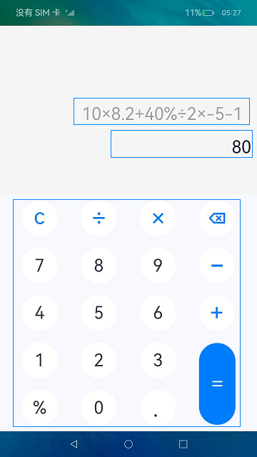
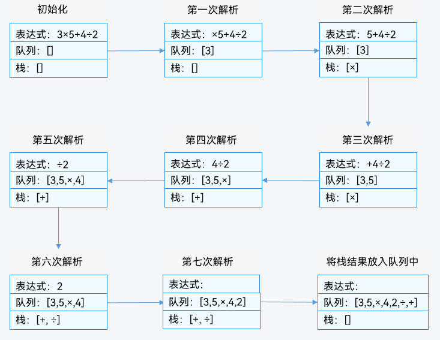

# 简易计算器（ArkTS）

## 介绍

本篇Codelab基于基础组件、容器组件，实现一个支持加减乘除混合运算的计算器。


> **说明：** 
>由于数字都是双精度浮点数，在计算机中是二进制存储数据的，因此小数和非安全整数（超过整数的安全范围[-Math.pow(2, 53)，Math.pow(2, 53)]的数据）在计算过程中会存在精度丢失的情况。
>
>1、小数运算时：“0.2 + 2.22 = 2.4200000000000004”，当前示例的解决方法是将小数扩展到整数进行计算，计算完成之后再将结果缩小，计算过程为“(0.2 * 100 + 2.22 * 100) / 100 = 2.42”。
>
>2、非安全整数运算时：“9007199254740992 + 1 = 9.007199254740992”，当前示例中将长度超过15位的数字转换成科学计数法，计算结果为“9007199254740992 + 1 = 9.007199254740993e15”。

### 相关概念

-   [ForEach](https://gitee.com/openharmony/docs/blob/master/zh-cn/application-dev/quick-start/arkts-rendering-control-foreach.md)组件：循环渲染组件**，**迭代数组并为每个数组项创建相应的组件。
-   [TextInput](https://gitee.com/openharmony/docs/blob/master/zh-cn/application-dev/reference/arkui-ts/ts-basic-components-textinput.md)组件：单行文本输入框组件。
-   [Image](https://gitee.com/openharmony/docs/blob/master/zh-cn/application-dev/reference/arkui-ts/ts-basic-components-image.md)组件：图片组件，支持本地图片和网络图片的渲染展示。

## 环境搭建

### 软件要求

-   [DevEco Studio](https://gitee.com/openharmony/docs/blob/master/zh-cn/application-dev/quick-start/start-overview.md#%E5%B7%A5%E5%85%B7%E5%87%86%E5%A4%87)版本：DevEco Studio 3.1 Release。
-   OpenHarmony SDK版本：API version 9。

### 硬件要求

-   开发板类型：[润和RK3568开发板](https://gitee.com/openharmony/docs/blob/master/zh-cn/device-dev/quick-start/quickstart-appendix-rk3568.md)。
-   OpenHarmony系统：3.2 Release。

### 环境搭建

完成本篇Codelab我们首先要完成开发环境的搭建，本示例以**RK3568**开发板为例，参照以下步骤进行：

1. [获取OpenHarmony系统版本](https://gitee.com/openharmony/docs/blob/master/zh-cn/device-dev/get-code/sourcecode-acquire.md#%E8%8E%B7%E5%8F%96%E6%96%B9%E5%BC%8F3%E4%BB%8E%E9%95%9C%E5%83%8F%E7%AB%99%E7%82%B9%E8%8E%B7%E5%8F%96)：标准系统解决方案（二进制）。以3.2 Release版本为例：

   

2. 搭建烧录环境。

   1.  [完成DevEco Device Tool的安装](https://gitee.com/openharmony/docs/blob/master/zh-cn/device-dev/quick-start/quickstart-ide-env-win.md)
   2.  [完成RK3568开发板的烧录](https://gitee.com/openharmony/docs/blob/master/zh-cn/device-dev/quick-start/quickstart-ide-3568-burn.md)

3. 搭建开发环境。

   1.  开始前请参考[工具准备](https://gitee.com/openharmony/docs/blob/master/zh-cn/application-dev/quick-start/start-overview.md#%E5%B7%A5%E5%85%B7%E5%87%86%E5%A4%87)，完成DevEco Studio的安装和开发环境配置。
   2.  开发环境配置完成后，请参考[使用工程向导](https://gitee.com/openharmony/docs/blob/master/zh-cn/application-dev/quick-start/start-with-ets-stage.md#创建ets工程)创建工程（模板选择“Empty Ability”）。
   3.  工程创建完成后，选择使用[真机进行调测](https://gitee.com/openharmony/docs/blob/master/zh-cn/application-dev/quick-start/start-with-ets-stage.md#使用真机运行应用)。

## 代码结构解读

本篇Codelab只对核心代码进行讲解，对于完整代码，我们会在gitee中提供。

```
├──entry/src/main/ets	                   // 代码区
│  ├──common
│  │  ├──constants
│  │  │  └──CommonConstants.ets            // 公共常量类
│  │  └──util
│  │     ├──CalculateUtil.ets              // 计算工具类
│  │     ├──CheckEmptyUtil.ets             // 非空判断工具类
│  │     └──Logger.ets                     // 日志管理工具类
│  ├──entryability
│  │  └──EntryAbility.ts	               // 程序入口类
│  ├──model
│  │  └──CalculateModel.ets                // 计算器页面数据处理类
│  ├──pages
│  │  └──HomePage.ets                      // 计算器页面
│  └──viewmodel    
│     ├──PressKeysItem.ets                 // 按键信息类
│     └──PresskeysViewModel.ets            // 计算器页面键盘数据
└──entry/src/main/resource                 // 应用静态资源目录
```

## 页面设计

页面由表达式输入框、结果输出框、键盘输入区域三部分组成，效果图如图：



表达式输入框位于页面最上方，使用TextInput组件实时显示键盘输入的数据，默认字体大小为“64fp”，当表达式输入框中数据长度大于9时，字体大小为“32fp”。

```typescript
// HomePage.ets
Column() {
  TextInput({ text: this.model.resultFormat(this.inputValue) })
    .height(CommonConstants.FULL_PERCENT)
    .fontSize(
      (this.inputValue.length > CommonConstants.INPUT_LENGTH_MAX ?
        $r('app.float.font_size_text')) : $r('app.float.font_size_input')
    )
    .enabled(false)
    .fontColor(Color.Black)
    .textAlign(TextAlign.End)
    .backgroundColor($r('app.color.input_back_color'))
}
....
.margin({
  right: $r('app.float.input_margin_right'),
  top: $r('app.float.input_margin_top')
})
```

结果输出框位于表达式输入框下方，使用Text组件实时显示计算结果和“错误”提示，当表达式输入框最后一位为运算符时结果输出框中值不变。

```typescript
// HomePage.ets
Column() {
  Text(this.model.resultFormat(this.calValue))
    .fontSize($r('app.float.font_size_text'))
    .fontColor($r('app.color.text_color'))
}
.width(CommonConstants.FULL_PERCENT)
.height($r('app.float.text_height'))
.alignItems(HorizontalAlign.End)
.margin({
  right: $r('app.float.text_margin_right'),
  bottom: $r('app.float.text_margin_bottom')})
```

用ForEach组件渲染键盘输入区域，其中0~9、“.”、“%”用Text组件渲染；“+-×÷=”、清零、删除用Image组件渲染。

```typescript
// HomePage.ets
ForEach(columnItem, (keyItem: PressKeysItem, keyItemIndex?: number) => {
  Column() {
    Column() {
      if (keyItem.flag === 0) {
        Image(keyItem.source !== undefined ? keyItem.source : '')
          .width(keyItem.width)
          .height(keyItem.height)
      } else {
        Text(keyItem.value)
          .fontSize(
            (keyItem.value === CommonConstants.DOTS) ?
              $r('app.float.font_size_dot') : $r('app.float.font_size_text')
          )
          .width(keyItem.width)
          .height(keyItem.height)
      }
    }
    .width($r('app.float.key_width'))
    .height(
      ((columnItemIndex === (keysModel.getPressKeys().length - 1)) &&
        (keyItemIndex === (columnItem.length - 1))) ?
        $r('app.float.equals_height') : $r('app.float.key_height')
    )
    ...
    .backgroundColor(
      ((columnItemIndex === (keysModel.getPressKeys().length - 1)) &&
        (keyItemIndex === (columnItem.length - 1))) ?
        $r('app.color.equals_back_color') : Color.White
    )
    ...
  }
  .layoutWeight(
    ((columnItemIndex === (keysModel.getPressKeys().length - 1)) &&
      (keyItemIndex === (columnItem.length - 1))) ? CommonConstants.TWO : 1
  )
  ...
}, (keyItem: PressKeysItem) => JSON.stringify(keyItem))
```

## 组装计算表达式

页面中数字输入和运算符输入分别调用inputNumber方法和inputSymbol方法。

```typescript
// HomePage.ets
ForEach(columnItem, (keyItem: PressKeysItem, keyItemIndex?: number) => {
  Column() {
    Column() {
      ...
    }
    ...
    .onClick(() => {
      if (keyItem.flag === 0) {
        this.model.inputSymbol(keyItem.value);
      } else {
        this.model.inputNumber(keyItem.value);
      }
    })
  }
  ...
  )
  ...
}, (keyItem: PressKeysItem) => JSON.stringify(keyItem))
```

> **说明：** 
>输入的数字和运算符保存在数组中，数组通过“+-×÷”运算符将数字分开。
>例如表达式为“10×8.2+40%÷2×-5-1”在数组中为\["10", "×", "8.2", "+", "40%", "÷", "2", "×", "-5", "-", "1"\]。
>表达式中“%”为百分比，例如“40%”为“0.4”。

当为数字输入时，首先根据表达式数组中最后一个元素判断当前输入是否匹配，再判断表达式数组中最后一个元素为是否为负数。

```typescript
// CalculateModel.ets
inputNumber(value: string) {
  ...
  let len = this.expressions.length;
  let last = len > 0 ? this.expressions[len - 1] : '';
  let secondLast = len > 1 ? this.expressions[len - CommonConstants.TWO] : undefined;
  if (!this.validateEnter(last, value)) {
    return;
  }
  if (!last) {
    this.expressions.push(value);
  } else if (!secondLast) {
    this.expressions[len - 1] += value;
  }
  if (secondLast && CalculateUtil.isSymbol(secondLast)) {
    this.expressions[len -1] += value;
  }
  if (secondLast && !CalculateUtil.isSymbol(secondLast)) {
    this.expressions.push(value);
  }
  ...
}

// CalculateModel.ets
validateEnter(last: string, value: string) {
  if (!last && value === CommonConstants.PERCENT_SIGN) {
    return false;
  }
  if ((last === CommonConstants.MIN) && (value === CommonConstants.PERCENT_SIGN)) {
    return false;
  }
  if (last.endsWith(CommonConstants.PERCENT_SIGN)) {
    return false;
  }
  if ((last.indexOf(CommonConstants.DOTS) !== -1) && (value === CommonConstants.DOTS)) {
    return false;
  }
  if ((last === '0') && (value != CommonConstants.DOTS) &&
    (value !== CommonConstants.PERCENT_SIGN)) {
    return false;
  }
  return true;
}
```

当输入为“=”运算符时，将结果输入出框中的值显示到表达式输入框中，并清空结果输出框。当输入为“清零”运算符时，将页面和表达式数组清空。

```typescript
// CalculateModel.ets
inputSymbol(value: string) {
  ...
  switch (value) {
    case Symbol.CLEAN:
      this.expressions = [];
      this.context.calValue = '';
      break;
    ...
    case Symbol.EQU:
      if (len === 0) {
        return;
      }
      this.getResult().then(result => {
        if (!result) {
          return;
        }
        this.context.inputValue = this.context.calValue;
        this.context.calValue = '';
        this.expressions = [];
        this.expressions.push(this.context.inputValue);
      })
      break;
    ...
  }
  ...
}
```

当输入为“删除”运算符时，若表达式数组中最后一位元素为运算符则删除，为数字则删除数字最后一位，重新计算表达式的值（表达式数组中最后一位为运算符则不参与计算），删除之后若表达式长度为0则清空页面。

```typescript
// CalculateModel.ets
inputSymbol(value: string) {
  ...
  switch (value) {
    ...
    case CommonConstants.SYMBOL.DEL:
      this.inputDelete(len);
      break;
    ...
  }
  ...
}

// CalculateModel.ets
inputDelete(len: number) {
  if (len === 0) {
    return;
  }
  let last = this.expressions[len - 1];
  let lastLen = last.length;
  if (lastLen === 1) {
    this.expressions.pop();
    len = this.expressions.length;
  } else {
    this.expressions[len - 1] = last.slice(0, last.length - 1);
  }
  if (len === 0) {
    this.context.inputValue = '';
    this.context.calValue = '';
    return;
  }
  if (!CalculateUtil.isSymbol(this.expressions[len - 1])) {
    this.getResult();
  }
}
```

当输入为“+-×÷”四则运算符时，由于可输入负数，故优先级高的运算符“×÷”后可输入“-”，其它场景则替换原有运算符。

```typescript
// CalculateModel.ets
inputSymbol(value: string) {
  ...
  switch (value) {
    ...
    default:
      this.inputOperators(len, value);
      break;
  }
  ...
}

// CalculateModel.ets
inputOperators(len: number, value: string) {
  let last = len > 0 ? this.expressions[len - 1] : undefined;
  let secondLast = len > 1 ? this.expressions[len - CommonConstants.TWO] : undefined;
  if (!last && (value === Symbol.MIN)) {
    this.expressions.push(this.getSymbol(value));
    return;
  }
  if (!last) {
    return;
  }
  if (!CalculateUtil.isSymbol(last)) {
    this.expressions.push(this.getSymbol(value));
    return;
  }
  if ((value === Symbol.MIN) &&
    (last === CommonConstants.MIN || last === CommonConstants.ADD)) {
    this.expressions.pop();
    this.expressions.push(this.getSymbol(value));
    return;
  }
  if (!secondLast) {
    return;
  }
  if (value !== Symbol.MIN) {
    this.expressions.pop();
  }
  if (CalculateUtil.isSymbol(secondLast)) {
    this.expressions.pop();
  }
  this.expressions.push(this.getSymbol(value));
}
```

## 解析计算表达式

将表达式数组中带“%”的元素转换成小数，若表达式数组中最后一位为“+-×÷”则删除。

```typescript
// CalculateUtil.ets
parseExpression(expressions: Array<string>): string {
  ...
  let len = expressions.length;
  ...
  expressions.forEach((item: string, index: number) => {
    // 处理表达式中的%
    if (item.indexOf(CommonConstants.PERCENT_SIGN) !== -1) {
      expressions[index] = (this.mulOrDiv(item.slice(0, item.length - 1),
        CommonConstants.ONE_HUNDRED, CommonConstants.DIV)).toString();
    }
    // 最后一位是否为运算符
    if ((index === len - 1) && this.isSymbol(item)) {
      expressions.pop();
    }
  });
  ...
}
```

先初始化队列和栈，再从表达式数组左边取出元素，进行如下操作：

-   当取出的元素为数字时则放入队列中。
-   当取出的元素为运算符时，先判断栈中元素是否为空，是则将运算符放入栈中，否则判断此运算符与栈中最后一个元素的优先级，若此运算符优先级小则将栈中最后一个元素弹出并放入队列中，再将此运算符放入栈中，否则将此运算符放入栈中。
-   最后将栈中的元素依次弹出放入队列中。

```typescript
// CalculateUtil.ets
parseExpression(expressions: Array<string>): string {
  ...
  while (expressions.length > 0) {
    let current = expressions.shift();
     if (current !== undefined) {
        if (this.isSymbol(current)) {
           while (outputStack.length > 0 &&
           this.comparePriority(current, outputStack[outputStack.length - 1])) {
              let popValue: string | undefined = outputStack.pop();
              if (popValue !== undefined) {
                 outputQueue.push(popValue);
              }
           }
           outputStack.push(current);
        } else {
           outputQueue.push(current);
        }
     }
  }
  while (outputStack.length > 0) {
    outputQueue.push(outputStack.pop());
  }
  ...
}
```

以表达式“3×5+4÷2”为例，用原理图讲解上面代码，原理图如图：



遍历队列中的元素，当为数字时将元素压入栈，当为运算符时将数字弹出栈，并结合当前运算符进行计算，再将计算的结果压栈，最终栈底元素为表达式结果。

```typescript
// CalculateUtil.ets
dealQueue(queue: Array<string>) {
  ...
  let outputStack: string[] = [];
   while (queue.length > 0) {
      let current: string | undefined = queue.shift();
      if (current !== undefined) {
         if (!this.isSymbol(current)) {
            outputStack.push(current);
         } else {
            let second: string | undefined = outputStack.pop();
            let first: string | undefined = outputStack.pop();
            if (first !== undefined && second !== undefined) {
               let calResultValue: string = this.calResult(first, second, current)
               outputStack.push(calResultValue);
            }
         }
      }
   }
   if (outputStack.length !== 1) {
      return 'NaN';
   } else {
      let end = outputStack[0].endsWith(CommonConstants.DOTS) ?
      outputStack[0].substring(0,  outputStack[0].length - 1) : outputStack[0];
      return end;
   }
}
```

获取表达式“3×5+4÷2”组装后的表达式，用原理图讲解上面代码，原理图如图：


## 总结

您已经完成了本次Codelab的学习，并了解到以下知识点：

1. ForEach组件的使用。
2. TextInput组件的使用。
3. Image组件的使用。


