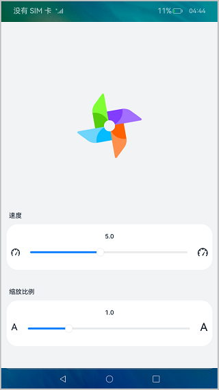
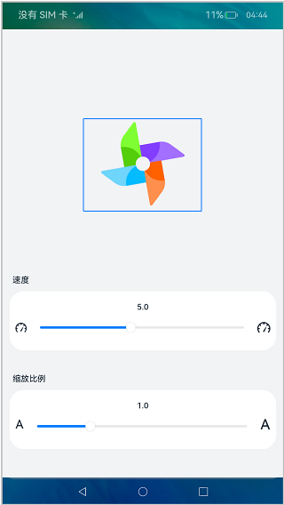

# 基础组件Slider的使用（ArkTS）
## 介绍

在本教程中，我们将通过一个简单的样例，学习如何使用声明式UI编程框架的基础组件。本篇Codelab将会使用Image组件、Slider组件、Text组件共同实现一个可调节的风车动画，实现效果如图所示：


### 相关概念

-   [Text组件](https://gitee.com/openharmony/docs/blob/master/zh-cn/application-dev/reference/arkui-ts/ts-basic-components-text.md)：文本组件，用于呈现一段信息。
-   [Image组件](https://gitee.com/openharmony/docs/blob/master/zh-cn/application-dev/reference/arkui-ts/ts-basic-components-image.md)：图片组件，用来渲染展示图片。
-   [Slider组件](https://gitee.com/openharmony/docs/blob/master/zh-cn/application-dev/reference/arkui-ts/ts-basic-components-slider.md)：滑动条组件，用来快速调节设置值，如音量、亮度等。

## 环境搭建

### 软件要求

-   [DevEco Studio](https://gitee.com/openharmony/docs/blob/master/zh-cn/application-dev/quick-start/start-overview.md#%E5%B7%A5%E5%85%B7%E5%87%86%E5%A4%87)版本：DevEco Studio 3.1 Canary1及以上版本。
-   OpenHarmony SDK版本：API version 9及以上版本。

### 硬件要求

-   开发板类型：[润和RK3568开发板](https://gitee.com/openharmony/docs/blob/master/zh-cn/device-dev/quick-start/quickstart-appendix-rk3568.md)。
-   OpenHarmony系统：3.2 Beta3及以上版本。

### 环境搭建

完成本篇Codelab我们首先要完成开发环境的搭建，本示例以**RK3568**开发板为例，参照以下步骤进行：

1.  [获取OpenHarmony系统版本](https://gitee.com/openharmony/docs/blob/master/zh-cn/device-dev/get-code/sourcecode-acquire.md#%E8%8E%B7%E5%8F%96%E6%96%B9%E5%BC%8F3%E4%BB%8E%E9%95%9C%E5%83%8F%E7%AB%99%E7%82%B9%E8%8E%B7%E5%8F%96)：标准系统解决方案（二进制）。以3.2 Beta3版本为例：

    

2.  搭建烧录环境。
    1.  [完成DevEco Device Tool的安装](https://gitee.com/openharmony/docs/blob/master/zh-cn/device-dev/quick-start/quickstart-ide-env-win.md)
    2.  [完成RK3568开发板的烧录](https://gitee.com/openharmony/docs/blob/master/zh-cn/device-dev/quick-start/quickstart-ide-3568-burn.md)

3.  搭建开发环境。
    1.  开始前请参考[工具准备](https://gitee.com/openharmony/docs/blob/master/zh-cn/application-dev/quick-start/start-overview.md#%E5%B7%A5%E5%85%B7%E5%87%86%E5%A4%87)，完成DevEco Studio的安装和开发环境配置。
    2.  开发环境配置完成后，请参考[使用工程向导](https://gitee.com/openharmony/docs/blob/master/zh-cn/application-dev/quick-start/start-with-ets-stage.md#创建ets工程)创建工程（模板选择“Empty Ability”），选择JS或者eTS语言开发。
    3.  工程创建完成后，选择使用[真机进行调测](https://gitee.com/openharmony/docs/blob/master/zh-cn/application-dev/quick-start/start-with-ets-stage.md#使用真机运行应用)。
## 代码结构解读
本篇Codelab只对核心代码进行讲解，完整代码可以直接从gitee获取。
```
├──entry/src/main/ets             // 代码区      
│  ├──common                        
│  │  └──Constants.ets            // 常量
│  ├──entryability
│  │  └──EntryAbility.ts          // 应用的入口
│  ├──pages
│  │  └──SliderPage.ets           // 入口页面
│  └──view                         
│     └──PanelComponent.ets       // 自定义组件
└──entry/src/main/resources       // 资源文件目录
```
## 页面结构

整个程序的页面构造十分简洁，由Image组件构成风车。自定义组件PanelComponent由Text组件和Slider组件构成，用来显示文本和控制图像，具体效果如下图所示：



## 添加风车

在SliderPage文件中，添加Image组件，给定使用图片的路径，并配置通用属性[图形变换](https://gitee.com/openharmony/docs/blob/master/zh-cn/application-dev/reference/arkui-ts/ts-universal-attributes-transformation.md)中的rotate属性和scale属性。自此，页面中已经有了风车的图像。

```typescript
...
  build() {
    Column() {
      Image($rawfile('windmill.png'))
        .objectFit(ImageFit.Contain)
        .height(Constants.IMAGE_SIZE)
        .width(Constants.IMAGE_SIZE)
        .rotate({
          x: RotatePosition.X,
          y: RotatePosition.Y,
          z: RotatePosition.Z,
          angle: this.angle
        })
        .scale({ x: this.imageSize, y: this.imageSize })
        ...
    }
    .justifyContent(FlexAlign.End)
    .height(Constants.PERCENTAGE_100)
    .backgroundColor($r('app.color.background_color'))
  }
...
```

效果如下：



## 如何让风车动起来

在speedChange\(\)函数中，以固定的时间间隔调整rotate的角度，也就是参数angle。onPageShow是SliderPage页面的生命周期方法，在其中调用speedChange\(\)函数，表示从程序启动时，便开始执行。自此我们已经实现了风车的旋转效果。代码如下：

```typescript
...
  speedChange() {
    let that = this;
    this.angle = Constants.ANGLE;
    this.interval = setInterval(function () {
      that.angle += that.speed;
    }, Constants.DELAY_TIME)
  }

  onPageShow() {
    clearInterval(this.interval);
    this.speedChange();
  }
...
```

## 调节风车的转速

在PanelComponent的构造参数中，给定调节转速的初始值和样式。在callback事件中，将子组件Slider滑动的value给到事先定义好的变量speed，实现Text组件的更新，并且通过调用speedChange\(\)方法实现转速的改变。代码如下：

```typescript
PanelComponent({
  mode: SliderMode.SPEED,
  title: $r('app.string.speed_text'),
  text: this.speed.toFixed(Constants.FRACTION_DIGITS),
  callback: ((value: number, mode: SliderChangeMode) => {
    this.speed = value;
    clearInterval(this.interval);
    this.speedChange();
  }),
  options: {
    value: this.speed,
    min: SliderSpeed.MIN,
    max: SliderSpeed.MAX,
    step: SliderSpeed.STEP,
    style: SliderStyle.InSet
  }
})
```

## 调节风车的大小

在PanelComponent的构造参数中，给定调节大小的初始值和样式。在callback事件中，将子组件Slider滑动的value给到事先定义好的变量imageSize，实现Text组件的更新和调节风车大小。代码如下：

```typescript
PanelComponent({
  mode: SliderMode.SCALE,
  title: $r('app.string.scale_text'),
  text: this.imageSize.toFixed(Constants.FRACTION_DIGITS),
  callback: ((value: number, mode: SliderChangeMode) => {
    this.imageSize = value;
  }),
  options: {
    value: this.imageSize,
    min: SliderScale.MIN,
    max: SliderScale.MAX,
    step: SliderScale.STEP,
    style: SliderStyle.InSet
  }
}).margin({ bottom: Constants.PANEL_MARGIN_BOTTOM,
    top: Constants.PANEL_MARGIN_TOP });
```
## 总结

您已经完成了本次Codelab的学习，并了解到以下知识点：

1. Slider组件的使用。
2. Image组件的使用。
3. Text组件的使用。
4. 通用属性rotate和scale属性的使用。


