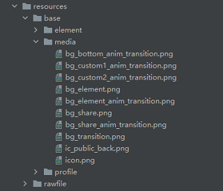
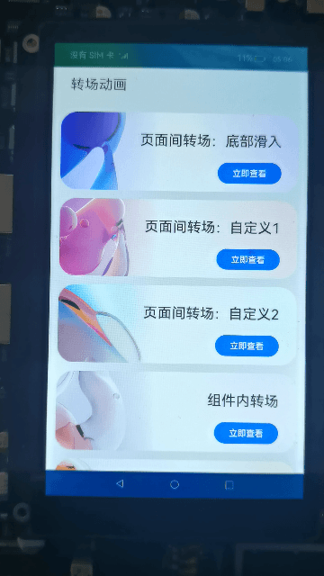

# 转场动画的使用（ArkTS）

## 介绍

在本教程中，我们将会通过一个简单的样例，学习如何基于ArkTS的声明式开发范式开发转场动画。其中包含页面间转场、组件内转场以及共享元素转场。效果如图所示：


>  **说明：**
> 本Codelab使用的display接口处于mock阶段，在预览器上使用会显示白屏现象，可选择在真机或模拟器上运行。

### 相关概念

- [页面间转场](https://gitee.com/openharmony/docs/blob/master/zh-cn/application-dev/reference/arkui-ts/ts-page-transition-animation.md)：页面转场通过在全局pageTransition方法内配置页面入场组件和页面退场组件来自定义页面转场动效。

- [组件内转场](https://gitee.com/openharmony/docs/blob/master/zh-cn/application-dev/reference/arkui-ts/ts-transition-animation-component.md)：组件转场主要通过transition属性进行配置转场参数，在组件插入和删除时进行过渡动效，主要用于容器组件子组件插入删除时提升用户体验（需要配合animateTo才能生效，动效时长、曲线、延时跟随animateTo中的配置）。

- [共享元素转场](https://gitee.com/openharmony/docs/blob/master/zh-cn/application-dev/reference/arkui-ts/ts-transition-animation-shared-elements.md)：通过修改共享元素的sharedTransition属性设置元素在不同页面之间过渡动效。例如，如果两个页面使用相同的图片（但位置和大小不同），图片就会在这两个页面之间流畅地平移和缩放。

## 环境搭建

### 软件要求

- [DevEco Studio](https://gitee.com/openharmony/docs/blob/master/zh-cn/application-dev/quick-start/start-overview.md#%E5%B7%A5%E5%85%B7%E5%87%86%E5%A4%87)版本：DevEco Studio 3.1 Release。
- OpenHarmony SDK版本：API version 9。

### 硬件要求

- 开发板类型：[润和RK3568开发板](https://gitee.com/openharmony/docs/blob/master/zh-cn/device-dev/quick-start/quickstart-appendix-rk3568.md)。
- OpenHarmony系统：3.2 Release。

### 环境搭建

完成本篇Codelab我们首先要完成开发环境的搭建，本示例以**RK3568**开发板为例，参照以下步骤进行：

1. [获取OpenHarmony系统版本](https://gitee.com/openharmony/docs/blob/master/zh-cn/device-dev/get-code/sourcecode-acquire.md#%E8%8E%B7%E5%8F%96%E6%96%B9%E5%BC%8F3%E4%BB%8E%E9%95%9C%E5%83%8F%E7%AB%99%E7%82%B9%E8%8E%B7%E5%8F%96)：标准系统解决方案（二进制）。以3.2 Release版本为例：

   

2. 搭建烧录环境。

    1. [完成DevEco Device Tool的安装](https://gitee.com/openharmony/docs/blob/master/zh-cn/device-dev/quick-start/quickstart-ide-env-win.md)
    2. [完成RK3568开发板的烧录](https://gitee.com/openharmony/docs/blob/master/zh-cn/device-dev/quick-start/quickstart-ide-3568-burn.md)

3. 搭建开发环境。

    1. 开始前请参考[工具准备](https://gitee.com/openharmony/docs/blob/master/zh-cn/application-dev/quick-start/start-overview.md#%E5%B7%A5%E5%85%B7%E5%87%86%E5%A4%87)，完成DevEco Studio的安装和开发环境配置。
    2. 开发环境配置完成后，请参考[使用工程向导](https://gitee.com/openharmony/docs/blob/master/zh-cn/application-dev/quick-start/start-with-ets-stage.md#创建ets工程)创建工程（模板选择“Empty Ability”）。
    3. 工程创建完成后，选择使用[真机进行调测](https://gitee.com/openharmony/docs/blob/master/zh-cn/application-dev/quick-start/start-with-ets-stage.md#使用真机运行应用)。

## 代码结构解读

本篇Codelab只对核心代码进行讲解，完整代码可以直接从gitee获取。

```
├──entry/src/main/ets                      // 代码区
│  ├──common
│  │  ├──constants
│  │  │  └──CommonConstants.ets            // 公共常量类
│  │  └──utils           
│  │     ├──DimensionUtil.ets              // 屏幕适配工具类
│  │     └──GlobalContext.ets              // 全局上下文工具类
│  ├──entryability
│  │  └──EntryAbility.ets                  // 程序入口类
│  ├──pages
│  │  ├──BottomTransition.ets              // 底部滑出页面
│  │  ├──ComponentTransition.ets           // 移动动画转场页面
│  │  ├──CustomTransition.ets              // 放缩动画转场页面
│  │  ├──FullCustomTransition.ets          // 旋转动画转场页面
│  │  ├──Index.ets                         // 应用首页
│  │  ├──ShareItem.ets                     // 共享元素转场部件
│  │  └──SharePage.ets                     // 共享元素转场页面
│  ├──view
│  │  ├──BackContainer.ets                 // 自定义头部返回组件
│  │  └──TransitionElement.ets             // 自定义动画元素
│  └──viewmodel
│     └──AnimationModel.ets                // 动画封装的model类
└──entry/src/main/resources                // 资源文件目录
```

## 构建主界面

在这个任务中，我们将完成主界面的设计和开发，效果如图所示：


从上面效果图可以看出，主界面主要由5个相同样式的功能菜单组成，我们可以将这些菜单抽取成一个子组件Item。

1. 将所需要的图片添加到resources \> base \> media目录下。

   

2. 在Index.ets中引入首页所需要图片和路由信息，声明子组件的UI布局并添加样式，使用ForEach方法循环渲染首页列表常量数据“INDEX\_ANIMATION\_MODE”，其中imgRes是设置按钮的背景图片，url用于设置页面路由的地址。

   ```typescript
   // Index.ets
   import { INDEX_ANIMATION_MODE } from '../common/constants/CommonConstants';
   
   Column() {
     ForEach(INDEX_ANIMATION_MODE, (item: AnimationModel) => {
       Row()
         .backgroundImage(item.imgRes)
         .backgroundImageSize(ImageSize.Cover)
         .backgroundColor($r('app.color.trans_parent'))
         .height(DimensionUtil.getVp($r('app.float.main_page_body_height')))
         .margin({ bottom: DimensionUtil.getVp($r('app.float.main_page_body_margin')) })
         .width(FULL_LENGTH)
         .borderRadius(BORDER_RADIUS)
         .onClick(() => {
           router.pushUrl({ url: item.url })
             .catch((err: Error) => {
               hilog.error(DOMAIN, PREFIX, FORMAT, err);
             });
         })
     }, (item: AnimationModel) => JSON.stringify(item))
   }
   ```

## 页面间转场

### 实现“底部滑入”效果

在BottomTransition申明pageTransition方法配置转场参数，其中PageTransitionEnter用于自定义当前页面的入场效果，PageTransitionExit用于自定义当前页面的退场效果。效果如图所示：


通过设置PageTransitionEnter和PageTransitionExit的slide属性为SlideEffect.Bottom，来实现BottomTransition入场时从底部滑入，退场时从底部滑出。

```typescript
// BottomTransition.ets
@Entry
@Component
struct BottomTransition {
  build() {
    Column() {
      TransitionElement()
    }
  }

  /**
   * 页面转场通过全局pageTransition方法进行配置转场参数
   *
   * SlideEffect.Bottom 入场时从屏幕下方滑入。
   * SlideEffect.Bottom 退场时从屏幕下方滑出。
   */
  pageTransition() {
    PageTransitionEnter({ duration: TRANSITION_ANIMATION_DURATION, curve: Curve.Smooth }).slide(SlideEffect.Bottom);
    PageTransitionExit({ duration: TRANSITION_ANIMATION_DURATION, curve: Curve.Smooth }).slide(SlideEffect.Bottom);
  }
}
```

### 实现”页面转场：自定义1“效果

本节实现的效果，页面入场时为淡入和放大，退场时从右下角滑出。效果如图所示：


在CustomTransition.ets的Column组件中添加TransitionElement组件，并且定义pageTransition方法。

```typescript
// CustomTransition.ets
@Entry
@Component
struct CustomTransition {
  build() {
    Column() {
      TransitionElement()
    }
  }

  /**
   * 页面转场通过全局pageTransition方法进行配置转场参数
   *
   * 进场时透明度设置从0.2到1；x、y轴缩放从0变化到1
   * 退场时x、y轴的偏移量为500
   */
  pageTransition() {
    PageTransitionEnter({ duration: TRANSITION_ANIMATION_DURATION, curve: Curve.Smooth })
      .opacity(CUSTOM_TRANSITION_OPACITY)
      .scale(CUSTOM_TRANSITION_SCALE)
    PageTransitionExit({ duration: TRANSITION_ANIMATION_DURATION, curve: Curve.Smooth })
      .translate(CUSTOM_TRANSITION_TRANSLATE)
  }
}
```

>  **说明：**
> translate设置页面转场时的平移效果，为入场时起点和退场时终点的值，和slide同时设置时默认生效slide。

### 实现”页面转场：自定义2“动效

本节实现的效果，页面入场时淡入和放大，同时顺时针旋转；退场时淡出和缩小，同时逆时针旋转。效果如图所示：



在FullCustomTransition.ets的Column组件中添加TransitionElement组件，并且定义pageTransition方法。给Stack组件添加opacity、scale、rotate属性，定义变量animValue用来控制Stack组件的动效，在PageTransitionEnter和PageTransitionExit组件中动态改变myProgress的值。

```typescript
// FullCustomTransition.ets
@Entry
@Component
struct FullCustomTransition {
  @State animValue: number = FULL_CUSTOM_TRANSITION_DEFAULT_ANIM_VALUE;

  build() {
    Column() {
      TransitionElement()
    }
    .opacity(this.animValue)
    .scale({ x: this.animValue, y: this.animValue })
    .rotate({
      z: FULL_CUSTOM_TRANSITION_ROTATE_Z,
      angle: FULL_CUSTOM_TRANSITION_ANGLE * this.animValue
    })
  }

  /**
   * 页面转场通过全局pageTransition方法进行配置转场参数
   *
   * 进场过程中会逐帧触发onEnter回调，入参为动效的归一化进度(0 - 1)
   * 进场过程中会逐帧触发onExit回调，入参为动效的归一化进度(0 - 1)
   */
  pageTransition() {
    PageTransitionEnter({ duration: TRANSITION_ANIMATION_DURATION, curve: Curve.Smooth })
      .onEnter((type?: RouteType, progress?: number) => {
        if (!progress) {
          return;
        }
        this.animValue = progress;
      });
    PageTransitionExit({ duration: TRANSITION_ANIMATION_DURATION, curve: Curve.Smooth })
      .onExit((type?: RouteType, progress?: number) => {
        if (!progress) {
          return;
        }
        this.animValue = FULL_CUSTOM_TRANSITION_DEFAULT_ANIM_VALUE - progress;
      });
  }
}
```

## 组件内转场

本节实现组件内转场动效，通过一个按钮来控制组件的添加和移除，呈现容器组件子组件添加和移除时的动效。效果如图所示：


组件转场主要通过transition属性方法配置转场参数，在组件添加和移除时会执行过渡动效，需要配合animateTo才能生效。动效时长、曲线、延时跟随animateTo中的配置。

1. 在ComponentTransition.ets文件中，新建Image子组件，并添加两个transition属性，分别用于定义组件的添加动效和移除动效。

   ```typescript
   // ComponentTransition.ets
   Image($r('app.media.bg_element'))
     .TransitionEleStyles()
     .transition({
       type: TransitionType.Insert,
       scale: COMPONENT_TRANSITION_SCALE,
       opacity: COMPONENT_TRANSITION_OPACITY
     })
     .transition({
       type: TransitionType.Delete,
       rotate: COMPONENT_TRANSITION_ROTATE,
       opacity: COMPONENT_TRANSITION_OPACITY
     })
   ```

2. 在ComponentTransition代码中，定义一个isShow变量，用于控制Image子组件的添加和移除，在Button组件的onClick事件中添加animateTo方法，来使Image子组件子组件动效生效。

   ```typescript
   // ComponentTransition.ets
   @State isShow: boolean = false;
   
   Button($r('app.string.Component_transition_toggle'))
     .height(DimensionUtil.getVp($r('app.float.element_trans_btn_height')))
     .width(DimensionUtil.getVp($r('app.float.element_trans_btn_width')))
     .fontColor(Color.White)
     .backgroundColor($r('app.color.light_blue'))
     .onClick(() => {
       animateTo({ duration: TRANSITION_ANIMATION_DURATION }, () => {
         this.isShow = !this.isShow;
       })
     })
   ```

## 共享元素转场

效果如图所示：


共享元素转场通过给组件设置sharedTransition属性来实现，两个页面的组件配置为同一个id，则转场过程中会执行共享元素转场。sharedTransition可以设置动效的时长、动画曲线和延时，实现步骤如下：

1. 在ShareItem.ets中给Image组件设置sharedTransition属性，组件转场id设置为“SHARE\_TRANSITION\_ID”。

   ```typescript
   // ShareItem.ets
   Image($r('app.media.bg_transition'))
     .width(FULL_LENGTH)
     .height(DimensionUtil.getVp($r('app.float.share_item_element_height')))
     .borderRadius(DimensionUtil.getVp($r('app.float.share_item_radius')))
     .margin({ bottom: DimensionUtil.getVp($r('app.float.share_item_element_margin_bottom')) })
     .sharedTransition(SHARE_TRANSITION_ID, {
       duration: TRANSITION_ANIMATION_DURATION,
       curve: Curve.Smooth,
       delay: SHARE_ITEM_ANIMATION_DELAY
     })
     .onClick(() => {
       router.pushUrl({ url: SHARE_PAGE_URL })
         .catch((err: Error) => {
           hilog.error(DOMAIN, PREFIX, FORMAT, err);
         });
     })
   ```

2. 在SharePage.ets中给Image组件设置sharedTransition属性，组件转场id设置为“SHARE\_TRANSITION\_ID”。

   ```typescript
   // SharePage.ets
   @Entry
   @Component
   struct SharePage {
     build() {
       Column() {
         TransitionElement({ imgFit: ImageFit.Cover })
           .sharedTransition(SHARE_TRANSITION_ID, {
             duration: SHARE_ITEM_DURATION,
             curve: Curve.Smooth,
             delay: SHARE_ITEM_ANIMATION_DELAY
           })
       }
     }
   }
   ```

>  **说明：**
> 两个页面的组件配置为同一个id，则转场过程中会执行共享元素转场，配置为空字符串时不会有共享元素转场效果。

## 总结

您已经完成了本次Codelab的学习，并了解到以下知识点：

1. 如何实现页面间转场动画。
2. 如何实现组件内转场动画。
3. 如何实现共享元素转场动画。


