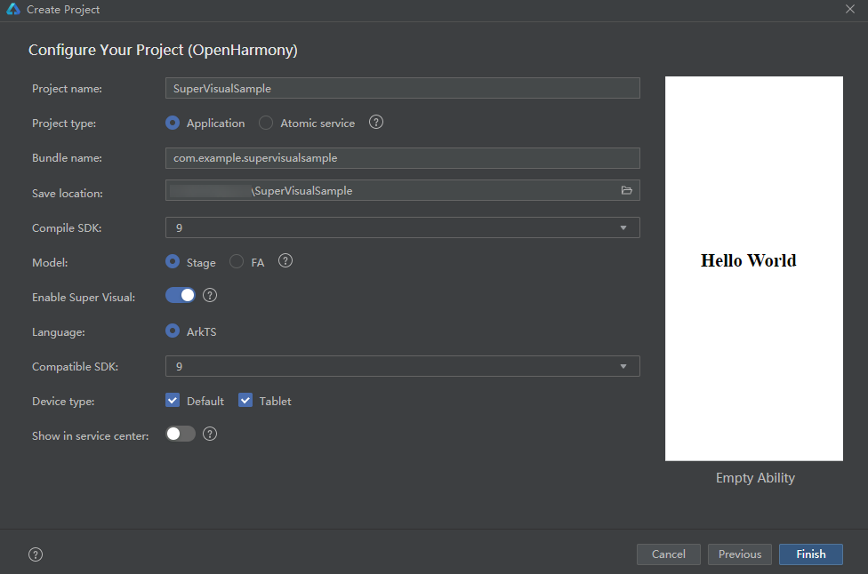
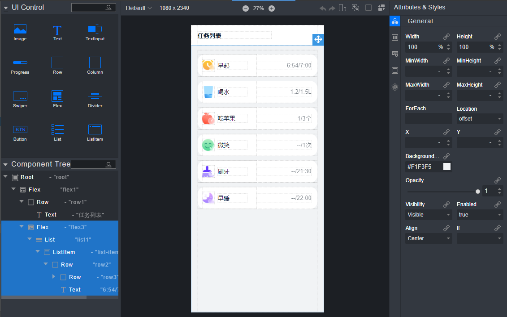
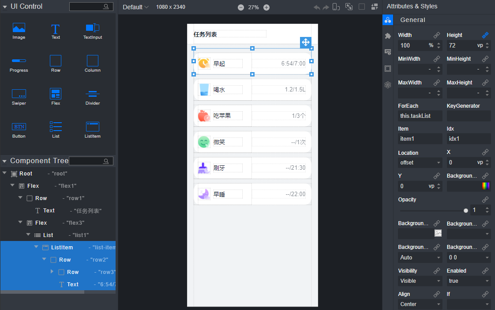
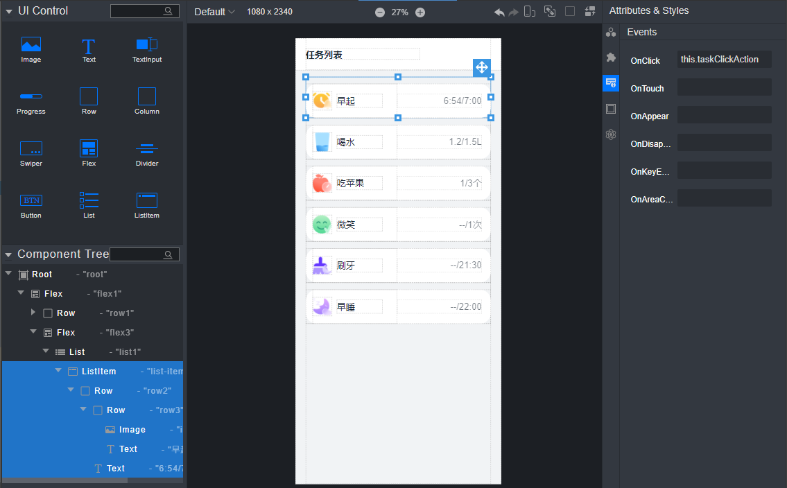

# 常用组件和容器低代码开发示例（ArkTS）

## 介绍

本篇Codelab是基于ArkTS语言的低代码开发方式实现的一个简单实例。具体实现功能如下：

1.   创建一个低代码工程。
2.   通过拖拽的方式实现任务列表和任务信息界面的界面布局。
3.   在UI编辑界面实现数据动态渲染和事件的绑定。

最终实现效果如下：


### 相关概念

低代码开发方式具有丰富的UI界面编辑功能，通过可视化界面开发方式快速构建布局，可有效降低开发者的上手成本并提升开发者构建UI界面的效率。

-   [List](https://gitee.com/openharmony/docs/blob/master/zh-cn/application-dev/reference/arkui-ts/ts-container-list.md)：List 是很常用的滚动类容器组件之一，它按照水平或者竖直方向线性排列子组件， List 的子组件必须是 ListItem ，它的宽度默认充满 List 的宽度。

-   [循环渲染](https://gitee.com/openharmony/docs/blob/master/zh-cn/application-dev/quick-start/arkts-rendering-control.md#%E5%BE%AA%E7%8E%AF%E6%B8%B2%E6%9F%93)：开发框架提供循环渲染（ForEach组件）来迭代数组，并为每个数组项创建相应的组件。

-   [警告弹窗](https://gitee.com/openharmony/docs/blob/master/zh-cn/application-dev/reference/arkui-ts/ts-methods-alert-dialog-box.md)：显示警告弹窗组件，可设置文本内容与响应回调。

## 环境搭建

### 软件要求

-   [DevEco Studio](https://gitee.com/openharmony/docs/blob/master/zh-cn/application-dev/quick-start/start-overview.md#%E5%B7%A5%E5%85%B7%E5%87%86%E5%A4%87)版本：DevEco Studio 3.1 Canary1及以上版本。
-   OpenHarmony SDK版本：API version 9及以上版本。

### 硬件要求

-   开发板类型：[润和RK3568开发板](https://gitee.com/openharmony/docs/blob/master/zh-cn/device-dev/quick-start/quickstart-appendix-rk3568.md)。
-   OpenHarmony系统：3.2 Beta3及以上版本。

### 环境搭建

完成本篇Codelab我们首先要完成开发环境的搭建，本示例以**RK3568**开发板为例，参照以下步骤进行：

1.  [获取OpenHarmony系统版本](https://gitee.com/openharmony/docs/blob/master/zh-cn/device-dev/get-code/sourcecode-acquire.md#%E8%8E%B7%E5%8F%96%E6%96%B9%E5%BC%8F3%E4%BB%8E%E9%95%9C%E5%83%8F%E7%AB%99%E7%82%B9%E8%8E%B7%E5%8F%96)：标准系统解决方案（二进制）。以3.2 Beta3版本为例：

    

2.  搭建烧录环境。
    1.  [完成DevEco Device Tool的安装](https://gitee.com/openharmony/docs/blob/master/zh-cn/device-dev/quick-start/quickstart-ide-env-win.md)
    2.  [完成RK3568开发板的烧录](https://gitee.com/openharmony/docs/blob/master/zh-cn/device-dev/quick-start/quickstart-ide-3568-burn.md)

3.  搭建开发环境。
    1.  开始前请参考[工具准备](https://gitee.com/openharmony/docs/blob/master/zh-cn/application-dev/quick-start/start-overview.md#%E5%B7%A5%E5%85%B7%E5%87%86%E5%A4%87)，完成DevEco Studio的安装和开发环境配置。
    2.  开发环境配置完成后，请参考[使用工程向导](https://gitee.com/openharmony/docs/blob/master/zh-cn/application-dev/quick-start/start-with-ets-stage.md#创建ets工程)创建工程（模板选择“Empty Ability”），选择JS或者eTS语言开发。
    3.  工程创建完成后，选择使用[真机进行调测](https://gitee.com/openharmony/docs/blob/master/zh-cn/application-dev/quick-start/start-with-ets-stage.md#使用真机运行应用)。

## 代码结构解读

```
└──entry/src/main/ets           // 代码区
│  ├──common                    
│  │  ├──images                 // 图片
│  │  └──Const.ts               // 常量类
│  ├──entryability              
│  │  └──EntryAbility.ets       // 程序入口类
│  └──pages
│     ├──TaskDetailPage.ets     // 详情页的逻辑描述文件
│     └──TaskPage.ets           // 首页的逻辑描述文件
├──entry/src/main/resources     // 资源文件
└──entry/src/main/supervisual
   └──pages
      ├──TaskDetailPage.visual  // 详情页面的数据模型
      └──TaskPage.visual        // 首页页面的数据模型
```

## 创建低代码工程

首先需要先创建一个低代码的工程，创建工程时，在配置工程界面打开“Enable Super Visual”开关，点击“Finish”。工程创建完成后，在src/main目录下会生成一个supervisual目录，supervisual/pages目录下的.visual文件，可以通过组件拖拽实现的页面数据模型文件。ets/pages下的.ets文件是跟supervisual/pages中的文件一一对应的，是对应界面的逻辑描述文件。


## 低代码设计界面布局

打开TaskPage.visual文件，界面如图所示：



中间部分是界面布局后的整体效果。

左侧上部的“UI Control”模块是我们可以进行拖拽的组件。

左侧下部的“Component Tree”模块是我们界面上所有的元素树。

右侧的“Attributes&Styles”模块是当前选中的界面元素的属性和样式的详细信息，通过修改这个模块的内容来改变界面上元素的样式属性等信息。

任务列表页面分了上下两部分，上边拖进来了一个Row组件来展示界面标题，下边用一个List组件来实现任务列表的数据展示，每个Item子组件用的横向布局，里边拖进去了一个Image组件和两个Text组件。

## 实现数据动态渲染

页面布局完成后，需要给ListItem 组件绑定一个ForEach的数据源。如图：



```typescript
// TaskPage.ets
@State taskList: Array<TaskInfo> = TASK_LIST;

taskClickAction() {
  router.push({
    url: 'pages/TaskDetailPage'
  });
}
```

同时给ListItem绑定一个点击事件来实现界面的跳转功能。



## 手动创建低代码页面

在pages下新建一个visual文件（右键-\>New-\>Visual），IDE会在ets/pages和supervisual/pages下同时创建一个名字相同后缀分别是.ets和.visual的文件，同样通过组件拖拽的方式去实现任务信息界面的布局，给界面绑定数据源和点击事件。detail.ets文件中代码如下：

```typescript
@State detailList: Array<DetailModel> = DETAILS;

showDialog() {
  AlertDialog.show({
    title: $r('app.string.task_clock'),
    message: $r('app.string.task_done'),
    autoCancel: true,
    confirm: {
      value: $r('app.string.clock'),
      action: () => {
      }
    }
  });
}

backAction() {
  router.back();
}
```
## 总结

您已经完成了本次Codelab的学习，并了解到以下知识点：

1.  如何创建一个低代码工程。
2.  如何使用低代码实现界面布局。
3.  如何在低代码界面实现数据绑定和点击事件的绑定。

    


