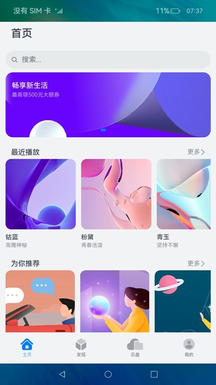
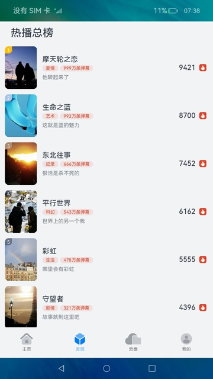
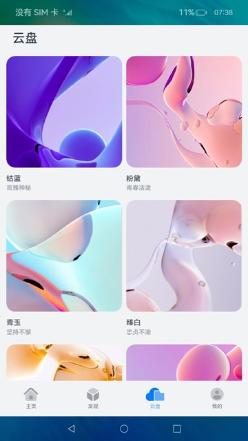
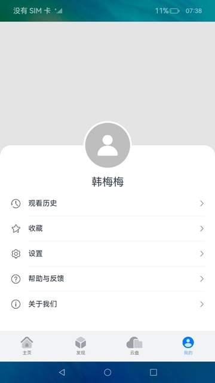
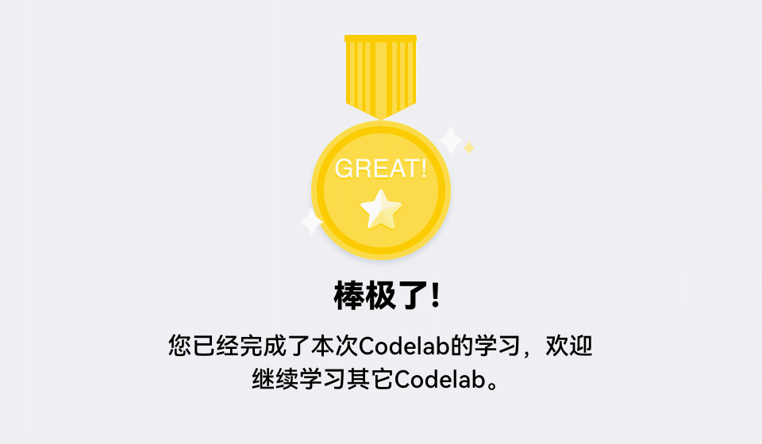

# 一次开发，多端部署-视频应用（ArkTS）

## 介绍

随着智能设备类型的不断丰富，用户可以在不同的设备上享受同样的服务，但由于设备形态不尽相同，开发者往往需要针对具体设备修改或重构代码，以实现功能完整性和界面美观性的统一。OpenHarmony为开发者提供了“一次开发，多端部署”的系统能力，让开发者可以基于一次开发，快速构建不同类型终端上的应用，降低开发成本，提高开发效率。

本篇Codelab基于“一次开发，多端部署”提供的自适应布局和响应式布局能力，实现了常见的视频播放应用的主界面。通过三层工程结构尽可能复用了部分代码，并根据设备尺寸的区别设计了对应的页面以兼顾美观和易用。应用被打开时会根据具体的设备形态显示对应的UI界面，其中RK3568开发板的首页效果如图所示：



### 相关概念

-   [一次开发，多端部署](https://gitee.com/openharmony/docs/blob/master/zh-cn/application-dev/key-features/multi-device-app-dev/Readme-CN.md#/openharmony/docs/blob/master/zh-cn/application-dev/key-features/multi-device-app-dev/introduction.md)：指一套代码工程，一次开发上架，多端按需部署，目标是支撑开发者高效地开发支持多种终端设备形态的应用。
-   [自适应布局](https://gitee.com/openharmony/docs/blob/master/zh-cn/application-dev/key-features/multi-device-app-dev/adaptive-layout.md)：当外部容器大小发生变化时，元素可以根据相对关系自动变化以适应外部容器变化的布局能力。相对关系如占比、固定宽高比、显示优先级等。当前自适应布局能力有7种：拉伸能力、均分能力、占比能力、缩放能力、延伸能力、隐藏能力、折行能力。自适应布局能力可以实现界面显示随外部容器大小连续变化。
-   [响应式布局](https://gitee.com/openharmony/docs/blob/master/zh-cn/application-dev/key-features/multi-device-app-dev/responsive-layout.md)：当外部容器大小发生变化时，元素可以根据断点、栅格或特定的特征（如屏幕方向、窗口宽高等）自动变化以适应外部容器变化的布局能力。当前响应式布局能力有3种：断点、媒体查询、栅格布局。
-   [GridRow](https://gitee.com/openharmony/docs/blob/master/zh-cn/application-dev/reference/arkui-ts/ts-container-gridrow.md)：栅格容器组件，仅可以和栅格子组件（GridCol）在栅格布局场景中使用。
-   [GridCol](https://gitee.com/openharmony/docs/blob/master/zh-cn/application-dev/reference/arkui-ts/ts-container-gridcol.md)：栅格子组件，必须作为栅格容器组件（GridRow）的子组件使用。

## 环境搭建

### 软件要求

-   [DevEco Studio](https://gitee.com/openharmony/docs/blob/master/zh-cn/application-dev/quick-start/start-overview.md#%E5%B7%A5%E5%85%B7%E5%87%86%E5%A4%87)版本：DevEco Studio 3.1 Release。
-   OpenHarmony SDK版本：API version 9。

### 硬件要求

-   开发板类型：[润和RK3568开发板](https://gitee.com/openharmony/docs/blob/master/zh-cn/device-dev/quick-start/quickstart-appendix-rk3568.md)。
-   OpenHarmony系统：3.2 Release。

### 环境搭建

完成本篇Codelab我们首先要完成开发环境的搭建，本示例以**RK3568**开发板为例，参照以下步骤进行：

1.  [获取OpenHarmony系统版本](https://gitee.com/openharmony/docs/blob/master/zh-cn/device-dev/get-code/sourcecode-acquire.md#%E8%8E%B7%E5%8F%96%E6%96%B9%E5%BC%8F3%E4%BB%8E%E9%95%9C%E5%83%8F%E7%AB%99%E7%82%B9%E8%8E%B7%E5%8F%96)：标准系统解决方案（二进制）。以3.2 Release版本为例：

    

2.  搭建烧录环境。
    1.  [完成DevEco Device Tool的安装](https://gitee.com/openharmony/docs/blob/master/zh-cn/device-dev/quick-start/quickstart-ide-env-win.md)
    2.  [完成RK3568开发板的烧录](https://gitee.com/openharmony/docs/blob/master/zh-cn/device-dev/quick-start/quickstart-ide-3568-burn.md)

3.  搭建开发环境。
    1.  开始前请参考[工具准备](https://gitee.com/openharmony/docs/blob/master/zh-cn/application-dev/quick-start/start-overview.md#%E5%B7%A5%E5%85%B7%E5%87%86%E5%A4%87)，完成DevEco Studio的安装和开发环境配置。
    2.  开发环境配置完成后，请参考[使用工程向导](https://gitee.com/openharmony/docs/blob/master/zh-cn/application-dev/quick-start/start-with-ets-stage.md#创建ets工程)创建工程（模板选择“Empty Ability”）。
    3.  工程创建完成后，选择使用[真机进行调测](https://gitee.com/openharmony/docs/blob/master/zh-cn/application-dev/quick-start/start-with-ets-stage.md#使用真机运行应用)。

## 代码结构解读

本篇Codelab只对核心代码进行讲解，对于完整代码，我们会在gitee中提供。

“一次开发，多端部署”推荐使用三层目录的工程结构来管理工程，上层目录包括common、features和product，common为公共特性目录，存放不同形态设备公用的类和常量，features为功能模块目录，存放应用的各个功能模块，product为产品层目录，存放不同形态设备范类代码。本Codelab不涉及功能特性，因此只存在common、product两个分层。

```
├──common                                // 公共能力层
│  ├──src/main/ets
│  │  ├──constants
│  │  │  └──CommonConstants.ets          // 公共常量类
│  │  ├──utils
│  │  │  └──BreakpointSystem.ets         // 断点工具类
│  │  └──viewmodel                       // 资源类接口
│  │     ├──BottomTabsItem.ets
│  │     ├──DriveTabsItem.ets  
│  │     ├──FindTabsItem.ets
│  │     ├──HomeTabsItem.ets
│  │     └──MineTabsItem.ets
│  └──src/main/resources                 // 资源文件夹
└──product                               // 产品定制层
   ├──default/src/main/ets               // 支持手机（含折叠屏）、平板
   │  ├──entryability
   │  │  └──EntryAbility.ts              // 程序入口类
   │  ├──pages
   │  │  └──MainPage.ets                 // 主页面
   │  ├──view
   │  │  ├──BottomTabsComponent.ets      // 底部页签组件
   │  │  ├──DriveTabsComponent.ets       // 云盘页组件
   │  │  ├──FindTabsComponent.ets        // 发现页组件
   │  │  ├──HomeTabsComponent.ets        // 首页组件
   │  │  ├──LeftTabsComponent.ets        // 侧边栏组件
   │  │  ├──MineTabsComponent.ets        // 个人页组件
   │  │  ├──RecentlyPlayedComponent.ets  // “最近播放”列表
   │  │  └──RecommendComponent.ets       // “为你推荐”列表
   │  └──viewmodel
   │     ├──BottomTabsModel.ets          // 底部页签model
   │     ├──DriveTabsModel.ets           // 云盘页model
   │     ├──FindTabsModel.ets            // 发现页model
   │     ├──HomeTabsModel.ets            // 首页model
   │     └──MineTabsModel.ets            // 个人页model
   └──default/src/main/resources         // 资源文件夹
```

## 主页面框架设计

为了操作便捷和充分利用不同形态设备的屏幕空间，按屏幕宽度的大小将设备划分为3类：

-   sm：320vp<=width<520vp，典型设备为手机。
-   md：520vp<=width<840vp，典型设备为折叠屏。
-   lg：840vp<=width，典型设备为平板或PC。

根据用户使用场景，当操作设备尺寸为sm或md时，一般为竖向使用，此时用于切换应用页面的页签栏适合置于底部。当操作设备尺寸为lg时，一般为横向使用，此时页签栏适合置于左侧。

```typescript
// MainPage.ets
@Entry
@Component
struct MainPage {
  ...
  build() {
    SideBarContainer(SideBarContainerType.Embed) {
      LeftTabs({ bottomTabIndex: $bottomTabIndex });  // 侧边栏

      Flex({ direction: FlexDirection.Column, alignItems: ItemAlign.End, justifyContent: FlexAlign.End }) {
        Tabs({ barPosition: BarPosition.End, index: 0, controller: this.controller }) {
          ... // 页面内容
        }
        if (this.currentBreakpoint !== Const.LG) {
          BottomTabs({ bottomTabIndex: $bottomTabIndex })  // 底部栏，当屏幕尺寸不为"lg"时显示
        }
      }
      .width(Const.FULL_SIZE)
      .backgroundColor($r('app.color.background_color'))
    }
    .showSideBar(this.currentBreakpoint === Const.LG)  // 当屏幕尺寸为"lg"时显示侧边栏
    .showControlButton(false)
    .sideBarWidth(Const.SIDEBAR_WIDTH)
    .maxSideBarWidth(Const.SIDEBAR_WIDTH_MAX)
    .minSideBarWidth(Const.SIDEBAR_WIDTH_MIN)
  }
}
```

## 各页面代码实现

### 首页

首页显示轮播图和“最近播放”、“为你推荐”两个列表，轮播图根据屏幕尺寸的区别，有显示数量的不同（sm为1，md为2，lg为3），列表使用具备自适应布局能力的List组件。  

```typescript
// HomeTabsComponent.ets
@Component
export struct HomeTabs {
  @Link currentBreakpoint: string;
  private scroller: Scroller = new Scroller();
  build() {
    Scroll(this.scroller) {
      GridRow({
        // 设置sm、md和lg的布局列数分别为4、8、12
        columns: { xs: Const.GRID_4, sm: Const.GRID_4, md: Const.GRID_8, lg: Const.GRID_12 },
        gutter: { x: $r('app.float.gutter_home') },
        breakpoints: { value: [Const.BREAKPOINTS_SM, Const.BREAKPOINTS_MD, Const.BREAKPOINTS_LG] }
      }) {
        GridCol({ span: { xs: Const.GRID_4, sm: Const.GRID_4, md: Const.GRID_8, lg: Const.GRID_12 } }) {
          ... // 标题
        }
        .height($r('app.float.title_height'))
        .margin({ bottom: $r('app.float.home_margin1') })

        // 搜索栏在sm、md下占满全部列，在lg下占8列
        GridCol({ span: { xs: Const.GRID_4, sm: Const.GRID_4, md: Const.GRID_8, lg: Const.GRID_8 } }) {
          ... // 搜索栏
        }
        .height($r('app.float.home_grid_height1'))

        GridCol({ span: { xs: Const.GRID_4, sm: Const.GRID_4, md: Const.GRID_8, lg: Const.GRID_12 } }) {
          Swiper() {
            ...
          }
          .height($r('app.float.home_swiper_height'))
          .itemSpace(Const.ITEM_SPACE)
          // 根据屏幕尺寸大小选择不同的轮播图数量
          .displayCount(this.currentBreakpoint === Const.LG ?
          Const.NUM_3 : (this.currentBreakpoint === Const.MD ? Const.NUM_2 : Const.NUM_1))
        }
        .height($r('app.float.home_grid_height2'))

        GridCol({ span: { xs: Const.GRID_4, sm: Const.GRID_4, md: Const.GRID_8, lg: Const.GRID_12 } }) {
          ... // ”最近播放”列表
        }
        .height($r('app.float.home_grid_height3'))

        GridCol({ span: { xs: Const.GRID_4, sm: Const.GRID_4, md: Const.GRID_8, lg: Const.GRID_12 } }) {
          ... // ”为你推荐”列表 
        }
        .height($r('app.float.home_column_height'))
      }
      .height(Const.FULL_SIZE)
    }
    ...
  }
}
```

### 发现页

发现页使用栅格布局实现“一次开发，多端部署”能力，把sm设置为4列，md设置为8列，lg设置为12列。热播榜单在不同设备尺寸上分别占据4列、6列和8列。

```typescript
// FindTabsComponent.ets
@Component
export struct FindTabs {
  private scroller: Scroller = new Scroller();
  build() {
    Scroll(this.scroller) {
      GridRow({
        // 设置sm、md和lg的布局列数分别为4、8、12
        columns: { xs: Const.GRID_4, sm: Const.GRID_4, md: Const.GRID_8, lg: Const.GRID_12 },
        gutter: { x: $r('app.float.gutter_find') },
        breakpoints: { value: [Const.BREAKPOINTS_SM, Const.BREAKPOINTS_MD, Const.BREAKPOINTS_LG] }
      }) {
        GridCol({ span: { xs: Const.GRID_4, sm: Const.GRID_4, md: Const.GRID_8, lg: Const.GRID_12 } }) {
          ... // 标题
        }
        .height($r('app.float.title_height'))

        LazyForEach(new FindDataSource(FindTabsList), (item: FindTabsItem) => {
          // 设置热播榜单在sm、md和lg上分别占据4、6、8列，并且设置offset属性保证在不同设备形态上都能保持居中
          GridCol({
            span: { xs: Const.GRID_4, sm: Const.GRID_4, md: Const.GRID_6, lg: Const.GRID_8 },
            offset: {
              md: FindTabsList.indexOf(item) === Const.OFFSET_0 ? Const.OFFSET_1 : Const.OFFSET_2,
              lg: FindTabsList.indexOf(item) === Const.OFFSET_0 ? Const.OFFSET_2 : Const.OFFSET_4
            }
          }) {
            ... // 榜单内容
          }
        }, (item: FindTabsItem) => JSON.stringify(item))
      }
    }
    ...
  }
}
```

RK3568开发板上发现页的实际效果如图所示：



### 云盘页

云盘页的栅格划分和发现页相同，但是每个子组件在所有屏幕尺寸上都只占据2列。

```typescript
// DriveTabsComponent.ets
@Component
export struct DriveTabs {
  private scroller: Scroller = new Scroller();
  build() {
    Scroll(this.scroller) {
      GridRow({
        // 设置sm、md和lg的布局列数分别为4、8、12
        columns: { xs: Const.GRID_4, sm: Const.GRID_4, md: Const.GRID_8, lg: Const.GRID_12 },
        gutter: { x : $r('app.float.gutter_drive') },
        breakpoints: { value: [Const.BREAKPOINTS_SM, Const.BREAKPOINTS_MD, Const.BREAKPOINTS_LG] }
      }) {
        GridCol({ span: { xs: Const.GRID_4, sm: Const.GRID_4, md: Const.GRID_8, lg: Const.GRID_12 } }) {
          ... // 标题
        }
        .height($r('app.float.title_height'))

        ForEach(DriveList, (item: DriveTabsItem) => {
          // 设置云盘内容在sm、md和lg上均占据2列
          GridCol({ span: { xs: Const.NUM_2, sm: Const.NUM_2, md: Const.NUM_2, lg: Const.NUM_2 } }) {
            ... // 云盘内容
          }
        }, (item: DriveTabsItem) => JSON.stringify(item))
      }
    }
    ...
  }
}
```

RK3568开发板上云盘页的实际效果如图所示：



### 个人页

个人页的栅格划分仍然和发现页相同，但子组件在sm、md形态下占满全部列，在lg形态下只占据8列。

```typescript
// MineTabsComponent.ets
@Component
export struct MineTabs {
  private scroller: Scroller = new Scroller();
  build() {
    Scroll(this.scroller) {
      GridRow({
        // 设置sm、md和lg的布局列数分别为4、8、12
        columns: { xs: Const.GRID_4, sm: Const.GRID_4, md: Const.GRID_8, lg: Const.GRID_12 },
        gutter: { x: $r('app.float.gutter_mine') },
        breakpoints: { value: [Const.BREAKPOINTS_SM, Const.BREAKPOINTS_MD, Const.BREAKPOINTS_LG] }
      }) {
        // 设置个人页在sm和md上占满全部列，在lg上占8列，为保证居中在lg上设置offset为2列
        GridCol({
          span: { xs: Const.GRID_4, sm: Const.GRID_4, md: Const.GRID_8, lg: Const.GRID_8 },
          offset: { lg: Const.OFFSET_2 }
        }) {
          ... // 个人页内容
        }
      }
      .height(Const.FULL_SIZE)
      .backgroundColor($r('app.color.mine_background_color'))
    }
    ...
  }
}
```

RK3568开发板上个人页的实际效果如图所示：



## 总结

您已经完成了本次Codelab的学习，并了解到以下知识点：

1.  根据设备尺寸形态设计不同的页面布局。
2.  使用栅格布局实现“一次开发，多端部署”能力。




