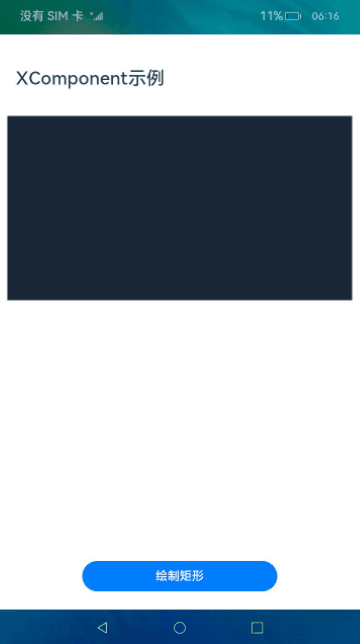
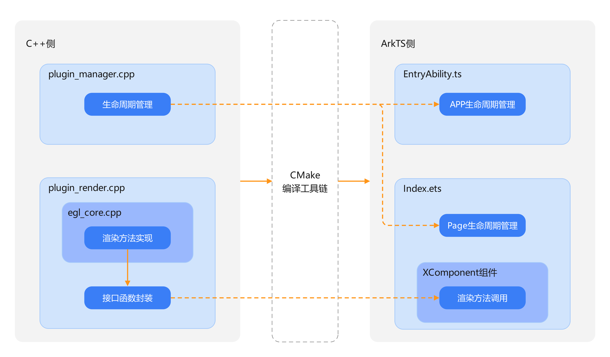
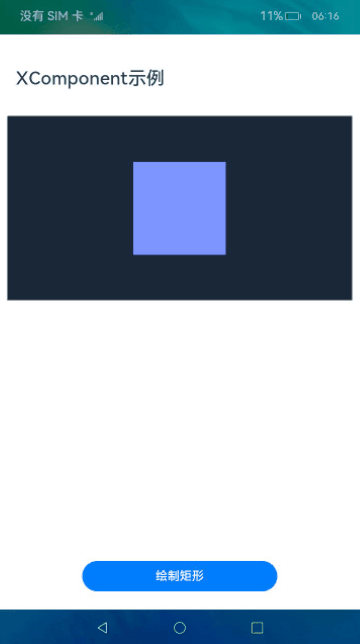

# Native XComponent组件的使用（ArkTS）

## 介绍

本篇Codelab主要介绍如何使用XComponent组件调用Native API来创建EGL/GLES环境，从而使用标准OpenGL ES进行图形渲染。使用OpenGL ES实现在主页面绘制一个正方形，并可以改变正方形的颜色。如图所示，点击绘制矩形按钮，XComponent组件绘制区域中渲染出一个正方形，点击绘制区域，正方形显示另一种颜色，点击绘制矩形按钮正方形还原至初始绘制的颜色。



### 相关概念

-   [EGL\(Embedded Graphic Library\)](https://gitee.com/openharmony/docs/blob/OpenHarmony-3.2-Release/zh-cn/application-dev/reference/native-lib/third_party_libc/musl.md#egl)：EGL 是Khronos渲染API (如OpenGL ES 或 OpenVG) 与底层原生窗口系统之间的接口。
-   [XComponent](https://gitee.com/openharmony/docs/blob/OpenHarmony-3.2-Release/zh-cn/application-dev/reference/arkui-ts/ts-basic-components-xcomponent.md)：可用于EGL/OpenGLES和媒体数据写入，并显示在XComponent组件。

## 环境搭建

### 软件要求

-   [DevEco Studio](https://gitee.com/openharmony/docs/blob/master/zh-cn/application-dev/quick-start/start-overview.md#%E5%B7%A5%E5%85%B7%E5%87%86%E5%A4%87)版本：DevEco Studio 3.1 Release及以上版本。
-   OpenHarmony SDK版本：API version 9及以上版本。

### 硬件要求

-   开发板类型：[润和RK3568开发板](https://gitee.com/openharmony/docs/blob/master/zh-cn/device-dev/quick-start/quickstart-appendix-rk3568.md)。
-   OpenHarmony系统：3.2 Release及以上版本。

### 环境搭建

完成本篇Codelab我们首先要完成开发环境的搭建，本示例以**RK3568**开发板为例，参照以下步骤进行：

1. [获取OpenHarmony系统版本](https://gitee.com/openharmony/docs/blob/master/zh-cn/device-dev/get-code/sourcecode-acquire.md#%E8%8E%B7%E5%8F%96%E6%96%B9%E5%BC%8F3%E4%BB%8E%E9%95%9C%E5%83%8F%E7%AB%99%E7%82%B9%E8%8E%B7%E5%8F%96)：标准系统解决方案（二进制）。以3.2 Release版本为例：

   

2. 搭建烧录环境。

   1.  [完成DevEco Device Tool的安装](https://gitee.com/openharmony/docs/blob/master/zh-cn/device-dev/quick-start/quickstart-ide-env-win.md)
   2.  [完成RK3568开发板的烧录](https://gitee.com/openharmony/docs/blob/master/zh-cn/device-dev/quick-start/quickstart-ide-3568-burn.md)

3. 搭建开发环境。

   1.  开始前请参考[工具准备](https://gitee.com/openharmony/docs/blob/master/zh-cn/application-dev/quick-start/start-overview.md#%E5%B7%A5%E5%85%B7%E5%87%86%E5%A4%87)，完成DevEco Studio的安装和开发环境配置。
   2.  开发环境配置完成后，请参考[使用工程向导](https://gitee.com/openharmony/docs/blob/master/zh-cn/application-dev/quick-start/start-with-ets-stage.md#创建ets工程)创建工程（模板选择“Empty Ability”）。
   3.  工程创建完成后，选择使用[真机进行调测](https://gitee.com/openharmony/docs/blob/master/zh-cn/application-dev/quick-start/start-with-ets-stage.md#使用真机运行应用)。

## 代码结构解读

### 代码目录结构图

本篇Codelab只对核心代码进行讲解，对于完整代码，我们会在gitee中提供。

```
├──entry/src/main
│  ├──cpp                           // C++代码区
│  │  ├──CMakeLists.txt             // CMake配置文件
│  │  ├──napi_init.cpp              // C++源代码
│  │  ├──common
│  │  │  └──common.h                // 常量定义文件
│  │  ├──manager                    // 生命周期管理模块
│  │  │  ├──plugin_manager.cpp
│  │  │  └──plugin_manager.h
│  │  ├──render                     // 渲染模块
│  │  │  ├──egl_core.cpp
│  │  │  ├──egl_core.h
│  │  │  ├──plugin_render.cpp
│  │  │  └──plugin_render.h
│  │  └──types                      // 接口存放文件夹
│  │     └──libhello
│  │        ├──index.d.ts           // 接口文件
│  │        └──oh-package.json5     // 接口注册配置文件
│  └──ets                           // 代码区
│     ├──common
│     │  └──CommonConstants.ets     // 常量定义文件
│     ├──entryability
│     │  └──EntryAbility.ts         // 程序入口类
│     └──pages                      // 页面文件
│        └──Index.ets               // 主界面
└──entry/src/main/resources         // 资源文件目录
```

## 应用架构

应用架构如图所示。其中，C++侧代码用于实现业务逻辑，ArkTS侧代码用于展示前端界面以及调用相关方法。

-   C++侧：实现图形渲染方法并进行接口函数封装，管理应用和页面的生命周期。
-   ArkTS侧：实现前端界面，调用C++侧的图形渲染方法，并在应用和页面的生命周期调用相关C++侧方法。
-   CMake编译工具链：跨平台的编译工具，将C++侧代码编译成so文件提供给ArkTS侧。



## 界面设计

主界面由标题、绘制区域、按钮组成。Index.ets文件完成界面实现，使用Column及Row容器组件进行布局。



```typescript
// Index.ets
@Entry
@Component
struct Index {
  ...
  build() {
    Column() {
      Row() {
        ...
      }
      .height($r('app.float.title_height'))
      Column() {
        XComponent({
          ...
        })
      }
      .height(CommonConstants.XCOMPONENT_HEIGHT)
      Row() {
        Button($r('app.string.button_text'))
          .fontSize($r('app.float.button_font_size'))
          .fontWeight(CommonConstants.FONT_WEIGHT)
      }
      .width(CommonConstants.FULL_PARENT)
    }
    .width(CommonConstants.FULL_PARENT)
    .height(CommonConstants.FULL_PARENT)
  }
}
```

## ArkTS侧方法调用

在ArkTS侧导入编译生成的动态链接库文件。增加XComponent组件，设置XComponent组件的唯一标识id，指定XComponent组件类型及需要链接的动态库名称。组件链接动态库加载完成后回调onLoad()方法指定上下文环境，上下文环境包含来自C++挂载的方法。新增Button组件，绑定由Native API注册的drawRectangle()方法，点击后绘制正方形。

```typescript
// Index.ets
// 导入动态链接库
import nativerender from 'libnativerender.so';

@Entry
@Component
struct Index {
  // XComponent实例对象的context
  private xComponentContext = null;
  ...
  build() {
    ...
    // 增加XComponent组件
    XComponent({
      id: CommonConstants.XCOMPONENT_ID,
      type: CommonConstants.XCOMPONENT_TYPE,
      libraryname: CommonConstants.XCOMPONENT_LIBRARY_NAME
    })
      .onLoad((xComponentContext) => {
        // 获取XComponent实例对象的context，context上挂载的方法由开发者在C++侧定义
        this.xComponentContext = xComponentContext;
      })
    ...
    // 增加Button组件
    Button($r('app.string.button_text'))
      .onClick(() => {
        if (this.xComponentContext) {
          this.xComponentContext.drawRectangle();
        }
      })
    ...
  }
}
```

## C++侧功能实现

### 渲染功能实现

- 进行环境的初始化，包括初始化可用的EGLDisplay、确定可用的surface配置、创建渲染区域surface、创建并关联上下文等。

  ``` c++
  // egl_core.cpp
  void EGLCore::EglContextInit(void *window, int width, int height)
  {
      m_width = width;
      m_height = height;
      if (m_width > 0) {
          // 计算绘制矩形宽度百分比
          m_widthPercent = FIFTY_PERCENT * m_height / m_width;
      }
      m_eglWindow = static_cast<EGLNativeWindowType>(window);
  
      // 初始化display
      m_eglDisplay = eglGetDisplay(EGL_DEFAULT_DISPLAY);
      if (EGL_NO_DISPLAY == m_eglDisplay) {
          return;
      }
  
      EGLint majorVersion;
      EGLint minorVersion;
      if (!eglInitialize(m_eglDisplay, &majorVersion, &minorVersion)) {
          return;
      }
  
      // 选择配置
      const EGLint maxConfigSize = 1;
      EGLint numConfigs;
      if (!eglChooseConfig(m_eglDisplay, ATTRIB_LIST, &m_eglConfig, maxConfigSize, &numConfigs)) {
          return;
      }
  
      // 创建surface
      if (nullptr != m_eglWindow) {
          m_eglSurface = eglCreateWindowSurface(m_eglDisplay, m_eglConfig, m_eglWindow, NULL);
          if (m_eglSurface == nullptr) {
              return;
          }
      }
  
      // 创建context
      m_eglContext = eglCreateContext(m_eglDisplay, m_eglConfig, EGL_NO_CONTEXT, CONTEXT_ATTRIBS);
      if (!eglMakeCurrent(m_eglDisplay, m_eglSurface, m_eglSurface, m_eglContext)) {
          return;
      }
  
      // 创建program
      m_programHandle = CreateProgram(VERTEX_SHADER, FRAGMENT_SHADER);
      if (!m_programHandle) {
          return;
      }
  }
  ```

- 使用EGL渲染正方形。实现一个渲染函数，通过调用EGL相关API进行绘制。绘制颜色使用小数表示，需要将十六进制颜色转换成十进制数值除以255计算。例如#182431转换十进制分别为24/36/49。

  ```c++
  // common.h
  /**
   * 绘制矩形颜色 #7E8FFB
   */
  const GLfloat DRAW_COLOR[] = { 126.0f / 255, 143.0f / 255, 251.0f / 255, 1.0f };
  
  /**
   * 绘制背景颜色 #182431
   */
  const GLfloat BACKGROUND_COLOR[] = { 24.0f / 255, 36.0f / 255, 49.0f / 255, 1.0f };
  
  /**
   * 绘制背景顶点
   */
  const GLfloat BACKGROUND_RECTANGLE_VERTICES[] = {
      -1.0f, 1.0f,
      1.0f, 1.0f,
      1.0f, -1.0f,
      -1.0f, -1.0f
  };
  
  // egl_core.cpp
  void EGLCore::Draw()
  {
      // 绘制准备工作
      GLint positionHandle = PrepareDraw();
  
      // 绘制背景
      ExecuteDraw(positionHandle, BACKGROUND_COLOR, BACKGROUND_RECTANGLE_VERTICES);
  
      // 确定绘制矩形的顶点，使用绘制区域的百分比表示
      const GLfloat rectangleVertices[] = {
          -m_widthPercent, FIFTY_PERCENT,
          m_widthPercent, FIFTY_PERCENT,
          m_widthPercent, -FIFTY_PERCENT,
          -m_widthPercent, -FIFTY_PERCENT
      };
  
      // 绘制矩形
      ExecuteDraw(positionHandle, DRAW_COLOR, rectangleVertices);
  
      // 绘制后操作
      FinishDraw();
  
      // 标记已绘制
      m_flag = true;
  }
  
  // 绘制前准备，获取positionHandle
  GLint EGLCore::PrepareDraw()
  {
      if (!eglMakeCurrent(m_eglDisplay, m_eglSurface, m_eglSurface, m_eglContext)) {
          return -1;
      }
  
      glViewport(DEFAULT_X_POSITION, DEFAULT_X_POSITION, m_width, m_height);
      glClearColor(GL_RED_DEFAULT, GL_GREEN_DEFAULT, GL_BLUE_DEFAULT, GL_ALPHA_DEFAULT);
      glClear(GL_COLOR_BUFFER_BIT);
      glUseProgram(m_programHandle);
  
      GLint positionHandle = glGetAttribLocation(m_programHandle, POSITION_HANDLE_NAME);
      return positionHandle;
  }
  
  // 依据传入参数在指定区域绘制指定颜色
  void EGLCore::ExecuteDraw(GLint positionHandle, const GLfloat *color, const GLfloat rectangleVertices[])
  {
      glVertexAttribPointer(positionHandle, POINTER_SIZE, GL_FLOAT, GL_FALSE, 0, rectangleVertices);
      glEnableVertexAttribArray(positionHandle);
      glVertexAttrib4fv(1, color);
      glDrawArrays(GL_TRIANGLE_FAN, 0, TRIANGLE_FAN_SIZE);
      glDisableVertexAttribArray(positionHandle);
  }
  
  // 结束绘制操作
  void EGLCore::FinishDraw()
  {
      // 强制刷新缓冲
      glFlush();
      glFinish();
  
      // 交换前后缓存
      eglSwapBuffers(m_eglDisplay, m_eglSurface);
  }
  ```
  
- 改变正方形的颜色。重新绘制一个大小相同、颜色不同的正方形，与原正方形地址交换，实现改变颜色的功能。

  ```C++
  // common.h
  /**
   * 改变后绘制的颜色 #92D6CC
   */
  const GLfloat CHANGE_COLOR[] = { 146.0f / 255, 214.0f / 255, 204.0f / 255, 1.0f };
  
  // egl_core.cpp
  void EGLCore::ChangeColor()
  {
      // 界面未绘制矩形时退出
      if (!m_flag) {
          return;
      }
  
      // 绘制准备工作
      GLint positionHandle = PrepareDraw();
  
      // 绘制背景
      ExecuteDraw(positionHandle, BACKGROUND_COLOR, BACKGROUND_RECTANGLE_VERTICES);
  
      // 确定绘制矩形的顶点，使用绘制区域的百分比表示
      const GLfloat rectangleVertices[] = {
          -m_widthPercent, FIFTY_PERCENT,
          m_widthPercent, FIFTY_PERCENT,
          m_widthPercent, -FIFTY_PERCENT,
          -m_widthPercent, -FIFTY_PERCENT
      };
  
      // 使用新的颜色绘制矩形
      ExecuteDraw(positionHandle, CHANGE_COLOR, rectangleVertices);
  
      // 结束绘制
      FinishDraw();
  }
  ```


### 使用Native API将C++方法传递给ArkTS

- 创建NAPI接口函数NapiDrawRectangle\(\)，封装对应C++渲染方法。根据XComponent组件信息，获取对应的渲染模块render，调用绘制矩形的方法。

  ```c++
  // plugin_render.cpp
  napi_value PluginRender::NapiDrawRectangle(napi_env env, napi_callback_info info)
  {
      // 获取环境变量参数
      napi_value thisArg;
      if (napi_ok != napi_get_cb_info(env, info, nullptr, nullptr, &thisArg, nullptr)) {
          return nullptr;
      }
  
      // 获取环境变量中XComponent实例
      napi_value exportInstance;
      if (napi_ok != napi_get_named_property(env, thisArg, OH_NATIVE_XCOMPONENT_OBJ, &exportInstance)) {
          return nullptr;
      }
  
      OH_NativeXComponent *nativeXComponent = nullptr;
      if (napi_ok != napi_unwrap(env, exportInstance, reinterpret_cast<void **>(&nativeXComponent))) {
          return nullptr;
      }
  
      // 获取XComponent实例的id
      char idStr[OH_XCOMPONENT_ID_LEN_MAX + 1] = {};
      uint64_t idSize = OH_XCOMPONENT_ID_LEN_MAX + 1;
      if (OH_NATIVEXCOMPONENT_RESULT_SUCCESS != OH_NativeXComponent_GetXComponentId(nativeXComponent, idStr, &idSize)) {
          return nullptr;
      }
  
      std::string id(idStr);
      PluginRender *render = PluginRender::GetInstance(id);
      if (render) {
          // 该接口函数封装的是上文实现的渲染方法
          render->m_eglCore->Draw();
      }
      return nullptr;
  }
  ```

- 使用Native API中的napi\_define\_properties方法，将接口函数NapiDrawRectangle\(\)注册为ArkTS侧接口drawRectangle\(\)，在ArkTS侧调用drawRectangle\(\)方法，完成正方形的绘制。

  ```C++
  // plugin_render.cpp
  napi_value PluginRender::Export(napi_env env, napi_value exports)
  {
      // 将接口函数注册为ArkTS侧接口drawRectangle 
      napi_property_descriptor desc[] = {
          { "drawRectangle", nullptr, PluginRender::NapiDrawRectangle, nullptr, nullptr, nullptr, napi_default, nullptr }
      };
      napi_define_properties(env, exports, sizeof(desc) / sizeof(desc[0]), desc);
      return exports;
  }
  ```

### 使用Native API实现触摸事件回调函数

通过将上文实现的改变颜色函数ChangeColor\(\)封装为触摸事件回调函数的方式，实现在触摸时改变正方形的颜色。创建一个新函数DispatchTouchEventCB\(\)，将C++对应方法封装于其中。将新函数绑定为组件触摸事件的回调函数，组件绘制区域产生触摸事件时触发，改变正方形展示的颜色。

```c++
// plugin_render.cpp
void DispatchTouchEventCB(OH_NativeXComponent *component, void *window)
{
    char idStr[OH_XCOMPONENT_ID_LEN_MAX + 1] = {};
    uint64_t idSize = OH_XCOMPONENT_ID_LEN_MAX + 1;
    if (OH_NATIVEXCOMPONENT_RESULT_SUCCESS != OH_NativeXComponent_GetXComponentId(component, idStr, &idSize)) {
        return;
    }

    std::string id(idStr);
    auto render = PluginRender::GetInstance(id);
    if (nullptr != render) {
        // 封装改变颜色的函数
        render->m_eglCore->ChangeColor();
    }
}

PluginRender::PluginRender(std::string &id)
{
    this->m_id = id;
    this->m_eglCore = new EGLCore(id);
    auto renderCallback = &PluginRender::m_callback;
    renderCallback->OnSurfaceCreated = OnSurfaceCreatedCB;
    renderCallback->OnSurfaceChanged = OnSurfaceChangedCB;
    renderCallback->OnSurfaceDestroyed = OnSurfaceDestroyedCB;

    // 这一步修改了触摸事件的回调函数，在触摸事件触发时调用NAPI接口函数，从而调用原C++方法
    renderCallback->DispatchTouchEvent = DispatchTouchEventCB;
}
```

## 注册与编译

在napi\_init.cpp文件中，Init方法注册上文实现的接口函数，从而将封装的C++方法传递出来，供ArkTS侧调用。编写接口的描述信息，根据实际需要可以修改对应参数。

```c++
// napi_init.cpp
static napi_value Init(napi_env env, napi_value exports)
{
    napi_property_descriptor desc[] = {
        { "getContext", nullptr, PluginManager::GetContext, nullptr, nullptr, nullptr, napi_default, nullptr }
    };
    // 将接口函数注册为ArkTS侧接口getContext()
    napi_define_properties(env, exports, sizeof(desc) / sizeof(desc[0]), desc);

    // 方法内检查环境变量是否包含XComponent组件实例，若实例存在注册绘制相关接口
    bool ret = PluginManager::GetInstance()->Export(env, exports);
    if (!ret) {
        OH_LOG_Print(LOG_APP, LOG_ERROR, LOG_PRINT_DOMAIN, "Init", "Init failed");
    }
    return exports;
}

static napi_module nativerenderModule = {
    .nm_version = 1,
    .nm_flags = 0,
    .nm_filename = nullptr,
    .nm_register_func = Init,        // 入口函数
    .nm_modname = "nativerender",    // 模块名称
    .nm_priv = ((void *)0),
    .reserved = { 0 }
};
```

使用CMake工具链将C++源代码编译成动态链接库文件。本篇Codelab中会链接两次动态库，第一次为import语句，第二次为XComponent组件链接动态库。

```cmake
# CMakeList.txt
# 声明使用 CMAKE 的最小版本号
cmake_minimum_required(VERSION 3.4.1)

# 配置项目信息
project(XComponent)

# set命令，格式为set(key value)，表示设置key的值为value
set(NATIVERENDER_ROOT_PATH ${CMAKE_CURRENT_SOURCE_DIR})

# 设置头文件的搜索目录
include_directories(
    ${NATIVERENDER_ROOT_PATH}
    ${NATIVERENDER_ROOT_PATH}/include
)

# 添加名为nativerender的库，库文件名为libnativerender.so，添加cpp文件
add_library(nativerender SHARED
    render/egl_core.cpp
    render/plugin_render.cpp
    manager/plugin_manager.cpp
    napi_init.cpp
)
...
# 添加构建需要链接的库
target_link_libraries(nativerender PUBLIC ${EGL-lib} ${GLES-lib} ${hilog-lib} ${libace-lib} ${libnapi-lib} ${libuv-lib} libc++.a)
```

## 总结

您已经完成了本次Codelab的学习，并了解到以下知识点：

1.  使用XComponent组件调用Native API创建EGL/GLES环境。
2.  使用OpenGL ES进行开发渲染。
3.  使用回调函数响应触摸事件。


